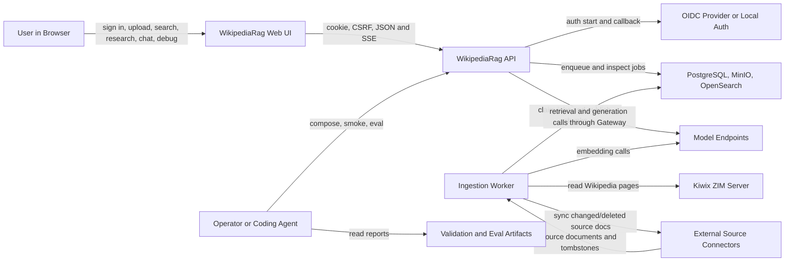
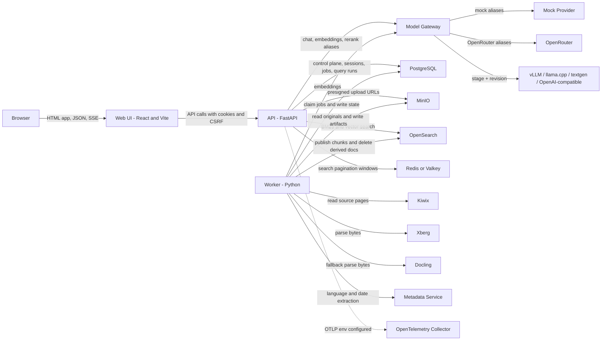

# Architecture Overview

This document is the compact architecture entry point for WikipediaRag. It
describes the system boundary, runtime containers, stable principles and where
to find detailed architecture docs. Active work, blockers and validation belong
in [STATUS.md](STATUS.md).

## Scope

WikipediaRag is a local production-shaped RAG platform for Russian Wikipedia
and uploaded document knowledge bases, with implemented foundations for
external source connections. It covers:

- browser-based local operation;
- application auth and tenant/KB authorization;
- asynchronous Wikipedia and document ingestion;
- object-storage-first document handling;
- external source connectors for local/corporate source synchronization;
- tenant-scoped hybrid retrieval and grounded answer generation;
- durable local-first Deep Research over private KB evidence, with a
  server-owned one-to-three-KB scope, bounded planner/tool episodes, verified
  claims and ACL-trimmed reports;
- local validation, eval and release-gate workflows.

External production operation is planned work. The repository contains Compose
profiles and production requirements, but not a fully supported external
deployment.

## Users And External Systems

- End users: sign in, select knowledge bases, upload documents, import Wikipedia subsets, ask questions, run bounded Deep Research and inspect citations.
- Operators and coding agents: run Compose, validation commands, eval gates and runtime smokes.
- Identity provider: optional OIDC provider, with a local Keycloak smoke profile.
- Model providers: OpenRouter (development proxy), vLLM, llama.cpp,
  text-generation-webui, generic OpenAI-compatible endpoints and test-only
  Mock through the Model Gateway control-plane contract. WikipediaRag never
  manages the lifecycle of an external model process.
- Source archives and connectors: local ZIM files served by Kiwix; XML
  multistream dumps are a fallback path; Confluence Data Center, Jira Data
  Center, GitLab Self-Managed, local folder, internal crawler, Kiwix/ZIM
  source-version tracking and deterministic Sunduk/DocSmart mocks share the
  source connector contract.

## Architecture Principles

- API and workers are stateless where practical.
- Client input never directly controls `tenant_id`; tenant and KB scope are injected server-side from `ActorContext`.
- Every persistent entity and search document carries tenant scope where applicable.
- PostgreSQL plus object storage form the backup/restore boundary; OpenSearch is rebuildable derived state.
- Original files, normalized documents and parser reports live in object storage.
- Failed or cancelled ingestion jobs must not publish searchable chunks.
- Physical search indices are versioned and published through KB active-index metadata and aliases.
- Model calls go through Model Gateway aliases; business code does not call providers directly.
- Deep Research is local-private and server-scoped; document text is evidence,
  never executable planner instruction.
- Normal logs and reports must redact secrets, prompts, provider payloads, raw document text, parser stderr and storage object keys.
- Background transitions must be idempotent and resumable.
- ZIM/libzim + Kiwix is the primary local Wikipedia path.
- XML multistream fallback remains supported.
- XML fallback parser offsets must remain monotonic non-decreasing offsets.
- Retrieval readiness failures use the safe `KB_NOT_READY` contract.
- Retrieval responses expose `index_contract_id`; indexed documents carry `metadata.index_contract_id`.
- Retrieval Correctness V3 uses scoped entity identity `(tenant, knowledge base,
  source, snapshot, native id)`, immutable read-path index publication,
  provenance-preserving content units and sequence-ordered safe retrieval
  events. Native source identifiers remain resolvable only through a scoped
  legacy mapping.

## System Context

## Containers

## Runtime Components

- Web UI: one React/Vite screen for auth, KB selection, import, upload, search, Deep Research, chat and retrieval debugging.
- API: FastAPI service for auth, admin APIs, KBs, source management, upload sessions, document lifecycle, Deep Research lifecycle, chat SSE, debug search, readiness and safe errors.
- Worker: Python loop that claims PostgreSQL jobs, imports Wikipedia, syncs external sources, processes document uploads, runs bounded Deep Research episodes and handles deferred document purge.
- PostgreSQL: control-plane source of truth, durable job state and Deep Research lifecycle/memory.
- MinIO: original uploads and normalized/parser artifacts.
- OpenSearch: derived BM25/vector search representation.
- Redis/Valkey: tenant-scoped search-window cache with bounded pooled clients; failures fall back to uncached search.
- Kiwix: read-only local ZIM serving.
- Model Gateway: provider boundary for chat, embedding and rerank. PostgreSQL
  stores one global draft/validated/active revision with immutable resolved
  snapshots; stage calls pin a revision and may only reduce workload output
  limits. YAML is bootstrap/export input without secrets.
- Parser services: Xberg, Docling and metadata-service.
- OpenTelemetry collector: local collector configured in Compose; application instrumentation beyond request/trace IDs is limited.

## Data Ownership Summary

| Data | Authoritative location | Derived or transient copies |
| --- | --- | --- |
| Tenants, users, sessions, groups, KB grants, audit events | PostgreSQL | None |
| Knowledge sources, sync runs and source document states | PostgreSQL | Connector responses and source snapshots |
| Upload sessions, batches, ingestion jobs, job items | PostgreSQL | UI memory polling state |
| Original uploaded bytes | MinIO, referenced by PostgreSQL metadata | Browser selected `File` objects before upload |
| Normalized documents and parser reports | MinIO, referenced by PostgreSQL metadata | Worker memory during processing |
| Document metadata, versions and lifecycle | PostgreSQL | UI public metadata |
| Chunks and publication state | PostgreSQL for durable metadata; OpenSearch for search | OpenSearch documents |
| Query runs and retrieval events | PostgreSQL | Chat SSE payloads and debug responses |
| Deep Research runs, questions, episodes, tool metadata, evidence, claims, coverage and reflections | PostgreSQL | ACL-trimmed API detail and deterministic report |
| Model connections, encrypted credential versions, aliases, revisions, stage bindings and validation reports | PostgreSQL | YAML bootstrap/export without secrets; Gateway request metadata |
| ZIM archive | Local ignored `zim/` files served by Kiwix | Imported chunks and source URLs |
| Eval and validation reports | Ignored `artifacts/` paths | `docs/STATUS.md` latest pointers |

See [architecture/data-and-storage.md](architecture/data-and-storage.md) for the
authoritative storage matrix.

## Detailed Architecture

- [Web architecture](architecture/web.md)
- [Runtime services](architecture/services.md)
- [Data and storage](architecture/data-and-storage.md)
- [Main flows](architecture/flows.md)
- [Security and tenancy](architecture/security-and-tenancy.md)
- [Search and Deep Research backend](architecture/search-and-deep-research.md)
- [Deployment and operations](architecture/deployment-and-operations.md)

## Key Decisions

- Keep PostgreSQL plus MinIO/object storage as the backup/restore boundary.
- Treat OpenSearch as rebuildable derived state.
- Use Model Gateway aliases for model-provider access.
- Resolve tenant and KB access server-side through `ActorContext`.
- Use async object-storage-first document ingestion, not synchronous large-file ingestion inside API requests.
- Keep Extended Search bounded and server-scoped; Multi-KB runs use the same ActorContext/DocumentAccessScope for every KB.
- Use ExecPlans for implementation history and ADRs for durable architecture decisions going forward.

ADR guidance and template are in [decisions/](decisions/).

## Open Architecture Questions

- External deployment model, TLS/reverse proxy strategy and environment isolation.
- Production identity provider, tenant onboarding and richer external ACL connector policy beyond JSON `document_access` trimming.
- Diagnose the post-episode/provider terminal stall in the isolated
  OpenRouter/Qwen hard gate before treating it as a quality or context-policy
  result. The 45% default remains until a clean 35%/45%/55% comparison passes.
- Measure the new five-tool Deep Research registry and 80k stage profiles on a
  fresh runtime matrix before changing default budgets or adding broader
  orchestration.
- Malware scanning and parser isolation requirements beyond local Compose hardening.
- Restore automation, restore drills and backup retention.
- Observability backend, retention, alerting and ownership.
- Whether uploaded user document contents may be sent to external model providers.
- Local llama.cpp model choices, licenses, hardware sizing and quality thresholds.

## Non-Goals

- Production external hosting support in the current local MVP.
- Explicit deny rules and source-specific ACL engines beyond JSON `document_access`.
- GraphRAG, multi-agent swarm retrieval, ColBERT, learned sparse retrieval or proposition indexing.
- Direct provider calls from business logic.
- Synchronous ingestion of large files inside HTTP requests.
