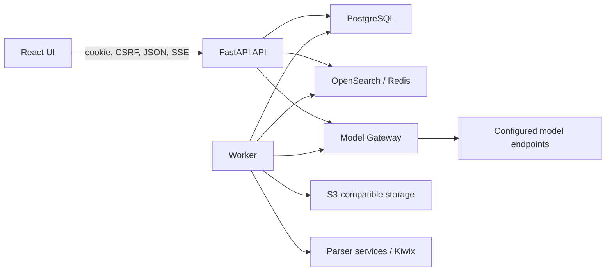

# Architecture Overview

WikipediaRag is a multi-tenant RAG system for Wikipedia and uploaded document
knowledge bases. This page defines system boundaries and ownership. Executable
contract evidence is indexed in [contract-map.md](architecture/contract-map.md);
current work belongs in [STATUS.md](STATUS.md).

XML multistream fallback remains supported for Wikipedia ingestion when Kiwix
is unavailable or cannot serve the requested source.
Its resume offsets are monotonic non-decreasing offsets. ZIM/libzim + Kiwix is the primary local Wikipedia path. Retrieval returns `KB_NOT_READY` until an
`index_contract_id` is active and projected as `metadata.index_contract_id`.

## System Boundary

- The API owns public contracts, sessions, authorization and user-visible
  lifecycle operations.
- The worker owns asynchronous ingestion, publication, purge and research
  transitions.
- PostgreSQL owns control-plane state, authorization, lifecycle and durable
  research state.
- Object storage owns original uploads and derived document artifacts.
- OpenSearch and Redis/Valkey are rebuildable retrieval projections.
- Model Gateway owns alias resolution, operation contracts, endpoint adapters
  and safe provider errors.
- Parser services process bytes or text but receive no tenant authority,
  storage credentials or provider secrets.

## Architecture Invariants

1. Tenant and KB authority comes from server-owned `ActorContext`; client IDs
   and filters are re-authorized at their boundary.
2. PostgreSQL confirms publication and current document ACL before a derived
   retrieval candidate can be exposed.
3. Large ingestion and research work is asynchronous, durable, resumable and
   bounded. Failed or cancelled work does not publish searchable chunks.
4. PostgreSQL plus object storage is the backup boundary. Search indices and
   caches may be rebuilt.
5. Business model calls use provider-neutral Model Gateway aliases. Chat,
   embedding, rerank and token counting remain distinct operations.
6. Endpoint suitability depends on operation compatibility and readiness, not
   whether the endpoint is remote or local.
7. Public responses and normal logs exclude secrets, provider payloads, raw
   prompts, raw document contents and storage keys.
8. Durable research evidence is rechecked against current publication and ACL
   before model context or public reports are built.
9. Migrations are additive; background state transitions are idempotent and
   lease/CAS protected where concurrent workers may act.

## Data Ownership

| Data | Authority | Derived copies |
| --- | --- | --- |
| Users, sessions, tenants, roles, KB grants and ACLs | PostgreSQL | UI session state |
| Sources, documents, versions, jobs, chunks and publication | PostgreSQL | OpenSearch documents |
| Original and normalized document bytes | Object storage | Worker memory |
| Search windows and facets | PostgreSQL/OpenSearch inputs | Redis/Valkey cache |
| Query events and durable Deep Research state | PostgreSQL | SSE/API projections |
| Model connections, aliases and active revisions | PostgreSQL/Gateway | Safe runtime metadata |
| Eval results | Immutable ignored artifacts | Compact status summaries |

## Detailed Contracts

- [Runtime services](architecture/services.md)
- [Data and storage](architecture/data-and-storage.md)
- [Main flows](architecture/flows.md)
- [Security and tenancy](architecture/security-and-tenancy.md)
- [Web UI](architecture/web.md)
- [Search and Deep Research](architecture/search-and-deep-research.md)
- [Deployment and operations](architecture/deployment-and-operations.md)
- [Canonical contract map](architecture/contract-map.md)
