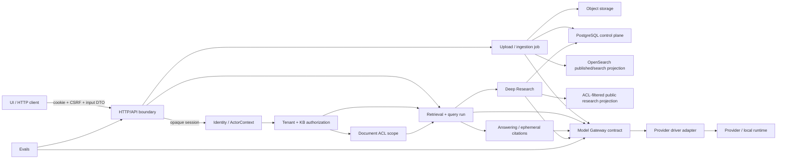

# Contract Map текущей архитектуры

## Метод и границы достоверности

Карта описывает фактическое поведение на 2026-08-12. Доказательствами служат
только `src/`, `tests/`, `config/`, Compose, `.env.example`, `Makefile` и UI.
Ссылки вида `path:line` указывают на исполняемый код либо тест. Документация
использовалась только для навигации и не является доказательством ownership.

Трассировка каждого существенного вывода имеет вид:

```text
code → contract → owner → boundary → executable invariant
```

`Owner` ниже означает authoritative owner, только если это подтверждено
кодом. Если один semantic concept записывается в независимые writable места
либо выбор authority не следует из кода, указан `UNCLEAR`.

Статусы проверки: `TYPE`, `UNIT TEST`, `INTEGRATION TEST`, `DB CONSTRAINT`,
`RUNTIME VALIDATION`, `EVAL`, `ARCHITECTURE TEST`, `NOT ENFORCED`.

## 1. System Contract Map



Направления на схеме подтверждаются маршрутизацией API (`src/wikipediarag/api/app.py:20-56`), серверным созданием upload session (`src/wikipediarag/api/handlers.py:2047-2105`), worker-пайплайном (`src/wikipediarag/ingestion.py:833-1086`), retrieval (`src/wikipediarag/retrieval.py:84-370`) и вызовами Model Gateway (`src/wikipediarag/model_client.py:78-260`). Состав развёртываемых границ подтверждает `compose.yaml:161-329`.

### Domains и разрешённые зависимости

| Domain | Владеет / публикует | Может зависеть от | Не должен зависеть от | Код и проверка |
|---|---|---|---|---|
| Identity / session | Серверный `ActorContext`; публикует проверенный actor для handler. | Session repository и policy. | Client `tenant_id`, `user_id`, `group_id` как authority. | Producer `auth_service.load_actor_for_session` (`src/wikipediarag/auth_service.py:284`); consumer `_load_actor` (`src/wikipediarag/api/handlers.py:4333-4354`); `tests/unit/test_auth_service.py:136-159`. |
| Tenant + KB authorization | Роль actor в active tenant и effective KB role; публикует разрешение на KB operation. | `ActorContext`, repository role lookup. | Document-level ACL как замену KB role; UI authority. | `src/wikipediarag/auth.py:103-123`, `src/wikipediarag/repository.py:3481-3519`; consumer handler `src/wikipediarag/api/handlers.py:4383-4409`; `tests/unit/test_auth_policy.py:85-145`. |
| Document ACL | `DocumentAccessScope`, нормализацию policy и search predicate. | Authorised KB/document lookup. | Обратный вызов к UI, provider или model code. | `src/wikipediarag/document_access.py:21-89`; consumers repository/search index; `tests/unit/test_auth_policy.py:104-130`, `tests/unit/test_document_viewer.py:143-174`. |
| Document/source lifecycle + ingestion | Upload item, parser result, document version, chunks и переход publication. | Object storage, repository, parser, Model Gateway, index adapter. | HTTP request как место синхронной тяжёлой обработки; provider drivers. | Producer worker `src/wikipediarag/ingestion.py:833-1086`; consumer repository/index; `tests/unit/test_document_ingestion.py:71-97`, `tests/unit/test_upload_batches.py:180-207`. |
| Storage/index publication | Object bytes и search projection. | Storage/index adapters, metadata от ingestion. | Authority из object key или client prefix. | Server строит key `src/wikipediarag/api/handlers.py:2090-2105`; storage adapter `src/wikipediarag/storage.py:49-140`; `tests/unit/test_cli_cross_tenant_hardening.py:102-130`. Publication ownership сейчас `UNCLEAR`, см. раздел 4. |
| Retrieval / query run | Validated retrieval contract, candidates, ephemeral `Evidence`, query-run events. | KB authorization, document ACL, index/repository, Model Gateway. | Durable research memory как вход без явного adapter. | `src/wikipediarag/retrieval_contract.py:49-250`, `src/wikipediarag/retrieval.py:84-370`, `src/wikipediarag/repository.py:3187-3730`; `tests/unit/test_retrieval_contract.py:35-129`, `tests/unit/test_multi_kb_retrieval.py:60-205`. |
| Answering / citations | Answer draft, citation validation и claim-to-citation consistency в ответе. | Ephemeral retrieval evidence, Model Gateway. | Durable research evidence ID как взаимозаменяемый `Evidence`. | `src/wikipediarag/answering.py:531-667`; `tests/unit/test_retrieval_answering.py:46-77`, `tests/unit/test_retrieval_answering.py:324-356`, `tests/unit/test_retrieval_answering.py:704-727`. |
| Model Gateway / control plane | Операционные model contracts, provider-neutral request, provider adapter. | YAML registry или persisted revision на явно выбранном пути; driver. | Business domain от provider-specific driver. | `src/wikipediarag/model_control.py:29-298`, `src/wikipediarag/gateway_app.py:343-670`, `src/wikipediarag/model_drivers.py:37-306`; `tests/unit/test_model_control.py:91-136`, `tests/unit/test_gateway_app.py:257-289`. |
| Deep Research | Durable run/scope/episode/evidence/claim state; ACL-filtered model-facing и public projections. | Retrieval, planner/tools/verifier, repository, Model Gateway. | Public projection как durable source of truth; provider driver. | `src/wikipediarag/deep_research.py:678-875`, `src/wikipediarag/deep_research.py:1094-1226`, `src/wikipediarag/deep_research.py:2561-3271`; `src/wikipediarag/repository.py:3908-5322`; `tests/unit/test_deep_research.py:443-526`, `tests/unit/test_deep_research.py:1026-1085`. |
| Evals | Eval task/dataset/run artefacts и API/Gateway clients для измерений. | Public API or Model Gateway, eval artefact storage. | Runtime query-run/research-run ownership. | `src/wikipediarag/eval/schemas.py:68-310`, `src/wikipediarag/eval/runner.py:178-244`; `tests/integration/test_eval_runner.py:707-846`. |
| HTTP/UI boundary | Transport DTO, cookie/CSRF interaction, SSE/public projections. | API handlers only. | Client-controlled identity or direct database/provider access. | UI `services/ui/src/App.tsx:909-936`, `services/ui/src/App.tsx:1195-1205`; API CSRF/actor checks `src/wikipediarag/api/handlers.py:4333-4364`; `tests/unit/test_api_contract_abstention.py:62-123`. |

## 2. Canonical Contracts

| ID | Contract | Owner | Producers | Consumers | Invariants | Verification |
|---|---|---|---|---|---|---|
| AUTH-C01 | Server-owned `ActorContext` (`user_id`, platform/tenant role, active tenant, session data). | `auth.ActorContext` type; session-to-actor construction by `auth_service`. | `load_actor_for_session` (`src/wikipediarag/auth_service.py:284-344`). | `_load_actor`, handlers (`src/wikipediarag/api/handlers.py:4333-4364`). | **AUTH-001:** actor is derived from opaque server session; request fields are not authority. | `TYPE` (`src/wikipediarag/auth.py:42-50`); `RUNTIME VALIDATION`; `UNIT TEST` (`tests/unit/test_auth_service.py:136-159`). |
| AUTH-C02 | Active tenant and effective KB role. | `auth` policy plus repository role lookup. | `require_active_tenant` / `effective_knowledge_base_role` (`src/wikipediarag/auth.py:103-123`), repository (`src/wikipediarag/repository.py:3481-3519`). | KB-scoped handlers and retrieval scope (`src/wikipediarag/api/handlers.py:4383-4409`). | **AUTH-002:** no tenant-scoped operation without active tenant; KB access is checked before operation. | `RUNTIME VALIDATION`; `UNIT TEST` (`tests/unit/test_auth_policy.py:85-145`). |
| AUTH-C03 | Document access policy and search predicate. | PostgreSQL is the executable read owner; OpenSearch/Redis are derived candidate layers. | `normalize_document_access`, `document_access_filter`; durable event and `search_projection_reconciliation`. | Viewer paths, PostgreSQL confirmation, lease-fenced repair. | **AUTH-003:** ACL and publication are confirmed from PostgreSQL before fusion/exposure; historical discovery is bounded/idempotent and OpenSearch is repairable only. | `tests/unit/test_retrieval_current_state.py`, `tests/unit/test_search_projection_worker.py`, `tests/functional/test_retrieval_business_path.py`, Playwright Search corruption scenario. |
| ING-C01 | Upload-session acceptance and server-owned object location. | API upload handler. | `create_upload_session` (`src/wikipediarag/api/handlers.py:2047-2105`). | Storage presign/client PUT, upload worker. | **ING-001:** tenant/KB prefix is generated after actor and KB authorization; client does not choose object key. | `RUNTIME VALIDATION`; `UNIT TEST` (`tests/unit/test_cli_cross_tenant_hardening.py:102-130`). |
| ING-C02 | Validated and normalized document before chunking. | `document_ingestion`. | `validate_upload_bytes`, `normalize_uploaded_document`, `chunks_for_normalized_document` (`src/wikipediarag/document_ingestion.py:155-370`); worker (`src/wikipediarag/ingestion.py:869-1019`). | Chunk persistence and embedding/indexing. | **ING-002:** bytes pass validation and normalization before chunks/embeddings. | `TYPE`; `RUNTIME VALIDATION`; `UNIT TEST` (`tests/unit/test_document_ingestion.py:71-97`, `tests/unit/test_document_ingestion.py:220-245`). |
| ING-C03 | Document-version chunks and publication state. | PostgreSQL decides retrievability; OpenSearch is a derived, disposable projection. | Publication transaction creates `document_publication`; worker derives exact current projection from PostgreSQL and repairs bounded deltas. | SQL current-state loader and OpenSearch candidate retrieval. | **ING-003:** only published chunks of the active current version may be retrievable; stale OpenSearch `published` metadata cannot cross PostgreSQL confirmation. Historical discovery is bounded/idempotent, long repair is lease-fenced, and terminal event history is retention-bounded. | `tests/unit/test_retrieval_current_state.py`, `tests/unit/test_search_projection_worker.py`, `tests/functional/test_retrieval_business_path.py`, `services/ui/playwright/ui-upload-search.spec.ts`. |
| RET-C01 | Index/run compatibility contract. | `retrieval_contract`. | `build_index_contract`, `build_run_contract` (`src/wikipediarag/retrieval_contract.py:135-184`). | `retrieve`, `retrieve_multi` (`src/wikipediarag/retrieval.py:107-115`, `src/wikipediarag/retrieval.py:416-427`). | **RET-001:** query/run contract must validate against active index contract before retrieval. | `TYPE`; `RUNTIME VALIDATION`; `UNIT TEST` (`tests/unit/test_retrieval_contract.py:35-129`). |
| RET-C02 | Single-KB retrieval result and query run. | `retrieval.retrieve` plus query-run repository state. | `retrieve` creates evidence and events (`src/wikipediarag/retrieval.py:84-370`); query run repository (`src/wikipediarag/repository.py:3241-3730`). | Chat handler/answering and research tools (`src/wikipediarag/api/handlers.py:2897-3262`, `src/wikipediarag/research_tools.py:208-286`). | **RET-002:** event/run is tenant-scoped and completed or failed explicitly; `S<n>` is a response-local evidence reference. | `RUNTIME VALIDATION`; `UNIT TEST` (`tests/unit/test_retrieval_contract.py:120-129`, `tests/unit/test_retrieval_answering.py:46-77`). |
| RET-C03 | Multi-KB retrieval request/result. | `retrieval.retrieve_multi`; **RELATED-BUT-DISTINCT** from RET-C02. | `retrieve_multi` validates per-KB contract and may delegate one-KB case (`src/wikipediarag/retrieval.py:373-427`). | Chat and research tool paths (`src/wikipediarag/api/handlers.py:3037-3049`, `src/wikipediarag/research_tools.py:208-286`). | **RET-003:** every KB has its own active contract and authorization scope; same chunk in different KBs is not silently the same result. | `RUNTIME VALIDATION`; `UNIT TEST` (`tests/unit/test_multi_kb_retrieval.py:60-205`). |
| EVID-C01 | Ephemeral retrieval `Evidence` and display citation ref. | `schemas.Evidence` constructed by retrieval. | `Evidence(evidence_id="S…")` (`src/wikipediarag/retrieval.py:265-284`; shape `src/wikipediarag/schemas.py:767-807`). | Answer formatting/citation validation and transient research episode inputs (`src/wikipediarag/answering.py:531-667`, `src/wikipediarag/deep_research.py:3271-3330`). | **EVID-001:** citations refer only to evidence in the current answer/retrieval set; they are not durable research IDs. | `TYPE`; `RUNTIME VALIDATION`; `UNIT TEST` (`tests/unit/test_retrieval_answering.py:46-77`, `tests/unit/test_retrieval_answering.py:324-356`). |
| EVID-C02 | Durable research evidence record and public `E-…` reference. | Research repository. | `create_research_evidence` derives stable DB identity and public ref (`src/wikipediarag/repository.py:5163-5307`). | Research claims, ACL-filtered research views/reports (`src/wikipediarag/deep_research.py:678-700`; schema `src/wikipediarag/schemas.py:519-536`). | **EVID-002:** durable evidence is bound to research run + chunk; one `(research_run_id, chunk_id)` identity is unique and conflicting content is rejected. | `DB CONSTRAINT` (`src/wikipediarag/db.py:703-729`); `RUNTIME VALIDATION`; `UNIT TEST` (`tests/unit/test_deep_research.py:526-556`, `tests/unit/test_deep_research.py:984-1043`). |
| EVID-C03 | Durable research claim with evidence-record references. | Research repository. | `create_research_claim` (`src/wikipediarag/repository.py:5310-5370`); episode persistence (`src/wikipediarag/deep_research.py:2561-2650`). | Verification and report projection. | **EVID-003:** durable claim uses durable evidence record IDs, while episode claim draft uses ephemeral evidence; the two lifecycles are not interchangeable. | `RUNTIME VALIDATION`; `UNIT TEST` (`tests/unit/test_deep_research.py:599-636`, `tests/unit/test_deep_research.py:984-1043`). |
| MODEL-C01 | Provider-neutral operation-specific request: chat, embedding, rerank, token counting. | `ModelClient` client contract + Gateway operation model. | Business callers use `ModelClient` (`src/wikipediarag/model_client.py:78-260`); Gateway resolves operation (`src/wikipediarag/gateway_app.py:343-360`). | Gateway and domain callers (ingestion/retrieval/answering/research). | **MODEL-001:** chat, embedding and rerank remain separate contracts despite similar transport shape. | `TYPE`; `RUNTIME VALIDATION`; `UNIT TEST` (`tests/unit/test_model_control.py:91-136`, `tests/unit/test_model_client_observability.py:161-299`). |
| MODEL-C02 | Provider driver request/response adaptation. | `model_drivers`; it is an **ADAPTER**, not a business contract. | Gateway `driver_for` (`src/wikipediarag/model_drivers.py:37-306`, `src/wikipediarag/gateway_app.py:516-670`). | External provider/local runtime; admin test/discover router is an explicit control-plane consumer (`src/wikipediarag/api/routers/model_control.py:213-216`, `src/wikipediarag/api/routers/model_control.py:306-309`). | **MODEL-002:** provider-specific knowledge terminates at Gateway/driver boundary. | Gateway behavioural tests and explicit import-boundary check `tests/unit/test_architecture_boundaries.py`. |
| MODEL-C03 | Active model configuration / revision selection. | Gateway: active revision snapshot in PostgreSQL for alias operations; YAML is initial configuration only while no active revision exists. | DB revision snapshot/alias lookup (`src/wikipediarag/gateway_app.py`); YAML registry is explicit bootstrap fallback. | Business `ModelClient` alias calls. | **MODEL-003:** Gateway returns safe effective identity (revision/hash, alias, operation, connection, provider/model and resolution source) with each call. | `UNIT TEST` (`tests/unit/test_gateway_app.py`); `FUNCTIONAL TEST` (`tests/functional/test_model_runtime_config_path.py`) for chat, embedding and rerank. |
| DR-C01 | Durable research run and immutable-at-creation KB scope. | Research repository/schema. | `create_research_run` (`src/wikipediarag/repository.py:3908-3975`); API (`src/wikipediarag/api/handlers.py:3901-3948`). | Worker episodes, visibility/report projections. | **DR-001:** run scope stores each KB once and is used as the run boundary, distinct from query run/job. | `DB CONSTRAINT` (`src/wikipediarag/db.py:589-627`); `UNIT TEST` (`tests/unit/test_deep_research.py:1101-1228`). |
| DR-C02 | Research execution state (lease, stage CAS, pause/cancel). | Research repository. | Lease/CAS/pause/cancel operations (`src/wikipediarag/repository.py:4760-5113`). | Research worker (`src/wikipediarag/deep_research.py:1094-1226`). | **DR-002:** only holder of a valid lease may advance a run; stage changes are compare-and-set. | `RUNTIME VALIDATION`; `UNIT TEST` (`tests/unit/test_deep_research.py:1026-1085`, `tests/unit/test_deep_research.py:1426-1467`); `INTEGRATION TEST` (`tests/integration/test_deep_research_persistence.py:31-89`). |
| DR-C03 | Research visibility and public report projection. | `deep_research` visibility projection over durable records. | `visible_research_evidence` / report construction (`src/wikipediarag/deep_research.py:678-700`, `src/wikipediarag/deep_research.py:838-875`). | Model synthesis and public API response. | **DR-003:** durable memory, model-facing context and public projection are separate; only evidence currently visible under ACL is exposed. | `RUNTIME VALIDATION`; `UNIT TEST` (`tests/unit/test_deep_research.py:443-526`). |
| EVAL-C01 | Eval task/dataset/run result contract. | `eval.schemas` and eval runner. | Eval runner (`src/wikipediarag/eval/runner.py:178-244`) and artifact code (`src/wikipediarag/eval/artifacts.py:84-121`). | Eval reporting, API/Gateway eval clients. | **EVAL-001:** eval records are evaluation artefacts, not query run or research run state. | `TYPE`; `INTEGRATION TEST` (`tests/integration/test_eval_runner.py:707-846`). |

### ID и lifecycle: не смешивать значения

| Идентификатор / структура | Значение и lifecycle | Классификация и доказательство |
|---|---|---|
| `document_id` | Долгоживущая logical document identity; используется при обновлении ACL и адресации index document. | `CANONICAL` для logical document в текущем document lifecycle: producer ingestion/handler (`src/wikipediarag/api/handlers.py:2404-2450`), consumer OpenSearch update (`src/wikipediarag/search_index.py:311-350`); `tests/unit/test_document_viewer.py:242-278`. |
| `document_version_id` | Версия содержимого; DB schema отделяет version от document и chunks ссылаются на version. | `RELATED-BUT-DISTINCT` от `document_id`: `src/wikipediarag/db.py:359-394`, `src/wikipediarag/db.py:455-484`; producer worker (`src/wikipediarag/ingestion.py:926-1068`); `tests/unit/test_document_ingestion.py:220-245`. |
| `chunk_id` | Идентификатор searchable fragment/versioned chunk; используется в DB, index и research evidence identity. | `CANONICAL` только для chunk identity, не для citation: `src/wikipediarag/repository.py:2297-2365`, `src/wikipediarag/search_index.py:117-176`, `src/wikipediarag/repository.py:5163-5210`; `tests/unit/test_deep_research.py:984-1043`. |
| `S<n>` / `Evidence.evidence_id` | Эфемерная порядковая ссылка в retrieval result/answer. | `RELATED-BUT-DISTINCT` от durable evidence: producer `src/wikipediarag/retrieval.py:265-284`, consumer `src/wikipediarag/answering.py:537-667`; `tests/unit/test_retrieval_answering.py:46-77`. |
| Research evidence DB ID и `E-…` | Durable record identity и публичный display ref, сервером вычисленный из record identity. | `PROJECTION`: public `E-…` не заменяет DB ID; `src/wikipediarag/repository.py:56-60`, `src/wikipediarag/repository.py:5163-5307`; `tests/unit/test_deep_research.py:526-556`. |
| Claim draft / durable research claim ID | Draft появляется из текущего retrieval evidence; durable claim создаётся и хранит ссылки на durable evidence records. | `RELATED-BUT-DISTINCT`: `src/wikipediarag/deep_research.py:3271-3330` vs `src/wikipediarag/repository.py:5310-5370`; `tests/unit/test_deep_research.py:599-636`. |
| `query_run_id` / `research_run_id` / ingestion job ID | Query run фиксирует один retrieval execution; research run — длительное stateful исследование; ingestion job — отдельный lifecycle публикации. | `RELATED-BUT-DISTINCT`: query state `src/wikipediarag/repository.py:3241-3730`; research state `src/wikipediarag/db.py:589-679`; ingestion job schema `src/wikipediarag/db.py:410-454`; `tests/unit/test_multi_kb_retrieval.py:137-161`, `tests/unit/test_deep_research.py:1101-1228`. |

## 3. Boundary Rules

### Authority boundary

- `ActorContext` — server-owned projection session, не HTTP input: producer `src/wikipediarag/auth_service.py:284-344`, consumer `src/wikipediarag/api/handlers.py:4333-4364`, test `tests/unit/test_auth_service.py:136-159` (**AUTH-001**).
- Active tenant и KB role проверяются до KB operation; document visibility добавляет отдельную policy: `src/wikipediarag/auth.py:103-123`, `src/wikipediarag/document_access.py:29-89`, `tests/unit/test_auth_policy.py:85-145` (**AUTH-002**, **AUTH-003**).
- UI допускается передавать выбранные KB IDs как transport input, но API обязан заново scope-ить их через actor; UI действительно отправляет IDs (`services/ui/src/App.tsx:1750-1764`), а handler создаёт query run после actor/tenant path (`src/wikipediarag/api/handlers.py:2733-2897`). Полный architecture test «каждый route re-authorizes client IDs» — `NOT ENFORCED`.

### Ingestion, storage и publication boundary

- HTTP endpoint принимает upload session, а тяжёлый путь живёт в worker: API `src/wikipediarag/api/handlers.py:2047-2105` → worker `src/wikipediarag/ingestion.py:833-1086`; tests `tests/unit/test_upload_batches.py:180-207` (**ING-001**, **ING-002**).
- Storage adapter владеет только object I/O; authorization и key construction остаются выше него: `src/wikipediarag/storage.py:49-140`, server key `src/wikipediarag/api/handlers.py:2090-2105`; `tests/unit/test_cli_cross_tenant_hardening.py:102-130`.
- Parser/normalizer публикует normalized document/chunks, а не HTTP DTO: `src/wikipediarag/document_ingestion.py:87-370`; consumer worker `src/wikipediarag/ingestion.py:910-1019`; `tests/unit/test_document_ingestion.py:71-97`.
- PostgreSQL and OpenSearch are boundary adapters for different access paths. Они не должны самостоятельно определять publication/ACL policy. Это правило нарушаемо сегодня, потому что mirror state пишется независимо (разделы 4 и 6).

### Retrieval, evidence и answer boundary

- Retrieval принимает only validated index/run contracts и access scope, публикует `RetrievalResult` with ephemeral `Evidence`: `src/wikipediarag/retrieval_contract.py:186-250`, `src/wikipediarag/retrieval.py:84-370`; `tests/unit/test_retrieval_contract.py:99-129` (**RET-001**, **RET-002**).
- `retrieve_multi` — узкая отдельная boundary для нескольких KB; новый multi-KB strategy должен входить через неё, не копировать single-KB policy: `src/wikipediarag/retrieval.py:373-427`; `tests/unit/test_multi_kb_retrieval.py:60-205` (**RET-003**).
- Answering может потреблять only current retrieval evidence and validates citation/claim references; durable research records должны быть адаптированы явно: `src/wikipediarag/answering.py:531-667`; `tests/unit/test_retrieval_answering.py:46-77` (**EVID-001**).

### Model boundary

- Business domains вызывают `ModelClient` operation methods; Gateway translates them to provider driver: `src/wikipediarag/model_client.py:78-260` → `src/wikipediarag/gateway_app.py:343-670` → `src/wikipediarag/model_drivers.py:37-306`. Это подтверждено domain consumers in `src/wikipediarag/ingestion.py:698-707`, `src/wikipediarag/retrieval.py:133-141`, `src/wikipediarag/answering.py:333-341`, `src/wikipediarag/deep_research.py:875-883`.
- Chat, embedding, rerank и token counting не объединять в общий domain DTO: они выделены `ModelOperation` (`src/wikipediarag/model_control.py:29-47`) и разными Gateway routes (`src/wikipediarag/gateway_app.py:343-360`); `tests/unit/test_model_control.py:91-136` (**MODEL-001**).
- Provider drivers допустимы в Gateway and explicit administrative test/discovery adapter (`src/wikipediarag/api/routers/model_control.py:213-216`, `src/wikipediarag/api/routers/model_control.py:306-309`), но не в runtime business code. This import boundary is enforced by `tests/unit/test_architecture_boundaries.py` (**MODEL-002**).

### Deep Research и eval boundary

- Research repository owns durable state; planner/tool/verification paths publish episode inputs/outputs, and report/context are projections: `src/wikipediarag/research_planner.py:71-246`, `src/wikipediarag/research_tools.py:71-286`, `src/wikipediarag/deep_research.py:678-875`, `src/wikipediarag/deep_research.py:2561-3271`; `tests/unit/test_deep_research.py:443-636` (**DR-001–003**).
- New research tool belongs in the tool registry/execution boundary rather than in API handler: registry `src/wikipediarag/research_tool_registry.py:44-90`, executor `src/wikipediarag/research_tools.py:208-286`; `tests/unit/test_deep_research.py:1351-1424`.
- Evals own evaluation records and clients; they may call public API/Gateway but must not become source of truth for runtime query/research state: `src/wikipediarag/eval/api_client.py:67-129`, `src/wikipediarag/eval/runner.py:178-244`; `tests/integration/test_eval_runner.py:707-846`.

## 4. Duplicated Contracts

Ниже только случаи, где код подтверждает две независимые writable реализации
одного semantic contract. `UNCLEAR` означает, что карта не назначает одного из
них canonical без миграционного решения.

### CON-DUP-001 — active model configuration (`DUPLICATE`)

| Поле | Подтверждённое состояние |
|---|---|
| Current implementations | Активная ревизия PostgreSQL разрешает операции по псевдониму (`src/wikipediarag/gateway_app.py`); YAML-реестр остаётся начальным каталогом, когда активной ревизии нет. |
| Canonical owner | Gateway выбирает активную запись PostgreSQL для обычного вызова по псевдониму. Бизнес-потребители продолжают передавать только псевдоним. |
| Risk | Проверка покрывает локальные chat, embedding и rerank, но не заменяет отдельную проверку миграции старой активной ревизии без снимка (**MODEL-003**). |
| Recommended consolidation | Не объединять YAML и настройку исполнения: сохранить YAML только как начальную настройку и проверить фактическую метку для чата, векторизации и перестановки. |
| Tests required before migration | `tests/functional/test_model_runtime_config_path.py` временно активирует ревизию и проверяет все три операции через Gateway и `mock`. |

### CON-DUP-002 — document ACL mirror (`DUPLICATE`)

| Поле | Подтверждённое состояние |
|---|---|
| Current implementations | Обработчик меняет PostgreSQL и в той же транзакции создаёт `search_projection_events`; работник идемпотентно обновляет OpenSearch. |
| Canonical owner | PostgreSQL: политика доступа и долговечное событие. OpenSearch/Redis — производные кандидаты, повторно проверяемые перед выдачей. |
| Risk | Накопившиеся или исторически расходящиеся проекции требуют отдельной периодической сверки; пока возможна только безопасная ложная нехватка результатов (**AUTH-003**). |
| Recommended consolidation | Не переносить ACL в общий объект. Следующей отдельной работой добавить ограниченную сверку и сквозной сбойный сценарий с отдельным пользователем. |
| Tests required before migration | Есть проверка повторной попытки и успешного завершения события; HTTP-сценарий создаёт отдельного `EDITOR` и проверяет устаревшие Redis/OpenSearch данные. |

### CON-DUP-003 — chunk publication state (`DUPLICATE`)

| Поле | Подтверждённое состояние |
|---|---|
| Current implementations | PostgreSQL фиксирует опубликованные chunks/version/item и событие `document_publication` в одной транзакции; работник строит OpenSearch-проекцию только из опубликованных строк. |
| Canonical owner | PostgreSQL. OpenSearch применяет признак `published` как дешёвый фильтр и остаётся производной проекцией. |
| Risk | Сбой после публикации PostgreSQL может временно скрыть результат до повторной обработки; историческое расхождение требует отдельной периодической сверки (**ING-003**). |
| Recommended consolidation | Не объединять хранилища: добавить ограниченную периодическую сверку события и индекса отдельной задачей. |
| Tests required before migration | Есть проверка фильтра BM25/dense и точной идемпотентной проекции версии; требуется отдельный сквозной ввод сбоя с вручную записанным staged-кандидатом. |

## 5. Related But Distinct

| Pair / classification | Почему не объединять | Код, producer/consumer, test |
|---|---|---|
| `ActorContext` vs HTTP request fields — `RELATED-BUT-DISTINCT` | Authority is server session-derived; request is untrusted transport input and must be re-authorized. | Producer `src/wikipediarag/auth_service.py:284-344`; consumer `src/wikipediarag/api/handlers.py:4333-4364`; `tests/unit/test_auth_service.py:136-159`. |
| KB authorization vs document ACL — `RELATED-BUT-DISTINCT` | KB role permits KB operation; document access adds policy/principal/group visibility and bypass rules. Different security scope and failure impact. | `src/wikipediarag/auth.py:103-123` vs `src/wikipediarag/document_access.py:21-89`; `tests/unit/test_auth_policy.py:104-145`. |
| Internal `Evidence` / HTTP citation presentation — `PROJECTION` | `Evidence` is model/domain input with current-result `S<n>` id; public response presents citation/ref and must not acquire ownership. | Producer `src/wikipediarag/retrieval.py:265-284`; consumer `src/wikipediarag/answering.py:531-667`; `tests/unit/test_retrieval_answering.py:46-77`. |
| Retrieval `Evidence` vs durable research evidence — `RELATED-BUT-DISTINCT` | First is ephemeral response-local evidence; second persists run+chunk identity, public `E-…` ref and conflict semantics. | `src/wikipediarag/schemas.py:767-807` vs `src/wikipediarag/repository.py:5163-5307`; `tests/unit/test_deep_research.py:526-556`, `tests/unit/test_deep_research.py:984-1043`. |
| Claim draft vs verified/persisted research claim — `RELATED-BUT-DISTINCT` | Draft derives from current retrieval evidence; durable claim references durable evidence records and has persistence/verification lifecycle. | `src/wikipediarag/deep_research.py:3271-3330` vs `src/wikipediarag/repository.py:5310-5370`; `tests/unit/test_deep_research.py:599-636`. |
| Chat vs embedding vs rerank vs token count — `RELATED-BUT-DISTINCT` | Different payload, result, provider capability and failure semantics; their common HTTP client is an adapter, not a universal DTO. | `src/wikipediarag/model_client.py:78-260`, `src/wikipediarag/model_control.py:29-47`; `tests/unit/test_model_control.py:91-136`. |
| Provider driver vs Model Gateway contract — `ADAPTER` | Driver holds provider endpoint/protocol details; business invokes operation contract via Gateway. | `src/wikipediarag/model_drivers.py:37-306`, `src/wikipediarag/gateway_app.py:343-670`; `tests/unit/test_gateway_app.py:257-289`. |
| Single-KB `retrieve` vs multi-KB `retrieve_multi` — `RELATED-BUT-DISTINCT` | Multi-KB validates and scopes each KB, even though it delegates the one-KB case. | `src/wikipediarag/retrieval.py:84-427`; `tests/unit/test_multi_kb_retrieval.py:60-205`. |
| Query run vs ingestion job vs research run — `RELATED-BUT-DISTINCT` | Query is retrieval event lifecycle; ingestion publishes a document; research is leased, staged durable work with a scope snapshot. | `src/wikipediarag/repository.py:3241-3730`; `src/wikipediarag/db.py:410-454`, `src/wikipediarag/db.py:589-679`; `tests/unit/test_deep_research.py:1026-1228`. |
| Durable research memory vs model-facing context vs public report — `PROJECTION` | Durable records are owner; context/report are ACL-filtered views with different exposure and lifecycle. | `src/wikipediarag/deep_research.py:678-700`, `src/wikipediarag/deep_research.py:838-875`; `tests/unit/test_deep_research.py:443-526`. |
| Eval run vs runtime query/research run — `RELATED-BUT-DISTINCT` | Eval task/result measures system behaviour; it does not own live retrieval/research state. | `src/wikipediarag/eval/schemas.py:68-310`, `src/wikipediarag/eval/runner.py:178-244`; `tests/integration/test_eval_runner.py:707-846`. |

## 6. Missing Executable Invariants

| Priority | Invariant | Current state | Missing executable protection | Smallest enforcement target |
|---|---|---|---|---|
| Critical | **AUTH-003:** index retrieval must never apply stale/weaker ACL than canonical document policy. | PostgreSQL подтверждает кандидата перед выдачей; изменение ACL ставит долговечное событие и строку ограниченной сверки. Работник восстанавливает точную проекцию одного документа и перечитывает её перед успехом. Функциональный HTTP-сценарий покрывает отдельного `EDITOR` и намеренно устаревшие Redis/OpenSearch. | Нет начального ограниченного добавления строк для старых документов и нет продления аренды во время долгого восстановления. | Добавить исторический пакет и продление аренды. |
| Critical | **ING-003:** unpublished chunks must never be returned by any retrieval backend. | OpenSearch BM25/dense фильтруют `published`; PostgreSQL подтверждает кандидата, включая текущую активную версию; публикация создаёт долговечную проекцию и строку сверки. | Нет сквозного ввода сбоя с вручную записанным staged-кандидатом в OpenSearch; исторические расхождения без нового события пока не обнаруживаются. | Добавить такой сценарий и исторический пакет. |
| High | **MODEL-003 (closed):** persisted model revision/config identity must equal effective runtime configuration. | Gateway использует неизменяемый снимок активной ревизии и возвращает безопасную метку. Сквозная проверка сопоставляет временную ревизию с chat, embedding и rerank у `mock`; неполный active snapshot переводит `/ready` в degraded и запрещает alias call без YAML fallback. | Legacy active revisions требуют явного повторного сохранения/активирования оператором; это операционная процедура, не runtime fallback. | Прямая unit-проверка readiness и alias failure. |
| High | **MODEL-002 (closed for current drivers):** runtime business modules must not bypass Model Gateway/provider-neutral client. | Current calls use `ModelClient`; `tests/unit/test_architecture_boundaries.py` запрещает импорт `model_drivers` и получение ключа OpenRouter вне явных границ Gateway/настроек/служебного пути. | Новый provider SDK обязан расширить guard в том же изменении. | Existing architecture boundary test. |
| High | **AUTH-004:** every client-supplied KB/document/group/filter/prefix identifier is re-authorized at its server boundary. | `tests/unit/test_api_authorization_inventory.py` classifies every public route; Search authorizes source/document/KB filter identifiers before retrieval and rejects group/object-prefix authority filters. Import fields resolve only existing basenames under server-owned roots. | Full authorised/cross-tenant mutation matrix remains to be run as a dedicated live API gate. | Inventory guard plus focused filter/import tests. |
| Medium | **DR-003:** public/model research projection must never reveal evidence no longer visible under current ACL. | Durable evidence is rechecked for current publication/lifecycle and ACL before it reaches context/report projections; mixed claims require every linked evidence item to remain visible. | Provider-backed revocation E2E remains a separate live gate. | Unit filtering/report tests and PostgreSQL persistence test. |

## 7. Refactoring Queue

Каждый пункт — самостоятельная будущая задача; production-код в этой задаче не
менялся.

### P0 — security / correctness

1. **ACL projection failure safety.** Добавить failure-injection test для DB-success/OpenSearch-failure при `PATCH document access`; затем решить fail-safe read and durable reconciliation protocol. Scope: ACL update path only. (Основание: CON-DUP-002, **AUTH-003**.)
2. **Publication parity in OpenSearch.** Добавить тесты BM25/dense на unpublished chunk и failure between index write and DB publish; затем добавить явный filter/projection transition. Scope: publication/retrieval boundary only. (Основание: CON-DUP-003, **ING-003**.)

### P1 — multiple sources of truth

1. **Make document ACL projection repairable.** После P0 tests add an idempotent outbox/reconciler from designated policy owner to OpenSearch, with observable lag/error state. Scope: document ACL projection only. (Основание: CON-DUP-002.)
2. **Make publication projection repairable.** После P0 tests add idempotent reconciliation of chunk publication between designated owner and index. Scope: document publication only. (Основание: CON-DUP-003.)

### P2 — missing architectural enforcement

1. **Authorization route matrix.** Cover every route accepting KB/document/group/filter/object-prefix IDs with authorised, insufficient-role and cross-tenant cases; assert denied writes create no jobs or mutations. Scope: API boundary tests only. (Основание: incomplete **AUTH-004** proof.)
2. **Research visibility after revocation.** Add an integration/provider-backed scenario that revokes document ACL after durable evidence persistence and before model/public projection; assert context, report, events and mixed-evidence claims omit revoked evidence. Scope: Deep Research view adapters only. (Основание: incomplete **DR-003** proof.)

### P3 — safe duplication cleanup

1. **Name transport projections explicitly.** Rename/document only the response-facing citation shapes so `S<n>` and `E-…` cannot be passed as the other contract; retain separate types. Scope: schemas and serialization after compatibility review. (Основание: section 5.)
2. **Contract-map link check.** Add a lightweight documentation check that every contract-table row contains source and test evidence, without making documentation an architecture authority. Scope: docs tooling only.

## Проверка карты

- Все claims о current behaviour привязаны к code/test `file:line`; claims без единственного owner помечены `UNCLEAR`.
- Таблица canonical contracts содержит owner, producer, consumer и verification для каждой строки.
- Дубликаты в разделе 4 основаны на независимых writable code paths, а не на сходстве DTO.
- В этой карте не предложены `common.py`, generic repository, universal DTO или универсальная state machine: extension points остаются узкими (`ModelClient` operations, parser/ingestion boundary, `retrieve_multi`, research tool registry).
