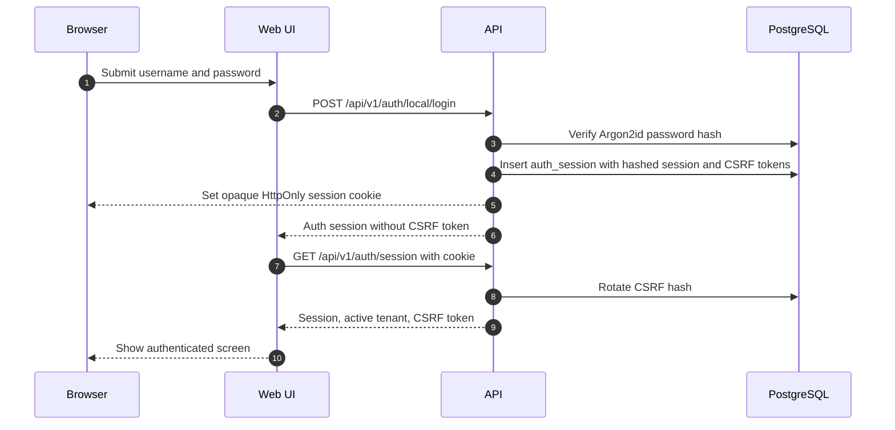
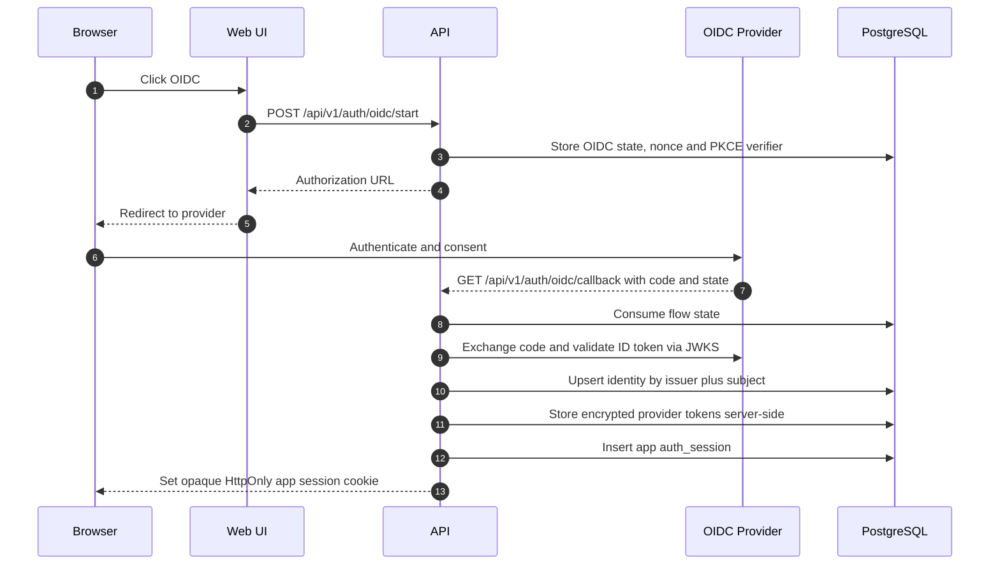
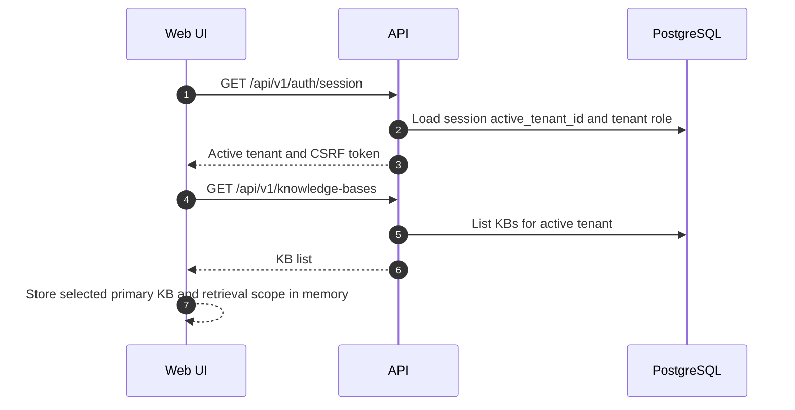
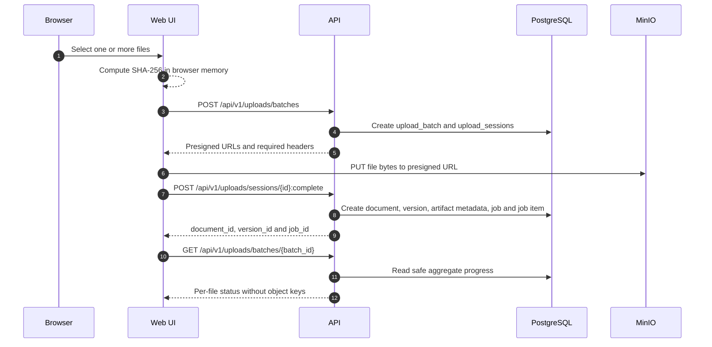
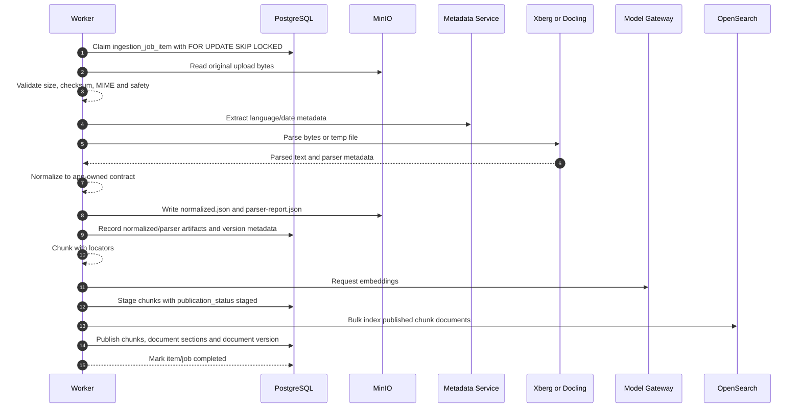
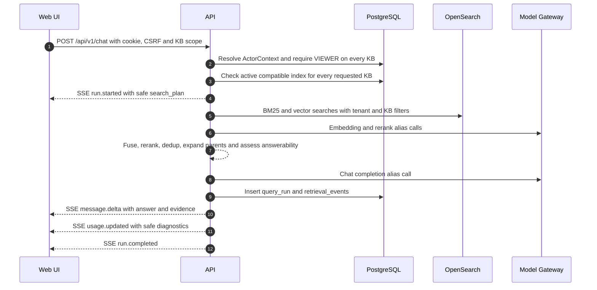
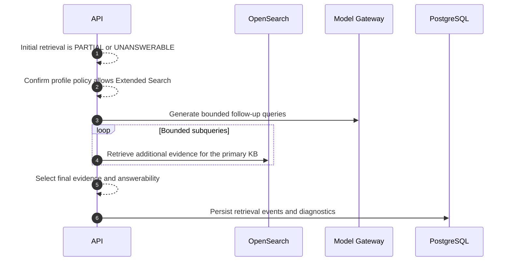
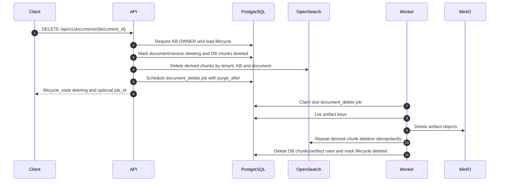
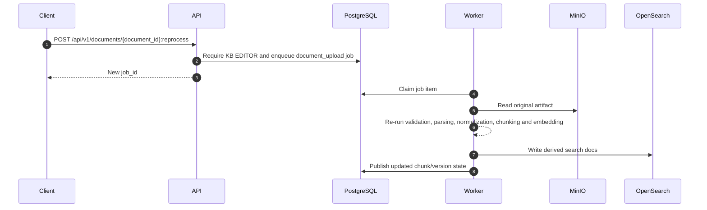
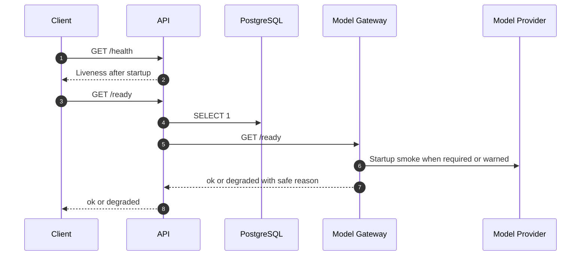

# Main Flows

These flows show durable writes, transient calls, publication points, failure
boundaries and user-visible results.

## Local Login And Application Session

Failure boundary: invalid credentials return a safe auth error; no session is
created.

## OIDC Authorization Code And PKCE

Failure boundary: issuer, audience, nonce, signature or state mismatch aborts
login before app session creation.

## Tenant And KB Selection

Failure boundary: no active tenant returns a server-side authorization error for
tenant-scoped operations.

## Document Upload

Failure boundary: unsafe filename, duplicate batch item, checksum mismatch or
missing object fails with a safe error before publication.

## Parsing, Chunking, Embedding And Publication

Publication point: chunks are queryable only after OpenSearch bulk index
succeeds and DB chunks/version are updated to published. Document sections are
written from the same published chunk set; failed or cancelled ingestion does
not publish document navigation state.

## Chat Retrieval And Generation

Failure boundary: missing role or not-ready KB fails safely before partial
retrieval. User sees stream failure only where the UI renders it.

## Extended Search

Extended Search is implemented as single-KB in this slice. Multi-KB direct
retrieval bypasses Extended Search.

## Document Delete And Deferred Purge

Failure boundary: purge failure records `purge_failed` and a safe error code so
the job can be retried.

## Reprocess And Reindex

Reindexing uses the active KB index contract. OpenSearch can be rebuilt from
PostgreSQL and MinIO; it is not the backup authority.

## Readiness And Degraded Dependencies

API `/ready` currently checks PostgreSQL and Model Gateway readiness. Redis,
MinIO and OpenSearch readiness checks were not confirmed in the API
implementation.
