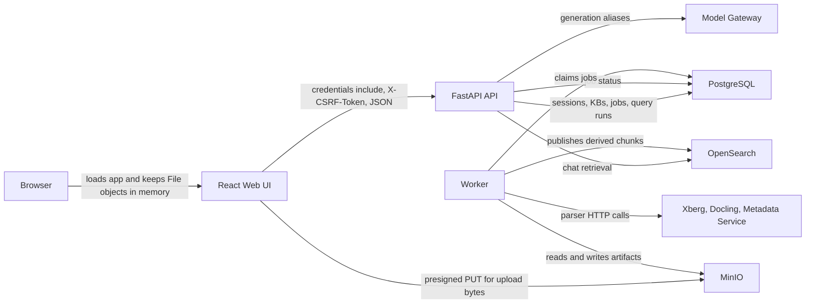

# Web Architecture

The web UI is implemented in `services/ui/src/App.tsx` as a React/Vite app
shell with client-side workspace tabs. It intentionally has no frontend
router: Chat, Search, Research and Knowledge Base panels remain mounted and
are hidden with the native `hidden` attribute so upload/research state and
drafts survive tab changes.

## Screens And Entry Points

- Header: product name, API readiness status, current session user, locale
  switcher and logout.
- Workspace tabs: Chat, Search, Research and Knowledge Base. Chat is the
  default when at least one KB is available; Knowledge Base is the default for
  an authenticated tenant with no KBs.
- Sign in: local username/password form and OIDC start button.
- Knowledge-base context bar: shared multi-KB scope picker for Chat/Search;
  Knowledge and Research keep their own single-KB selectors. The create-KB
  form is shown in the Knowledge Base workspace.
- Wikipedia Import: bounded ZIM import trigger and polled ingestion job progress.
- Upload: multi-file picker, batch upload status, per-file progress, retry for failed ingestion jobs and public metadata for the first completed document.
- Search: ordinary viewer-scoped search with metadata filters, result snippets and a document viewer open action.
- Document viewer: inline text viewer opened from search results, with document TOC, in-document search and chunk/section context.
- Deep Research: compact one-to-three-KB research workspace for starting durable runs,
  listing runs, reading progress, coverage, evidence, reflections and report,
  and pausing, resuming, cancelling or opening the latest episode in the
  retrieval debugger.
- Chat: question input, mode selector and advanced retrieval override controls;
  the profile defaults to backend `auto` and is not hardcoded in the browser.
- Answer and sources: generated answer plus cited evidence returned by chat SSE events.
- Retrieval Debugger: query-run retrieval events loaded after a chat run.

Backend admin APIs exist for users, tenants, groups and KB grants. No dedicated
frontend admin pages for those APIs were found.

## Login And Session

The browser starts by calling `GET /api/v1/auth/session` with
`credentials: "include"`. If authenticated, the UI loads
`GET /api/v1/knowledge-bases` and selects the first KB in React state.

Local login calls `POST /api/v1/auth/local/login`. OIDC login calls
`POST /api/v1/auth/oidc/start` and then redirects the browser to the returned
authorization URL. The backend callback creates the application session.

The browser receives only an opaque HttpOnly application session cookie. It
does not receive provider access or refresh tokens.

## Tenant And Knowledge-Base Selection

Active tenant is stored server-side in the app session. The UI displays
`active_tenant_id` from the session response but does not choose tenants in the
current screen. Knowledge bases are selected in browser memory:

- `selectedKnowledgeBaseId` is the single-KB selector for Knowledge/Research.
- `selectedRetrievalKnowledgeBaseIds` is the shared Chat/Search retrieval scope;
  an empty scope disables Ask/Search with an explanatory status.

The backend still enforces tenant and KB access through `ActorContext`; UI
choices are not trusted authority.

## Chat Screen

The chat form posts to `POST /api/v1/chat` with:

- `message`;
- `knowledge_base_ids`;
- `mode`;
- `stream: true`;
- `retrieval_profile`;
- retrieval override settings for BM25, dense, fusion, rerank, parent expansion, Extended Search and top K.

The client reads the SSE response using `fetch(...).body.getReader()` and a
local `parseSse` function. Browser `EventSource` is not used. The decoder
accepts CRLF/multiple `data:` lines and validates continuous sequence numbers
and exactly one terminal event.

Handled chat events in the UI:

- `message.delta`: updates answer text, evidence and query run id.
- `stage.started`, `stage.heartbeat`, `stage.completed`: update the visible
  stage, elapsed time and liveness status.
- `run.completed`, `run.failed`, `run.cancelled`: close the request with a
  safe localized message while retaining sources, query-run ID and technical
  details.

Transport retries preserve the same `client_request_id`/idempotency key;
explicit user retry creates a new logical request. Markdown is rendered by a
safe component and citation buttons open the selected evidence/document
fragment.

## Deep Research Panel

The Deep Research panel uses its own selected single KB, current backend-resolved
retrieval profile and current retrieval override controls. Starting a run calls
`POST /api/v1/research-runs`; listing/detail calls use
`GET /api/v1/research-runs` and `GET /api/v1/research-runs/{id}`.

The panel renders:

- run status and compact progress stage;
- coverage count and per-question coverage records;
- the first visible evidence memory records;
- latest operational reflection;
- final report markdown when available;
- pause/resume/cancel action buttons;
- debugger shortcut that loads the newest episode `query_run_id` through the
  existing query-run retrieval endpoint.

Research status polling is lightweight client-side polling while a selected run
is `received` or `running`; the backend remains the source of truth for
pause/resume/cancel.

The API detail includes public-safe tool-call metadata and derived-question
state, but the current panel does not render a separate tool-call ledger or
planner trace. It also does not expose the API/CLI context-policy override
controls. Raw tool queries, planner prompts, provider payloads and storage keys
are never displayed.

## Upload And Ingestion Progress

The UI accepts multiple files, computes SHA-256 with `crypto.subtle.digest`,
then calls `POST /api/v1/uploads/batches`. For each returned item, the browser:

1. uploads bytes directly to the presigned MinIO URL with `PUT`;
2. calls `POST /api/v1/uploads/sessions/{upload_session_id}:complete`;
3. polls `GET /api/v1/uploads/batches/{batch_id}`;
4. optionally calls `POST /api/v1/ingestion-jobs/{job_id}:resume` for failed items.

Batch status exposes safe per-file progress only. Object keys are not returned.

## Search And Document Viewer

Ordinary search calls `POST /api/v1/search` with selected KB ids, query, paging
and metadata filters. Results are rendered from server-provided document groups
with expandable snippets and include `chunk_id`, `document_id`,
`section_path`, safe snippet metadata and locator data. The UI opens the inline
document viewer by calling:

- `GET /api/v1/documents/{document_id}/structure` for title, source metadata, document access summary and TOC sections;
- `GET /api/v1/documents/{document_id}/context?chunk_id=...` for the precise hit plus neighboring chunks;
- `GET /api/v1/documents/{document_id}/context?section_id=...` when the user selects a TOC entry;
- `POST /api/v1/documents/{document_id}/search` for search within one active document.
KB managers can update document/source visibility from the source panel or
document viewer through the document access APIs. Group choices come from the
manager-scoped `GET /api/v1/knowledge-bases/{kb_id}/access-groups` lookup,
which omits group membership details.

The viewer renders extracted text chunks, not native PDF/Office pages. The API
continues to resolve tenant and KB authority server-side from the authenticated
actor and active document.

## Client State

State is held in React `useState` and `useMemo`. Confirmed state includes
session, KB list, selected KB ids, import job, question, retrieval settings,
answer, evidence, query run id, retrieval events, upload batch, upload items,
upload document metadata, ordinary search results, document viewer state,
research runs, selected research detail and errors.

The only persistent browser preference is the UI locale under the
`wikipediarag.locale` localStorage key. Selected files exist only as browser
`File` objects during the upload function.

## API Client Behavior

The UI uses a local `apiFetch` helper:

- prefixes paths with `VITE_API_BASE_URL` or `http://localhost:8000`;
- sends `credentials: "include"`;
- adds `X-CSRF-Token` for non-GET requests when the session response has a token.

Direct presigned MinIO `PUT` calls do not use the app API cookie or CSRF token.

## Reliability & UX Correction V2

Chat/Search call `GET /api/v1/retrieval-profiles` for the selected scope and
send no profile name when using `auto`; incompatible profiles remain disabled.
Transport retries preserve the same `client_request_id` and idempotency key,
while explicit retry creates a new logical request. The SSE decoder accepts
CRLF and multiple `data:` lines, validates continuous sequence numbers and
exactly one terminal event, and renders stage heartbeats. Markdown uses a safe
renderer; citation buttons open the corresponding evidence/document fragment.
Protocol tests and the Playwright smoke are in
`services/ui/src/App.protocol.test.ts` and `services/ui/playwright/`.

## UI States

- Loading: readiness starts as `checking`; Chat/Search immediately expose
  `aria-busy`, elapsed time and an AbortController-backed cancel action; upload
  items move through preparing, hashing, uploading, completing, queued and
  polled states.
- Empty: if no authenticated session exists, only the sign-in band is shown; if no KB exists, selectors render with no options.
- Degraded: `/ready` status is displayed in the header as returned by the API.
- Forbidden: API failures use localized safe envelopes; technical code/request ID
  details are expandable rather than raw response text.
- Failed: upload, Search and Chat preserve canonical error code, query-run ID
  and last stage; Chat keeps retrieved sources when generation fails and Stop
  produces a neutral cancelled state.

## Data The Browser Must Never Receive

- MinIO access keys or server-side object keys.
- Provider access or refresh tokens.
- Raw provider payloads or prompts.
- Parser stderr, stack traces or arbitrary parser logs.
- Cross-tenant tenant IDs, KB IDs, document IDs or query-run data outside the authenticated actor's scope.
- Secrets from `.env`, mounted secret files or smoke fixtures.

## User Scenarios

| Scenario | UI entry point | API or backend interaction | Client state | Errors |
| --- | --- | --- | --- | --- |
| Local login | Sign in form | `POST /api/v1/auth/local/login`, then `GET /api/v1/auth/session` and `GET /api/v1/knowledge-bases` | `session`, `knowledgeBases`, selected KB ids | Raw auth response text in `authError` |
| OIDC login | OIDC button | `POST /api/v1/auth/oidc/start`, browser redirect, backend callback sets app session | Browser leaves app, then session reloads on return | Raw start response text in `authError` |
| Select KB | KB toolbar | Existing loaded KB list; backend enforces chosen KB on later calls | `selectedKnowledgeBaseId`, `selectedRetrievalKnowledgeBaseIds` | Empty selector if no KBs are loaded |
| Create KB | KB create form | `POST /api/v1/knowledge-bases`, then reload list | `knowledgeBases`, `newKnowledgeBaseName` | No explicit render for failed create |
| Import Wikipedia subset | Wikipedia Import panel | `POST /api/v1/wikipedia/zim-imports`, poll `GET /api/v1/ingestion-jobs/{job_id}` | `job` | Job `error_message` displayed |
| Multi-file upload | Upload panel | `POST /api/v1/uploads/batches`, presigned MinIO `PUT`, complete sessions, poll batch | `uploadBatch`, `uploadItems`, `uploadDocument` | Upload/batch errors in item or panel |
| Retry failed ingestion | Upload item Retry button | `POST /api/v1/ingestion-jobs/{job_id}:resume`, poll batch | Item status and batch status | Response text on item |
| Ordinary search | Search form | `POST /api/v1/search` with selected KB scope and filters | grouped `searchResults`, `searchHasMore`, busy/abort state | localized safe error with technical details |
| Open document hit | Search result button | `GET /api/v1/documents/{document_id}/structure`, then context by `chunk_id` | `viewerStructure`, `viewerContext` | Response text in `viewerError` |
| Search inside document | Document viewer form | `POST /api/v1/documents/{document_id}/search` | `viewerSearchResults` | Response text in `viewerError` |
| Deep Research | Deep Research panel | `POST/GET /api/v1/research-runs`, action endpoints and latest episode debugger lookup | `researchRuns`, `researchDetail`, `researchError` | Response text in `researchError` |
| Chat | Chat form | `POST /api/v1/chat` SSE; backend calls retrieval and Model Gateway | `answer`, `evidence`, `queryRunId`, stage/heartbeat/sequence | safe terminal failure, sources and query-run ID retained |
| Retrieval debug | Debug button | `GET /api/v1/query-runs/{query_run_id}/retrieval` | `events` | Not displayed when request fails |

## Main Web Interaction

