# AS-IS: код-доказательная карта системы

**Срез репозитория:** рабочее дерево на 2026-08-13.  
**Статус отчёта:** `CONFIRMED` для утверждений с приведённым runtime-code evidence; всё, что зависит от состояния внешней среды, помечено отдельно.  
**Граница анализа:** только достижимый production/runtime код в `src/`, `services/ui/`, `compose.yaml`, `pyproject.toml`, `config/*.yaml` и SQL, исполняемый `ensure_schema()`. README, документация, комментарии и тесты использовались только как навигация и не являются evidence.

## Легенда и метод

| Маркер | Значение |
| --- | --- |
| `CONFIRMED` | Цепочка от реального entrypoint до реализации найдена в runtime-коде. |
| `PARTIALLY CONFIRMED` | Реализация и один край цепочки доказаны, но фактическое включение зависит от runtime-данных, сети либо конфигурации. |
| `NOT PROVEN` | Не следует из репозитория: состояние окружения, БД, внешнего провайдера или операционная практика. |
| `DEAD / UNREACHABLE` | Код не имеет доказанной цепочки от runtime entrypoint. |
| `TEST ONLY` | Находится только в `tests/` или вызывается лишь тестовым кодом. |

Evidence имеет формат `path:line — symbol()`. Если символ — константа, SQL-блок или router registry, имя дано без вымышленного вызова. Строки указывают на текущий срез, а не на документацию.

Для компактности таблиц сокращённые Python-пути (`db.py:…`, `auth.py:…`, `api/handlers.py:…`, `repository.py:…`) имеют неизменяемый префикс `src/wikipediarag/`; например, `api/handlers.py:2736` означает `src/wikipediarag/api/handlers.py:2736`. Полные пути используются в primary evidence и caller/callee chains.

## 1. Executive System Map

**CONFIRMED.** Это многотенантная RAG-система с React UI и FastAPI. Аутентифицированный пользователь выбирает tenant, получает эффективную роль в knowledge base (KB) по tenant-ролью, прямым и групповым grants, загружает или синхронизирует документы. API сохраняет команду в PostgreSQL и/или объект в MinIO; worker обрабатывает durable DB jobs. Нормализованные документы превращаются в canonical PostgreSQL chunks с embeddings; отдельный worker-проектор реплицирует их в OpenSearch. Поиск использует BM25 + dense retrieval, RRF, rerank и post-processing, но повторно подтверждает кандидатов и ACL в PostgreSQL. Chat отдаёт SSE и при нехватке evidence может запустить bounded Extended Search. Deep Research — отдельный durable job pipeline с планом, эпизодами, evidence/claims и отчётом. Все бизнес-вызовы моделей идут через Model Gateway; его alias может резолвиться из активной immutable DB revision либо YAML registry.

Primary chain: `src/wikipediarag/api/app.py:50 — create_app()` → router → `src/wikipediarag/api/handlers.py` → repository/adapter; worker: `src/wikipediarag/worker.py:382 — run_worker()` → `src/wikipediarag/ingestion.py:1999 — claim_and_process_once()` → processor.  
Статус фактической доступности PostgreSQL, MinIO, OpenSearch, Redis, model provider, Kiwix и parser containers: `NOT PROVEN`: код их вызывает, но snapshot не доказывает запущенные сервисы и их содержимое.

## 2. Master Architecture / Runtime Topology

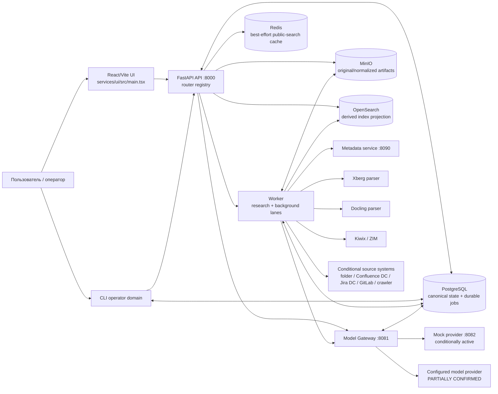

**CONFIRMED — Compose topology.** `compose.yaml` defines `postgres`, `redis`, `minio`, `opensearch`, `otel-collector`, `kiwix`, `xberg`, `docling`, `metadata-service`, `mock-provider`, `model-gateway`, `api`, `worker`, `ui`; Python service commands are the corresponding `python -m wikipediarag.*` modules. Evidence: `compose.yaml:2 — postgres`, `compose.yaml:138 — metadata-service`, `compose.yaml:161 — model-gateway`, `compose.yaml:187 — api`, `compose.yaml:282 — worker`, `compose.yaml:333 — ui`.

**PARTIALLY CONFIRMED — dependencies are runtime wiring, not readiness proof.** Compose `depends_on` supplies startup ordering, while API `/ready` explicitly probes selected dependencies and worker heartbeats. It does not prove that a deployed process uses Compose or that every dependency is healthy. Evidence: `compose.yaml:181 — model-gateway.depends_on`, `compose.yaml:270 — api.depends_on`, `compose.yaml:323 — worker.depends_on`; `src/wikipediarag/api/handlers.py:318 — ready()`.

### 2.1 Реальные entrypoints и reachability

| Component / entrypoint | Reachability | What it starts | Primary evidence | Supporting chain |
| --- | --- | --- | --- | --- |
| `wikipediarag-api` | `ACTIVE` | Uvicorn API on `0.0.0.0:8000` | `pyproject.toml:37 — [project.scripts]`; `src/wikipediarag/api/app.py:77 — main()` | `src/wikipediarag/api_app.py:1 — app` re-export → `create_app()` |
| API FastAPI app | `ACTIVE` | 14 router modules, error handlers, startup/shutdown | `src/wikipediarag/api/app.py:32 — ROUTERS`; `:50 — create_app()` | `:67 — handlers.startup`; `:68 — close_http_client` |
| `wikipediarag-worker` | `ACTIVE` | one research lane and one background lane, each with configured concurrency | `pyproject.toml:41 — [project.scripts]`; `src/wikipediarag/worker.py:382 — run_worker()` | `:39 — RESEARCH_KINDS`; `:40 — BACKGROUND_KINDS`; `:333 — _run_lane()` |
| `wikipediarag-gateway` | `ACTIVE` | Model Gateway FastAPI | `pyproject.toml:38 — [project.scripts]`; `src/wikipediarag/gateway_app.py:1281 — main()` | routes at `:237`, `:242`, `:304`, `:361`, `:370`, `:376`, `:382` |
| `wikipediarag-metadata` | `CONDITIONALLY ACTIVE` | local/remote metadata extraction HTTP service | `pyproject.toml:39 — [project.scripts]`; `compose.yaml:142 — metadata-service.command` | ingestion calls it at `src/wikipediarag/document_ingestion.py:203 — extract_metadata()` |
| `wikipediarag-mock-provider` | `CONDITIONALLY ACTIVE` | deterministic provider-shaped adapter | `pyproject.toml:40 — [project.scripts]`; `compose.yaml:152 — mock-provider.command` | Gateway may route a configured mock alias; provider choice is config/data dependent |
| `wikipediarag` CLI | `ACTIVE` operator entrypoint | imports, smoke, evaluation, gates and verification commands | `pyproject.toml:42 — [project.scripts]`; `src/wikipediarag/cli.py:182 — build_parser()`; `:538 — main()` | command dispatch calls API and/or DB workflows |
| React UI | `ACTIVE` when UI service is started | one client application | `services/ui/src/main.tsx:6 — ReactDOM.createRoot()` | `services/ui/src/App.tsx:1210 — apiFetch()` calls API |
| `python -m` modules | `ACTIVE` in Compose | API, worker, gateway, metadata, mock provider | `compose.yaml:142 — command`, `:152`, `:165`, `:191`, `:286` | each module has `main()` / `if __name__ == "__main__"` |
| source connectors | `CONDITIONALLY ACTIVE` | connector selected by persisted source `kind` | `src/wikipediarag/source_connectors.py:97 — connector_for_kind()` | source sync worker invokes selected connector |
| test modules and fixtures | `TEST ONLY` | testing/navigation only | `pyproject.toml:69 — testpaths = ["tests"]` | no test path is included by router/worker registry |

### 2.2 API lifecycle and readiness

**CONFIRMED.** Startup executes schema creation/upgrade, bootstrap-admin attempt, and stale chat-run recovery; shutdown closes the shared model HTTP client. The global CORS policy permits credentials only from `http://localhost:5173`. Evidence: `src/wikipediarag/api/app.py:53 — create_app()`; `src/wikipediarag/api/app.py:67 — create_app()`; `src/wikipediarag/api/handlers.py:298 — startup()`; `src/wikipediarag/api/handlers.py:4401 — recover_stale_chat_query_runs()`.

**CONFIRMED.** `/ready` checks DB, fresh worker heartbeats for both `deep_research` and a `document_upload` lane, search-projection health, Model Gateway, OpenSearch, MinIO, and conditionally parser services. It does not make Redis a readiness prerequisite. Evidence: `src/wikipediarag/api/handlers.py:318 — ready()`; worker heartbeat write: `src/wikipediarag/worker.py:343 — _run_lane.heartbeat()`.

## 3. Externally reachable API catalogue

All rows below are **CONFIRMED reachable**, because `ROUTERS` includes the module and the module registers the route. Every handler that calls `_require_actor()` also enforces CSRF on `POST`, `PATCH`, and `DELETE` (unless `auth_disabled` or test auth); model configuration `PUT` adds an explicit CSRF check. Evidence: `src/wikipediarag/api/app.py:32 — ROUTERS`; `src/wikipediarag/api/handlers.py:4409 — _require_actor()`; `src/wikipediarag/api/handlers.py:5104 — _require_csrf()`; `src/wikipediarag/api/routers/model_control.py:89 — _admin()`.

### 3.1 Health, identity and platform administration

| Method / path | Handler | Auth / authorization | Input → persistence / result | Evidence |
| --- | --- | --- | --- | --- |
| `GET /health` | `health()` | none | fixed health response | `api/routers/health.py:9 — router.add_api_route`; `api/handlers.py:313 — health()` |
| `GET /ready` | `ready()` | none | dependency/worker/projection readiness report | `api/routers/health.py:10 — router.add_api_route`; `api/handlers.py:318 — ready()` |
| `POST /api/v1/auth/local/login` | `local_login()` | local/hybrid auth mode | credentials → Argon2 check, `auth_sessions`, cookie and audit | `api/routers/auth.py:9 — router.add_api_route`; `api/handlers.py:404 — local_login()`; `auth_service.py:207 — authenticate_local_user()` |
| `POST /api/v1/auth/oidc/start`; `GET .../callback` | `oidc_start()` / `oidc_callback()` | requires configured OIDC path | flow state then callback/session | `api/routers/auth.py:10`, `:11`; `api/handlers.py:451 — oidc_start()`; `:461 — oidc_callback()` |
| `POST /api/v1/auth/local/password` | `change_password()` | actor + CSRF | password update | `api/routers/auth.py:12`; `api/handlers.py:501 — change_password()` |
| `POST /api/v1/auth/logout`; `GET /api/v1/auth/session`; `POST /api/v1/auth/session/tenant` | `logout()` / `get_session()` / `select_session_tenant()` | actor; mutators CSRF | revoke/rotate session or select membership tenant | `api/routers/auth.py:13-15`; `api/handlers.py:528`, `:555`, `:601` |
| `GET|POST /api/v1/admin/users`; `PATCH /api/v1/admin/users/{id}` | `admin_*user` | platform admin | user list/create/patch | `api/routers/admin.py:9-11`; `api/handlers.py:641`, `:658`, `:693` |
| `GET|POST /api/v1/admin/tenants`; `PATCH /api/v1/admin/tenants/{id}` | `admin_*tenant` | platform admin | tenant list/create/patch | `api/routers/admin.py:12-14`; `api/handlers.py:725`, `:734`, `:756` |

### 3.2 Tenant, KB, groups, grants and sources

| Method / path | Handler | Required effective role | Resulting business action | Evidence |
| --- | --- | --- | --- | --- |
| `GET|POST /api/v1/groups`; `PATCH|DELETE /api/v1/groups/{id}` | group handlers | active tenant; mutations tenant admin | local/OIDC group read and local membership administration | `api/routers/knowledge_bases.py:9-12`; `api/handlers.py:779`, `:822`, `:863`, `:895` |
| `GET /api/v1/knowledge-bases`; `GET /api/v1/retrieval-profiles` | list/profile handlers | actor + tenant | visible KBs and compatible retrieval profiles | `api/routers/knowledge_bases.py:13-14`; `api/handlers.py:918`, `:926` |
| `POST /api/v1/knowledge-bases` | `create_knowledge_base()` | tenant admin | KB plus ownership/grant data | `api/routers/knowledge_bases.py:15`; `api/handlers.py:1010 — create_knowledge_base()` |
| `GET|PATCH|DELETE /api/v1/knowledge-bases/{id}` | KB handlers | viewer / manager / owner | inspect, change, or delete KB | `api/routers/knowledge_bases.py:17-19`; `api/handlers.py:1054`, `:1066`, `:1096` |
| `GET /.../{kb}/access-groups` | `list_access_groups()` | viewer | groups relevant to KB access | `api/routers/knowledge_bases.py:16`; `api/handlers.py:802` |
| `GET|POST /.../{kb}/grants`; `PATCH|DELETE /.../{kb}/grants/{grant}` | grant handlers | viewer list; manager grants viewer/editor; owner manager/ownership operations | read/change direct or group KB grants and projection metadata | `api/routers/knowledge_bases.py:20-23`; `api/handlers.py:1214`, `:1234`, `:1289`, `:1351` |
| `GET|POST /.../{kb}/sources`; `GET|PATCH /.../{kb}/sources/{source}` | source handlers | viewer read; manager source config | source CRUD, encrypted credential write path | `api/routers/sources.py:9-12`; `api/handlers.py:1378`, `:1389`, `:1428`, `:1510` |
| `PATCH /.../{source}/access`; `POST ...:healthcheck`; `POST ...:sync`; `GET /api/v1/source-sync-runs/{id}` | source access/sync handlers | manager for changes/control; viewer-like protected reads | change default document ACL, probe connector, enqueue sync, read sync run | `api/routers/sources.py:13-24`; `api/handlers.py:1440`, `:1552`, `:1580`, `:1642` |

### 3.3 Ingestion, uploads and documents

| Method / path | Handler | Required effective role | Input → result / async effect | Evidence |
| --- | --- | --- | --- | --- |
| `POST /api/v1/wikipedia/imports`; `POST /api/v1/wikipedia/zim-imports` | import handlers | editor on resolved KB | validated configured file name → durable ingestion job | `api/routers/ingestion_jobs.py:9-10`; `api/handlers.py:1661`, `:1720` |
| `GET /api/v1/ingestion-jobs/{id}`; `GET .../events` | job/status stream | authenticated active tenant; tenant filter only | job row / SSE polling once per second to terminal state | `api/routers/ingestion_jobs.py:11-12`; `api/handlers.py:1788`, `:1803` |
| `POST .../{id}:cancel`; `POST .../{id}:resume` | job controls | editor on job KB | request cancel/resume flag/state | `api/routers/ingestion_jobs.py:13-14`; `api/handlers.py:1819`, `:1838` |
| `POST /api/v1/knowledge-bases/{kb}/documents` | `upload_document_multipart()` | editor | multipart bytes → MinIO original object + upload/doc/job records | `api/routers/uploads.py:9`; `api/handlers.py:1973 — upload_document_multipart()` |
| `POST /api/v1/uploads/sessions`; `POST /api/v1/uploads/batches`; `GET /api/v1/uploads/batches/{id}` | upload session/batch handlers | editor for create; actor/tenant for batch view | presigned PUT sessions and batch status | `api/routers/uploads.py:10-12`; `api/handlers.py:2096`, `:2181`, `:2306` |
| `POST /api/v1/uploads/sessions/{id}:complete` | `complete_upload_session_endpoint()` | editor/tenant-bound session | `head_object` verifies uploaded object then creates durable document ingestion | `api/routers/uploads.py:13-17`; `api/handlers.py:2325` |
| `GET /api/v1/documents/{id}`; `GET .../versions`; `GET .../structure`; `GET .../context`; `POST .../search` | document read handlers | viewer plus document ACL | current document/version/sections/context/local search | `api/routers/documents.py:9-14`; `api/handlers.py:2434`, `:2443`, `:2504`, `:2534`, `:2591` |
| `PATCH /api/v1/documents/{id}/access` | `patch_document_access()` | manager | validated in-tenant principals → canonical metadata and projection event | `api/routers/documents.py:11`; `api/handlers.py:2453`; `api/handlers.py:4511 — _validate_document_access_principals()` |
| `DELETE /api/v1/documents/{id}`; `POST ...:reprocess` | delete/reprocess handlers | owner / editor | soft delete + deferred purge job + immediate index deletion; or idempotent reprocess job | `api/routers/documents.py:15-16`; `api/handlers.py:2619`, `:2681` |

### 3.4 Retrieval, chat, query records and research

| Method / path | Handler | Required effective role | Input → result / persistence | Evidence |
| --- | --- | --- | --- | --- |
| `POST /api/v1/search` | `search()` | viewer in every requested KB | validated filters + current ACL → public retrieval response/cache | `api/routers/search.py:10`; `api/handlers.py:2736`; `search_service.py:55 — run_public_search()` |
| `POST /api/v1/search:debug` | `run_debug_search()` | editor in every requested KB | diagnostic retrieval + persisted query run/events | `api/routers/search.py:11`; `api/handlers.py:4225` |
| `POST /api/v1/chat` | `stream_chat_response()` | viewer in every requested KB | creates/replays query run, streams SSE retrieval/generation events | `api/routers/chat.py:9`; `api/handlers.py:2785` |
| `GET /api/v1/query-runs/{id}/retrieval`; `POST .../feedback`; `POST .../evaluation` | query-run handlers | query-run visibility policy | read retrieval events or persist feedback/evaluation | `api/routers/query_runs.py:9-11`; `api/handlers.py:3570`, `:3589`, `:3622` |
| `GET|POST /api/v1/research-plans`; `GET|PATCH /api/v1/research-plans/{id}`; `POST ...:approve` | plan handlers | creator+viewer or editor depending action | draft plan, scoped KBs (max three), approval creates run/job | `api/routers/research_plans.py:9-20`; `api/handlers.py:3719`, `:3792`, `:3814`, `:3888` |
| `GET|POST /api/v1/research-runs`; `GET /api/v1/research-runs/{id}`; `GET .../events`; `POST ...:pause|resume|cancel` | run handlers | creator+viewer or editor | durable research run/job, safe ACL-trimmed detail, lifecycle controls | `api/routers/research_runs.py:9-15`; `api/handlers.py:3953`, `:4117`, `:4158`, `:4172`, `:4189`, `:4210` |

### 3.5 Model-control plane

**CONFIRMED.** The following connected admin routes require a platform admin; `_require_actor()` supplies CSRF for mutating `POST/PATCH`, and `_admin()` adds it for the `PUT` draft endpoint. They manage DB model connections, credentials, models, immutable revisions and stage bindings. Evidence: `src/wikipediarag/api/routers/model_control.py:89 — _admin()`; routes `:123-697`; router inclusion `src/wikipediarag/api/app.py:36 — ROUTERS`.

| Endpoints | Handler family / effect | Important guard |
| --- | --- | --- |
| `GET|POST /api/v1/admin/model-connections`; `PATCH /.../{id}`; `POST .../{id}/test`; `POST .../{id}/discover` | list/create/optimistically patch/probe/discover model connections | URL is HTTP(S), no embedded credentials, optional host allowlist, blocks selected metadata hosts; safe headers may not contain secret/token/password keys | `api/routers/model_control.py:60 — _safe_url()`; `:130 — admin_create_model_connection()`; `:167 — admin_patch_model_connection()` |
| `GET|POST /api/v1/admin/models`; `PATCH /.../{id}`; `POST .../{id}/test`; `GET /api/v1/admin/model-stages` | DB model catalog and per-model probe | platform admin + Pydantic validation | `api/routers/model_control.py:334 — admin_list_models()` through `:421 — admin_model_stages()` |
| `GET /api/v1/admin/model-configuration`; `GET .../export`; `PUT .../draft`; `POST .../draft/validate`; `POST .../draft/activate`; `POST .../revisions/{id}/restore-to-draft` | inspect/export/save/validate/activate/restore immutable configuration revision | validation rejects missing stage alias/contracts, failed canary, bad parameter policy and incompatible active embedding index | `api/routers/model_control.py:435`, `:448`, `:488`, `:539 — _validate_snapshot()`, `:626`, `:670`, `:697` |

## 4. Домены, сущности и source of truth

### 4.1 ER / data diagram

```mermaid
erDiagram
  TENANTS ||--o{ TENANT_MEMBERSHIPS : has
  USERS ||--o{ TENANT_MEMBERSHIPS : belongs_to
  USERS ||--o{ AUTH_IDENTITIES : identifies
  USERS ||--o{ AUTH_SESSIONS : opens
  TENANTS ||--o{ GROUPS : owns
  GROUPS ||--o{ GROUP_MEMBERSHIPS : contains
  USERS ||--o{ GROUP_MEMBERSHIPS : member
  TENANTS ||--o{ KNOWLEDGE_BASES : owns
  KNOWLEDGE_BASES ||--o{ KNOWLEDGE_BASE_GRANTS : grants
  KNOWLEDGE_BASES ||--o{ INDEX_VERSIONS : indexes
  KNOWLEDGE_BASES ||--o{ KNOWLEDGE_SOURCES : configures
  KNOWLEDGE_BASES ||--o{ DOCUMENTS : contains
  KNOWLEDGE_SOURCES ||--o{ SOURCE_SYNC_RUNS : syncs
  KNOWLEDGE_SOURCES ||--o{ SOURCE_DOCUMENT_STATES : tracks
  DOCUMENTS ||--o{ DOCUMENT_VERSIONS : versions
  DOCUMENTS ||--o{ CHUNKS : canonical_chunks
  DOCUMENT_VERSIONS ||--o{ DOCUMENT_ARTIFACTS : artifacts
  DOCUMENT_VERSIONS ||--o{ INGESTION_JOB_ITEMS : ingests
  UPLOAD_BATCHES ||--o{ UPLOAD_SESSIONS : groups
  UPLOAD_SESSIONS ||--o{ INGESTION_JOB_ITEMS : supplies
  INGESTION_JOBS ||--o{ INGESTION_JOB_ITEMS : contains
  KNOWLEDGE_BASES ||--o{ QUERY_RUNS : queried
  QUERY_RUNS ||--o{ RETRIEVAL_EVENTS : emits
  RESEARCH_PLANS ||--o| RESEARCH_RUNS : approved_to
  RESEARCH_RUNS ||--o{ RESEARCH_EPISODES : executes
  RESEARCH_RUNS ||--o{ RESEARCH_QUESTIONS : answers
  RESEARCH_RUNS ||--o{ RESEARCH_EVIDENCE : records
  RESEARCH_RUNS ||--o{ RESEARCH_CLAIMS : derives
  MODEL_PROVIDER_CONNECTIONS ||--o{ MODEL_CATALOG_MODELS : hosts
  MODEL_CONFIGURATION_REVISIONS ||--o{ MODEL_STAGE_BINDINGS : binds
```

**CONFIRMED.** The SQL schema is executable through the API/worker startup path, including additive migrations: `src/wikipediarag/db.py:1176 — ensure_schema()` uses a transaction, advisory lock and schema migration records. Initial tables and later `ALTER TABLE` statements jointly define current columns; therefore this report gives the final observable contract, not only the first `CREATE TABLE`. Evidence: `src/wikipediarag/db.py:19 — SCHEMA_SQL`; `:852 — ADDITIVE_MIGRATIONS`; `:1176 — ensure_schema()`.

### 4.2 Entity catalogue

| Domain / entity | Identity, tenancy and ownership | Required state / constraints / defaults | Source of truth and lifecycle | Evidence |
| --- | --- | --- | --- | --- |
| Tenant | UUID `tenants.id`, globally unique `slug` | name required; timestamps default `now()` | PostgreSQL authority | `src/wikipediarag/db.py:24 — tenants` |
| User / membership | user UUID; membership PK `(tenant_id,user_id)` | platform role `USER`/`PLATFORM_ADMIN`; tenant role finally `MEMBER`/`TENANT_ADMIN`; disabled and password-change flags default false | PostgreSQL authority; membership determines active-tenant role | `db.py:32 — users`; `:55 — tenant_memberships`; `auth.py:103 — require_active_tenant()` |
| Auth identity / session / OIDC flow | identity unique `(issuer,subject)`; opaque session UUID | session stores only SHA-256 token/CSRF hashes; expiry, idle expiry, revocation, method local/oidc/test | PostgreSQL authority; hard removal is not implemented by shown code; session becomes invalid on expiry/revocation | `db.py:93 — auth_identities`; `:109 — auth_sessions`; `:129 — auth_oidc_flows`; `auth_service.py:238 — create_session()` |
| Group / membership | group tenant-owned; group member references global user | local/OIDC type; name/external_id unique within tenant and type | PostgreSQL authority; local membership is replaceable, OIDC group membership depends on OIDC sync path | `db.py:140 — groups`; `:154 — group_memberships`; `api/handlers.py:4530 — _replace_local_group_members()` |
| Knowledge base / KB grant | KB tenant-owned; grant `(tenant,kb,subject type,id)` unique | `active_index` defaults `wiki-chunks-read`; roles `VIEWER/EDITOR/MANAGER/OWNER` | PostgreSQL authority for ownership and access; active index is an index-version pointer | `db.py:83 — knowledge_bases`; `:164 — knowledge_base_grants`; `auth.py:123 — effective_knowledge_base_role()` |
| Model alias / connection / catalog / revision | aliases and DB connections have own IDs; revision UUID | operation chat/embedding/rerank; connection row-version; model state pending/active/retired; revision draft/validated/active/archived | PostgreSQL authority if an active revision exists; otherwise Gateway falls back to YAML registry | `db.py:70 — model_aliases`; `db.py:929-1022 — additive migration 005`; `gateway_app.py:536 — _resolve_alias_payload()` |
| Index version | text `index_versions.id`, tenant + KB scoped | source/profile/embed alias/dim/read-write-physical aliases; status defaults active | PostgreSQL is contract authority; OpenSearch is derived projection | `db.py:197 — index_versions`; `worker.py:87 — _repair_search_projection_document()` |
| Document | text global PK, still carries tenant + KB + optional source doc ID | `lifecycle_state` starts active; later deletion metadata includes deleted time/actor/reason/purge deadline | PostgreSQL canonical document record; deletion is soft first | `db.py:217 — documents`; `db.py:231-237 — documents lifecycle columns`; `repository.py:1870 — soft_delete_document()` |
| Document version / artifact | version text PK → document; artifact UUID → version | version ordinal default 1; status received → validating/parsing/normalized/indexing/published or failed/cancelled; artifacts only original/normalized/parser_report | PostgreSQL metadata authority; object bytes live in MinIO object key | `db.py:359 — document_versions`; `:394 — document_artifacts`; `ingestion.py:968 — _process_document_upload_item()` |
| Upload batch / session | UUIDs tenant + KB scoped; session optionally belongs to batch | batch received/running/completed/failed/cancelled; session created/uploaded/completed/expired/failed/cancelled; parser profile `standard`; expiry mandatory | PostgreSQL session metadata, MinIO direct-upload bytes | `db.py:324 — upload_batches`; `:338 — upload_sessions`; `storage.py:140 — create_presigned_put_url()` |
| Ingestion job / item | job UUID tenant + KB; item → job/document/version/session | job and item states received/running/completed/failed/cancelled; item attempts/progress/checkpoint and later retry schedule; cancel flag | PostgreSQL durable queue/source of truth | `db.py:410 — ingestion_jobs`; `:429 — ingestion_job_items`; `repository.py:238 — claim_next_job()` |
| Knowledge source / sync / source document state | source UUID tenant + KB; state PK `(tenant,kb,source,external_id)` | source active/disabled/failed; sync received/running/completed/failed/cancelled; source document active/deleted | PostgreSQL source metadata/cursor/state; external connector only input | `db.py:253 — knowledge_sources`; `:277 — source_sync_runs`; `:299 — source_document_states` |
| Chunk / section | chunk text PK, tenant + KB + document; section tied to document/version | vectors JSONB, metadata, `publication_status` later default published | PostgreSQL canonical current retrieval chunks; OpenSearch derived copy | `db.py:455 — chunks`; `db.py:477-484 — chunks extensions`; `repository.py:2297 — upsert_chunk()` |
| Query run / retrieval event / agent run | query UUID tenant + KB; event references query | query state received/running/completed/failed/cancelled; event sequence has DB sequence | PostgreSQL audit/replay/diagnostic record | `db.py:512 — query_runs`; `:536 — retrieval_events`; `:552 — agent_runs` |
| Research plan / run / scope | plan/run UUID tenant + primary KB + run scope rows | plan draft/approved/archived; run received/running/paused/completed/failed/cancelled; pause/cancel flags | PostgreSQL durable orchestration authority; report stored JSONB | `db.py:566 — research_plans`; `:589 — research_runs`; `repository.py:4424 — create_research_plan()`; `:4579 — create_research_run()` |
| Research episode/question/tool/evidence/claim | all scoped to research run, question/episode where applicable | questions enforce execution-state/outcome consistency; tool names/allowlist and statuses constrained; evidence/claim support states constrained | PostgreSQL research record; returned view is ACL-trimmed at read time | `db.py:633 — research_episodes`; `:652 — research_questions`; `:680-857 — research detail tables`; `api/handlers.py:5046 — _research_detail()` |
| Search projection event/reconciliation | event UUID and document reconciliation keyed by document | event received/running/completed/failed; reconciliation due/running/ok/degraded, lease/retry fields | PostgreSQL durable repair intent; OpenSearch only derived target | `db.py:1053-1123 — additive migration 007-009`; `worker.py:216 — _process_search_projection_once()` |

### 4.3 Deletion, projections and transaction boundary

**CONFIRMED.** `connect()` starts an SQLAlchemy transaction; `ensure_schema()` explicitly runs migration work under `engine.begin()`. No cross-system transaction spans PostgreSQL, MinIO, OpenSearch, model providers or connectors. Evidence: `src/wikipediarag/db.py:1153 — connect()`; `:1176 — ensure_schema()`; external calls in `src/wikipediarag/storage.py:64 — put_bytes()`, `src/wikipediarag/search_index.py:118 — bulk_index_chunks()`.

**CONFIRMED.** Document deletion is soft/delete-requested first: it writes document lifecycle + deletion job in one DB scope, then calls OpenSearch deletion after that scope. Physical artifact purge happens later when `document_delete` job becomes due. Evidence: `src/wikipediarag/api/handlers.py:2619 — delete_document()`; `:2640 — soft_delete_document`; `:2649 — create_document_deletion_job`; `src/wikipediarag/repository.py:238 — claim_next_job()`.

**PARTIALLY CONFIRMED.** The exact database history determines whether every additive migration has already run, but `ensure_schema()` has code to apply them. The schema/code does not prove migration success in a real deployment. Evidence: `src/wikipediarag/db.py:1176 — ensure_schema()`.

## 5. Major business flows

### F-01. Local/OIDC authentication, session and tenant selection

**CONFIRMED.**

1. Actor submits local credentials, or starts OIDC.
2. Local path is allowed only in `local` or `hybrid` mode. It loads user by username, requires `$argon2id$` hash validity and non-disabled user.
3. API chooses default active tenant from memberships (unless platform admin default logic applies), creates a random opaque session + independent CSRF token, stores hashes only, writes `Set-Cookie`, and audits login.
4. Later `_load_actor()` resolves the cookie against unrevoked, unexpired and idle-valid session; `_require_actor()` gates every protected endpoint. It requires CSRF for POST/PATCH/DELETE and blocks most actions when password change is required.
5. Tenant-selection validates the tenant/membership and rotates CSRF; logout revokes session and deletes cookie. OIDC flow uses durable state/nonce/verifier records, but a successful identity-provider exchange is `PARTIALLY CONFIRMED` because it needs external OIDC responses.

Caller/callee: `api/routers/auth.py:9-15 — router.add_api_route` → `api/handlers.py:404 — local_login()` / `:451 — oidc_start()` → `auth_service.py:207 — authenticate_local_user()` / `:238 — create_session()` → `db.py:109 — auth_sessions`.

```mermaid
sequenceDiagram
  participant U as Actor/UI
  participant A as API
  participant DB as PostgreSQL
  U->>A: POST local login or OIDC start
  A->>DB: load identity/user or save OIDC flow
  alt local accepted
    A->>DB: insert hashed session + CSRF token
    A-->>U: Set-Cookie HttpOnly session; session response
  else OIDC
    A-->>U: authorization URL
    U->>A: callback(code,state)
    A->>DB: consume flow/upsert identity/session
    A-->>U: Set-Cookie
  end
  U->>A: protected request + X-CSRF-Token when mutating
  A->>DB: validate session, tenant, CSRF
```

### F-02. Tenant roles, groups, KB access and document ACL

**CONFIRMED.** Effective KB role is maximum of direct user grant, local/OIDC group grants and tenant-admin baseline; platform admin becomes owner and tenant admin becomes at least manager. Viewer can query/citations/metadata; editor adds upload/reprocess/debug; manager adds source/grant viewer/editor; owner adds manager/ownership/delete. Evidence: `src/wikipediarag/auth.py:61 — KB_ROLE_RANK`; `:68 — KB_ROLE_CAPABILITIES`; `:123 — effective_knowledge_base_role()`.

Document ACL is separate from KB role. Policies are `kb`, `tenant`, `restricted`. Manager-or-higher, tenant admin and platform admin bypass document ACL. `restricted` requires listed user or an intersecting group. Untrusted source metadata is normalized to KB policy, preventing connector metadata from asserting a restrictive/other policy on its own. Evidence: `src/wikipediarag/document_access.py:29 — document_access_bypass()`; `:42 — normalize_document_access()`; `:58 — normalize_document_metadata_access()`; `:67 — is_document_visible()`.

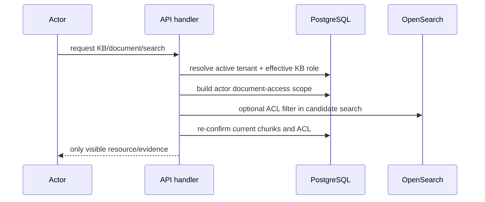

### F-03. Upload → ingest → publish → project

**CONFIRMED.** This is asynchronous after byte placement; no large-file parse is performed in the workerless part of the HTTP request.

1. Editor submits multipart bytes or creates presigned session/batch. Multipart writes original bytes to MinIO, then persists upload session, document/version/artifact and `document_upload` job/item. Presigned completion checks the MinIO object before creating the ingestion records.
2. Background worker claims DB job under a lease and claims due job items with `FOR UPDATE SKIP LOCKED`.
3. Item retrieves original bytes and validates empty/size/checksum, archives/macros/extensions/signature, remote HTML resources and JSON nesting.
4. It selects structured/text local parser or Xberg then Docling fallback after quality gate. Metadata service failure falls back to local extraction only when parsers are not required.
5. It persists normalized and parser-report objects/artifact rows, chunks by 220 words, requests embeddings through Model Gateway, writes staged then published canonical chunks and sections, marks version published, enqueues a projection event and completes the item.
6. Projection worker replaces/repairs derived OpenSearch document from current PostgreSQL chunks; it does not make OpenSearch authoritative.

Caller/callee: `api/routers/uploads.py:9-17 — router.add_api_route` → `api/handlers.py:1973 — upload_document_multipart()` / `:2325 — complete_upload_session_endpoint()` → `repository.py:607 — create_document_upload_records()` → `worker.py:363 — _run_lane.runner()` → `ingestion.py:1999 — claim_and_process_once()` → `ingestion.py:845 — process_document_upload()` → `_process_document_upload_item` at `ingestion.py:873` → `document_ingestion.py:155 — validate_upload_bytes()` and `:281 — normalize_uploaded_document()` → `worker.py:216 — _process_search_projection_once()`.

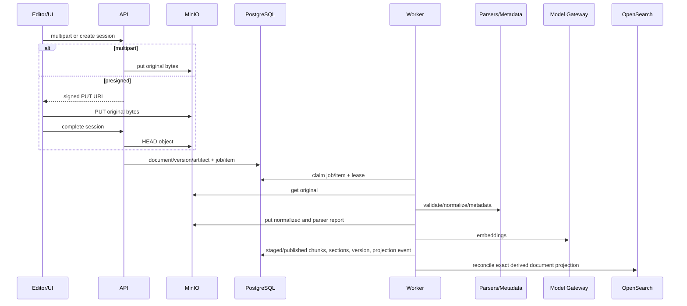

### F-04. Wikipedia XML/ZIM import

**CONFIRMED.** Editor imports only by API command that enqueues `wikipedia_xml` or `wikipedia_zim`; worker’s background lane dispatches these kinds. The supplied import filename is validated by the handler against configured paths/names rather than accepted as arbitrary server path. Exact corpus availability and successful parsing are `NOT PROVEN`. Evidence: `src/wikipediarag/api/handlers.py:1661 — create_wikipedia_import()`; `:1720 — create_zim_import()`; `src/wikipediarag/worker.py:40 — BACKGROUND_KINDS`; `src/wikipediarag/ingestion.py:102 — process_wiki_import()`; `:299 — process_zim_import()`.

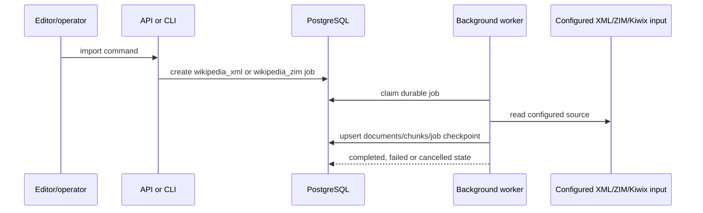

### F-05. Source connector → sync → document updates/tombstones

**CONFIRMED.** Manager creates/configures source; a sync API command or worker scheduler creates durable `source_sync` job. `connector_for_kind()` selects only eight kinds: Confluence DC, Jira DC, GitLab self-managed, Kiwix ZIM, local folder, internal crawler, Sunduk mock, DocSmart mock. Remote connectors require `http(s)` local-network base URL and TLS verification; local-folder traversal resolves files and keeps only children of configured root, with default max 1000 files.

The worker records a source-sync run, compares external IDs/content version/hash to source-document state, queues/reuses document ingest, updates ACL metadata and marks full-sync missing external IDs as tombstones. Exact external delivery and connector responses are `PARTIALLY CONFIRMED`.

Evidence chain: `api/handlers.py:1580 — sync_source()` → `repository.py:145 — create_source_sync_job()` → `worker.py:40 — BACKGROUND_KINDS` → `ingestion.py:1407 — process_source_sync()` → `source_connectors.py:97 — connector_for_kind()` → `repository.py:1344 — upsert_source_document_state()` / `:1428 — mark_source_document_tombstone()`.

```mermaid
sequenceDiagram
  participant M as Manager
  participant A as API
  participant DB as PostgreSQL
  participant W as Worker
  participant C as Conditional connector
  M->>A: configure / sync source
  A->>DB: source + encrypted credentials / source_sync job
  W->>DB: claim job; create/update sync run
  W->>C: healthcheck or sync(cursor, known IDs)
  C-->>W: documents + tombstones + cursor
  W->>DB: source document states, document jobs/ACL or tombstones
  W-->>DB: sync outcome/cursor/error
```

### F-06. Public search, debug search and query-run evidence

**CONFIRMED.** Actor must hold viewer role in every requested KB. The API derives document access scopes, forbids client-supplied authority fields such as group/object key/prefix, validates requested source/document IDs are tenant + selected-KB + visible, and requires each KB to have an active registered index. It then calls `run_public_search()` or debug retrieval.

Public search computes a tenant/scope fingerprint, tries Redis for 120 seconds, but both cached and fresh results are re-confirmed against current PostgreSQL canonical chunks and document ACL. Search is therefore not a cached authorization authority. Multi-KB calls are supported by `retrieve_multi`; requested KB scope is capped by `_kb_scope_ids` to the first three IDs. Evidence: `api/handlers.py:2736 — search()`; `:4640 — _authorize_search_identity_filters()`; `:4681 — _require_search_scope_ready()`; `search_service.py:55 — run_public_search()`; `:93 — _redis_key()`; `:314 — _confirm_current_search_results()`; `api/handlers.py:4595 — _kb_scope_ids()`.

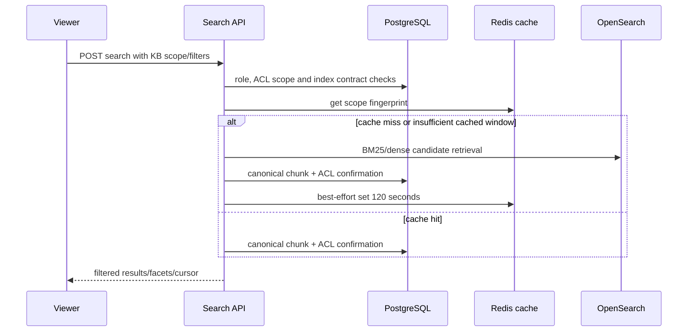

### F-07. Chat SSE and Extended Search

**CONFIRMED.** Chat is an SSE generator. It creates or replays a query run, persists retrieval/generation events, emits periodic operation heartbeats while bounded stages run, and cancels stage tasks on client cancellation or operation deadline. It can choose direct retrieval, then Extended Search when answerability is partial/unanswerable and route/profile conditions permit. Generation uses Model Gateway and citation/claim validation before terminal answer events. Evidence: `api/handlers.py:2785 — stream_chat_response()`; `:3005 — wait_for_stage_task()`; `:3489 — _replay_query_run_stream()`; `extended.py:116 — run_extended_search()`; `answerability.py:251 — should_try_extended_search()`; `answering.py:222 — generate_answer()`.

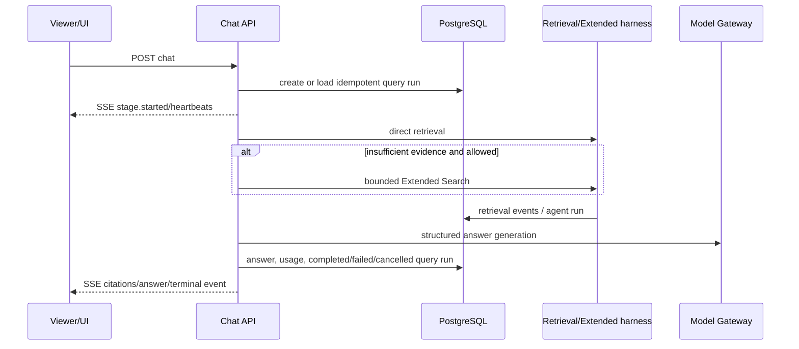

### F-08. Deep Research plan/run/pause/resume/cancel/recovery

**CONFIRMED.** A plan starts `draft`; creator may edit it while draft. Approval requires viewer access and active retrieval contracts in every scope KB, creates a durable run + `deep_research` job, then marks plan approved. Direct run creation likewise requires viewer in every scope KB and idempotency ownership. The scope helper retains at most three KB IDs. Read/control access is creator+viewer or any editor; returned evidence, claims and relations are trimmed again by current document ACL.

Worker deep-research controller acquires a DB controller lease, heartbeats, processes bounded episodes/questions/tool calls, persists evidence/claims/coverage/reflections, synthesizes final report and terminalizes. Pause/cancel request flags are observed at safe boundaries; resume creates a fresh worker job unless completed/cancelled. Restart recovery is lease-based rather than exactly-once external execution.

Evidence chain: `api/handlers.py:3719 — create_research_plan_endpoint()` → `repository.py:4424 — create_research_plan()`; `api/handlers.py:3888 — approve_research_plan_endpoint()` → `repository.py:4579 — create_research_run()`; `worker.py:39 — RESEARCH_KINDS` → `ingestion.py:1980 — process_job()` → `deep_research.py:1096 — process_deep_research()` → `:1228 — _run_research_episodes()` → `:1696 — _run_single_episode()` → `:2563 — _persist_episode_outputs()`.

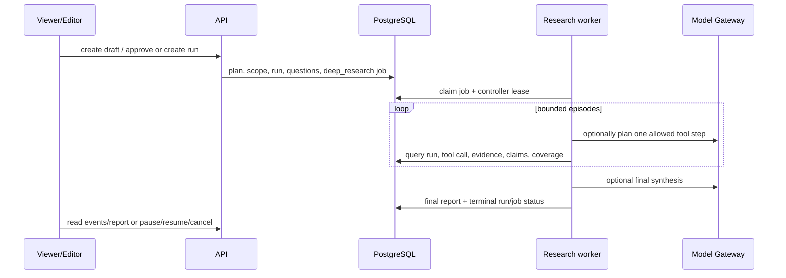

### F-09. Model configuration and model call

**CONFIRMED.** A platform administrator creates connection/model catalog rows, saves a draft snapshot, validates it, then activates a revision. Validation checks every known stage assignment, model contract/canary, parameter/thinking compatibility and active-index embedding fingerprint. Gateway first resolves aliases in active DB revision if present; otherwise it uses YAML registry. Stage calls with explicit revision require active/archived revision and matching hash. The Gateway proxies request to configured provider with circuit/structured-output handling. Real provider success is `PARTIALLY CONFIRMED`.

Evidence chain: `api/routers/model_control.py:488 — admin_save_model_configuration()` → `:539 — _validate_snapshot()` → `:670 — admin_activate_model_configuration()` → `gateway_app.py:403 — _resolve_stage_payload()` / `:536 — _resolve_alias_payload()` → `:612 — proxy()`; business caller `model_client.py:78 — chat_completion()` / `:156 — embeddings()` / `:199 — rerank()`.

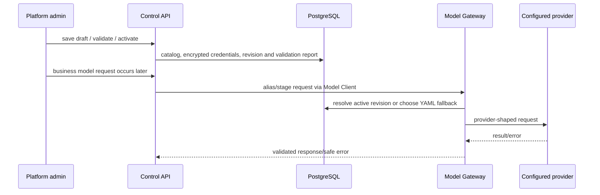

### F-10. CLI operator/evaluation domain

**CONFIRMED as reachable operator code, not a UI/API end-user capability.** `wikipediarag` exposes `import-wiki`, `import-zim`, `smoke`, model smoke/release gate, document/reliability/tenant verification and a broad `eval-*` family: corpus generation/status/run/report, retrieval run/status/report, trusted catalog/generation/pool/report, MIRACL map, review/freeze/release gate/status/diagnostics, profile retrieval, document prepare/ingest/run/status and full evaluation. Some commands invoke HTTP API; some invoke async evaluator/repository code directly. A command’s execution and its external corpus/model results remain `NOT PROVEN` without invocation.

Evidence: `src/wikipediarag/cli.py:182 — build_parser()`; command registrations `:186-521`; `:538 — main()`; representative async execution `:762`, `:803`, `:956`.

## 6. Business Rules Catalog

Все правила в таблице ниже — `CONFIRMED` production-code behaviour. Они не выводятся из README, тестов или названий.

| ID | Domain | Condition | Rule / effect | Alternative / error | Evidence |
| --- | --- | --- | --- | --- | --- |
| BR-001 | Tenant | `active_tenant_id` absent | Любая tenant-scoped операция требует выбрать active tenant | `409 ACTIVE_TENANT_REQUIRED` | `src/wikipediarag/auth.py:103 — require_active_tenant()` |
| BR-002 | Platform role | actor is not platform admin | Platform-admin endpoints denied | `403 PLATFORM_ADMIN_REQUIRED` | `auth.py:117 — require_tenant_admin()`; `api/handlers.py:4430 — _require_platform_admin()` |
| BR-003 | KB role | actor is platform admin | Effective KB role is owner | owner bypasses normal grant lookup | `auth.py:123 — effective_knowledge_base_role()` |
| BR-004 | KB role | actor is tenant admin | Effective KB role is at least manager | direct/group owner may raise role further | `auth.py:134-143 — effective_knowledge_base_role()` |
| BR-005 | KB role | direct and group grants coexist | Effective role is maximum rank, not additive capabilities | no grants → no KB role | `auth.py:61 — KB_ROLE_RANK`; `:123 — effective_knowledge_base_role()` |
| BR-006 | KB capability | viewer/editor/manager/owner | Capability ladder is query/citations/metadata; +upload/reprocess/debug; +source/grant viewer-editor; +manager/owner/delete | enforcement uses required role at endpoint | `auth.py:68 — KB_ROLE_CAPABILITIES` |
| BR-007 | Authentication | local mode not `local`/`hybrid` | Local login unavailable | local auth disabled path | `auth_service.py:73 — local_login_enabled()` |
| BR-008 | Authentication | password hash not Argon2id or mismatch | Local login fails without leaking which field was wrong | `INVALID_LOCAL_LOGIN` | `auth_service.py:56 — verify_password()`; `:207 — authenticate_local_user()` |
| BR-009 | Authentication | user disabled | Login/session actor denied | `USER_DISABLED` / no actor | `auth_service.py:227 — authenticate_local_user()`; `:284 — load_actor_for_session()` |
| BR-010 | Authentication | bootstrap local/hybrid with configured password | Startup creates or overwrites named bootstrap user as platform admin | absent secret/password means no bootstrap | `auth_service.py:101 — ensure_bootstrap_admin()` |
| BR-070 | Authentication | `auth_disabled=true` | `_load_actor` uses an in-process actor with configured default user/tenant and platform-admin/tenant-admin authority; CSRF also bypasses | no session, credential or membership lookup on that path | `auth_service.py:77 — auth_disabled_actor()`; `api/handlers.py:4385 — _load_actor()`; `:5104 — _require_csrf()` |
| BR-011 | Session | new session | Random opaque session/CSRF values are stored only as SHA-256 hashes, with max and idle expiry | values returned/cookie only at creation/rotation | `auth_service.py:65 — hash_secret()`; `:238 — create_session()` |
| BR-012 | Session | revoked, max-expired, idle-expired or disabled user | Session cannot load an actor | unauthenticated | `auth_service.py:284 — load_actor_for_session()` |
| BR-013 | CSRF | protected POST/PATCH/DELETE; auth enabled and non-test auth | `X-CSRF-Token` must match session hash | `403 CSRF_TOKEN_REQUIRED/INVALID` | `api/handlers.py:4409 — _require_actor()`; `:5104 — _require_csrf()` |
| BR-014 | CSRF | protected PUT of model configuration draft | Explicit CSRF additionally required, because generic actor guard handles no PUT | token error | `api/routers/model_control.py:89 — _admin()`; `:488 — admin_save_model_configuration()` |
| BR-015 | Password rotation | password_change_required and path is not password/logout/session management | Protected action denied after authentication | `403 PASSWORD_CHANGE_REQUIRED` | `api/handlers.py:4417-4426 — _require_actor()` |
| BR-016 | Group | supplied local group members | Every principal must exist in same tenant before membership update | `422 ACCESS_PRINCIPAL_OUT_OF_SCOPE` | `api/handlers.py:4511 — _validate_document_access_principals()`; `:4530 — _replace_local_group_members()` |
| BR-017 | Group | same tenant/type/name or tenant/type/external id | Group uniqueness is DB-enforced | SQL conflict | `db.py:140 — groups` |
| BR-018 | Grant | same KB/subject tuple | One grant per tenant/KB/subject type/ID | SQL conflict/update path | `db.py:164 — knowledge_base_grants` |
| BR-019 | Document ACL | untrusted source metadata | Ingestion normalizes ACL to KB policy rather than trusting supplied ACL | source cannot assert foreign principal policy | `document_access.py:58 — normalize_document_metadata_access()` |
| BR-020 | Document ACL | `kb` policy | Requires some effective KB role | otherwise hidden | `document_access.py:67 — is_document_visible()` |
| BR-021 | Document ACL | `tenant` policy | Any actor with tenant scope can view | otherwise hidden | `document_access.py:67 — is_document_visible()` |
| BR-022 | Document ACL | `restricted` policy | Requires direct listed user or intersecting listed group | otherwise hidden | `document_access.py:75-77 — is_document_visible()` |
| BR-023 | Document ACL | platform admin, tenant admin, or KB manager+ | ACL bypass permitted | lower role still evaluated | `document_access.py:29 — document_access_bypass()` |
| BR-024 | Search filters | client asks group/object key/object prefix/storage prefix filter | Authority-bearing filters are rejected | forbidden/validation error | `api/handlers.py:4640 — _authorize_search_identity_filters()` |
| BR-025 | Search filters | requested KB/source/document is outside tenant, selected scope or ACL | Return not found, not existence disclosure | `404 search filter resource not found` | `api/handlers.py:4653-4678 — _authorize_search_identity_filters()` |
| BR-026 | Search readiness | requested KB lacks KB record, read alias, or registered index version | Search/research plan cannot proceed | `KnowledgeBaseNotReady` mapped to API error | `api/handlers.py:4681 — _require_search_scope_ready()`; `retrieval_contract.py:186 — validate_active_retrieval_contract()` |
| BR-027 | Search cache | request cursor fingerprint mismatches current scope/request fingerprint | Return empty page; never continue stale cursor | no retrieval | `search_service.py:70-81 — run_public_search()` |
| BR-028 | Search cache | offset reaches 1000 | Return empty page | bounded public search window | `search_service.py:36-38`, `:80-82 — run_public_search()` |
| BR-029 | Search cache | Redis failure | Behave as cache miss; write failure is ignored | retrieval still runs | `search_service.py:201 — _redis_get()`; `:212 — _redis_set()` |
| BR-030 | Search ACL | fresh or cached candidates | Re-fetch canonical chunks and reapply document visibility before return | stale/deleted/denied candidate omitted | `search_service.py:314 — _confirm_current_search_results()` |
| BR-031 | Upload validation | zero bytes, > configured size, expected size/hash mismatch | Reject ingestion item | `ZERO_BYTE`, `OVERSIZED`, `SIZE_MISMATCH`, `CHECKSUM_MISMATCH` | `document_ingestion.py:155 — validate_upload_bytes()` |
| BR-032 | Upload validation | archive, macro Office, unsupported extension | Reject file | safe validation code | `document_ingestion.py:177-182 — validate_upload_bytes()` |
| BR-033 | Upload validation | HTML has remote resource or JSON depth exceeds limit | Reject file | `REMOTE_HTML_RESOURCE` / depth error | `document_ingestion.py:186-191 — validate_upload_bytes()` |
| BR-034 | Parser routing | structured/text extension | Use local normalization route | other binaries use Xberg/Docling path | `document_ingestion.py:281 — normalize_uploaded_document()` |
| BR-035 | Parser fallback | Xberg output empty/quality gate fail, PDF low text, replacement ratio >1%, table/layout signals | Try Docling | if both fail, propagate parser error | `document_ingestion.py:295-335 — normalize_uploaded_document()` / `quality_gate_fallback_reasons()` |
| BR-036 | Metadata | metadata service fails and parser services are optional | Fall back to local language/date extraction | required parser services → parser error | `document_ingestion.py:203 — extract_metadata()` |
| BR-037 | Chunking | normalized document text | Split on whitespace in 220-word windows; no overlap; deterministic ID includes version/chunker/ordinal/content hash | empty text → no chunks | `document_ingestion.py:338 — chunks_for_normalized_document()` |
| BR-038 | Publication | upload item after embedding | Canonical chunks first staged, then published with sections/version/projection event in one DB scope | projection is asynchronous | `ingestion.py:1033-1073 — _process_document_upload_item()` |
| BR-039 | Upload retry | validation error | Item fails immediately | no retry | `ingestion.py:1077-1078 — _process_document_upload_item()` |
| BR-040 | Upload retry | parser/other exception considered retryable and attempts remain | Reschedule item; otherwise fail item/version | retry delay/state persisted | `ingestion.py:1079-1094 — _process_document_upload_item()`; `repository.py:1641 — update_ingestion_job_item()` |
| BR-041 | Job claim | received, or running with expired lease; cancel not requested | Oldest matching job is atomically claimed with `FOR UPDATE SKIP LOCKED` and new lease | document delete additionally waits until `purge_after` | `repository.py:238 — claim_next_job()` |
| BR-042 | Job lease | heartbeat lacks same job+lease ID | Lease renewal returns false; worker is fenced from continued ownership | next worker may reclaim after expiry | `repository.py:295 — heartbeat_job_lease()`; `ingestion.py:2028 — claim_and_process_once.heartbeat_loop()` |
| BR-043 | Job cancellation | cancellation requested | Job is excluded from claims; processors check cancellation at stages | terminal cancelled path | `repository.py:258-272 — claim_next_job()`; `ingestion.py:845 — process_document_upload()` |
| BR-044 | Document deletion | first delete by KB owner | Mark document soft-deleted, create deferred deletion job, immediately issue OpenSearch delete | repeated delete returns deleted state | `api/handlers.py:2619 — delete_document()` |
| BR-045 | Reprocess | same idempotency key/payload/route actor tenant | Return stored safe response instead of another job | changed payload/key collision or in-progress record → conflict | `api/handlers.py:1873 — _claim_operation_idempotency()`; `repository.py:3974 — claim_idempotency_record()` |
| BR-046 | Source connector | unknown persisted source kind | Cannot instantiate connector | `CONNECTOR_KIND_UNSUPPORTED` | `source_connectors.py:97 — connector_for_kind()` |
| BR-047 | Source connector | remote base URL | Must be http(s), local-network host, TLS verification not disabled; mTLS needs both files | connector config error | `source_connectors.py:114 — connector_http_options()`; `:152 — _safe_base_url()` |
| BR-048 | Local folder source | scan candidate | resolve path; accept only descendants of root, allowed extensions, up to configured/default 1000 files | out-of-root/unsupported skipped | `source_connectors.py:244 — _local_folder_root()`; `:251 — _scan_local_folder()` |
| BR-049 | Source tombstone | full sync external id absent from scan | Mark as tombstone; incremental sync does not infer tombstones | preserved in source state | `source_connectors.py:285-294 — _scan_local_folder()`; `repository.py:1428 — mark_source_document_tombstone()` |
| BR-050 | Retrieval fusion | rank lists | RRF score adds `1/(60 + rank)` by `(KB, document, chunk)` identity; tie sort remains deterministic | no learned fusion | `retrieval.py:1046 — rrf_fuse()` |
| BR-051 | Rerank failure | profile does not require real provider | Fall back to deterministic lexical overlap rerank | real-provider profile rethrows | `retrieval.py:1099 — rerank()` |
| BR-052 | Post-processing | candidate near-duplicate/content unit seen | Drop candidate but retain supporting chunk IDs in selected unit | event explains `NEAR_DUPLICATE` | `retrieval.py:1192 — postprocess_candidates()` |
| BR-053 | Post-processing | page/document quota or token budget | Bound evidence context; a novel query term can bypass page quota, not a number alone | deferred/dropped events | `retrieval.py:1208-1289 — postprocess_candidates()` |
| BR-054 | Extended Search | question has configured complexity markers | May classify as extended; actual run bounded to 8 steps, 6 subqueries, 2 rewrites/subquery, 4 parallel calls, 20 docs, 300 chunks, 90 sec | stops with documented reason | `extended.py:34 — HarnessBudgets`; `:88 — should_start_extended()`; `:116 — run_extended_search()` |
| BR-055 | Extended Search | duplicate tool signature, sufficient evidence, no new evidence, two stalled coverage steps, or budget | Stop with `duplicate_tool_call`, `evidence_sufficient`, `no_new_evidence`, `coverage_stalled`, `budget_reached`, or unresolved conflict | final answerability still recomputed | `extended.py:288-525 — run_extended_search()` |
| BR-056 | Answerability | partial/unanswerable | Extended Search is eligible; conflicting is insufficient but not in `should_try_extended_search` | direct answer logic handles conflict | `answerability.py:122 — decide_answerability()`; `:243 — is_insufficient()`; `:251 — should_try_extended_search()` |
| BR-057 | Research scope | requested KB list | Primary KB is inserted if missing and list is truncated to three IDs | only retained KBs are authorized/used | `api/handlers.py:3672 — _research_plan_scope_ids()` |
| BR-058 | Research plan | plan not draft / wrong editor | Draft only creator can patch; approval only draft and requires each scope KB viewer + valid contract | 403/409 | `api/handlers.py:3814 — patch_research_plan_endpoint()`; `:3888 — approve_research_plan_endpoint()` |
| BR-059 | Research run | read/control request | Creator with viewer, or editor, may read/control; detail trims evidence, then claims/relations dependent on invisible evidence | `403 research run access denied` | `api/handlers.py:5023 — _authorize_research_run()`; `:5046 — _research_detail()` |
| BR-060 | Research control | run terminal | pause rejects terminal; resume rejects completed/cancelled and enqueues fresh job for other permitted states | 409 | `api/handlers.py:4172 — pause_research_run()`; `:4189 — resume_research_run()`; `:4210 — cancel_research_run()` |
| BR-061 | Research planner | model planner output malformed or contains tool outside allowed list | deterministic plan fallback/validation prevents arbitrary tool selection | planner output error / fallback | `research_planner.py:126 — plan_research_step()`; `:246 — _validate_planner_output()`; `research_tool_registry.py:37 — normalize_research_tool_mode()` |
| BR-062 | Research data | question becomes `done` | DB requires non-null allowed outcome; non-done requires null outcome | SQL CHECK violation | `db.py:659-669 — research_questions` |
| BR-063 | Model config | connection `PATCH` lacks `If-Match` | Reject optimistic write | `428 MODEL_CONFIG_VERSION_REQUIRED` | `api/routers/model_control.py:167 — admin_patch_model_connection()` |
| BR-064 | Model config | safe headers include secret/token/password field name | Reject; credentials must take encrypted credential storage path | `422 MODEL_SECRET_FIELD_FORBIDDEN` | `api/routers/model_control.py:130 — admin_create_model_connection()` |
| BR-065 | Model revision | missing stage/model/contract, failed canary, incompatible active embedding index | Validation report fails; activation repository validates revision | no active usable revision from that draft | `api/routers/model_control.py:539 — _validate_snapshot()` |
| BR-066 | Gateway | active DB revision exists | Alias lookup uses revision; otherwise YAML fallback | unavailable alias → HTTP error | `gateway_app.py:536 — _resolve_alias_payload()` |
| BR-067 | Model retry | retryable gateway/provider response | bounded attempts, Retry-After or exponential `2**attempt`, capped by operation deadline/timeout | terminal `ModelGatewayError` after attempts | `model_client.py:263 — _post_json()`; `:355 — _bounded_retry_sleep()` |
| BR-068 | Projection | OpenSearch event fails | Persist retry with exponential delay capped at 300 seconds; DB row is durable | event remains retryable | `repository.py:2884 — retry_search_projection_event()`; `worker.py:216 — _process_search_projection_once()` |
| BR-069 | Projection recovery | projection differs from canonical PostgreSQL | Delete extra/stale IDs, bulk index missing/stale chunks, read back exact fingerprint; lease fencing avoids false success | reconciliation marked failed/degraded on exception | `worker.py:87 — _repair_search_projection_document()`; `:262 — _process_search_projection_reconciliation_once()` |

## 7. Security matrix

| Actor / role | Resource | Operation | Allowed when | Denied / hidden when | Evidence |
| --- | --- | --- | --- | --- | --- |
| Unauthenticated | `/health`, `/ready`, local/OIDC start/callback | health/auth initiation | route does not call actor guard | protected API call without valid session | `api/routers/health.py:9-10`; `api/handlers.py:4409 — _require_actor()` |
| Local/hybrid user | session | local login | valid Argon2 password and enabled user | auth mode excludes local; invalid/disabled user | `auth_service.py:73 — local_login_enabled()`; `:207 — authenticate_local_user()` |
| OIDC user | session | OIDC callback | external flow and provider exchange succeeds | external state/config not valid | `api/handlers.py:451 — oidc_start()`; `:461 — oidc_callback()` |
| Authenticated actor | all tenant resources | read/mutate | active tenant selected; CSRF on POST/PATCH/DELETE | no tenant, expired/revoked/disabled session, bad CSRF | `auth.py:103 — require_active_tenant()`; `api/handlers.py:4409 — _require_actor()` |
| Platform admin | all KB/document ACL | all | treated as KB owner and document ACL bypass | never denied by KB/document role guard | `auth.py:123 — effective_knowledge_base_role()`; `document_access.py:29 — document_access_bypass()` |
| Tenant admin | KB/document ACL | manager-level KB operations and ACL bypass | membership role is `TENANT_ADMIN` | no membership/role | `auth.py:113 — can_manage_tenant()`; `:123 — effective_knowledge_base_role()`; `document_access.py:29` |
| KB viewer | KB/document/query | view/search/chat/citations/metadata | effective viewer + document ACL | no KB grant/ACL visibility | `auth.py:68 — KB_ROLE_CAPABILITIES`; `document_access.py:67 — is_document_visible()` |
| KB editor | documents / debug / research | upload, reprocess, debug, research access/control where role checks apply | effective editor | viewer cannot perform editor-only operations | `auth.py:68`; `api/handlers.py:2681 — reprocess_document()`; `:4225 — run_debug_search()` |
| KB manager | source, documents, grants | source config, document ACL, viewer/editor grant management | effective manager | manager cannot perform owner-only deletion/ownership | `auth.py:71-83`; `api/handlers.py:2453 — patch_document_access()` |
| KB owner | KB/document/grant | delete KB/doc, manager/ownership grants | effective owner | lesser roles rejected | `auth.py:84-99`; `api/handlers.py:2619 — delete_document()` |
| Group grant subject | KB | inherited role | membership and matching group grant, max role selection | missing/foreign group membership | `auth.py:123 — effective_knowledge_base_role()`; `db.py:154 — group_memberships` |
| Restricted-document user/group | evidence/document | read/search/result | listed user or group intersecting access scope | not listed, unless bypass | `document_access.py:67 — is_document_visible()`; `:80 — document_access_filter()` |
| Research creator | its research run | read/control | creator still holds viewer in primary KB | creator lost viewer, or non-creator not editor | `api/handlers.py:5023 — _authorize_research_run()` |
| Platform admin | model control | connection/catalog/revision | platform role and CSRF where mutation rule applies | ordinary tenant/KB admin | `api/routers/model_control.py:89 — _admin()` |

### Security observations confined to code facts

* **CONFIRMED:** job read/status SSE checks authentication and tenant equality, but unlike cancel/resume does not call `_require_kb_role`. Thus any actor with the same active tenant can read that job row/progress, whereas control needs editor on its KB. Evidence: `src/wikipediarag/api/handlers.py:1788 — get_ingestion_job()`; `:1803 — ingestion_job_events()`; contrast `:1819 — cancel_ingestion_job()` and `:1838 — resume_ingestion_job()`.
* **CONFIRMED:** UI disabled/hidden buttons are client ergonomics only. Backend repeats authorization in handlers; e.g. upload and reprocess independently call `_require_kb_role`. Evidence: `services/ui/src/App.tsx:2942 — disabled`; `src/wikipediarag/api/handlers.py:2681 — reprocess_document()`; `:4435 — _require_kb_role()`.
* **NOT PROVEN:** cookie transport is secure in a concrete deployment. Code has `session_cookie_secure=True` default and configurable SameSite, but environment values, TLS termination and browser deployment are outside repository proof. Evidence for code only: `src/wikipediarag/config.py:101-107 — Settings`.

## 8. State machines

### 8.1 Ingestion job and item

**CONFIRMED.** Both tables constrain status to `received/running/completed/failed/cancelled`. Claim moves eligible received or expired-running job to running; cancel stops future claim; resume returns an authorized job toward work; item retry returns retryable item to an eligible received state after delay. Exact all-path state assignment for Wikipedia/ZIM is implemented by their processors; below diagram only includes transitions proved by common repository/processor code.

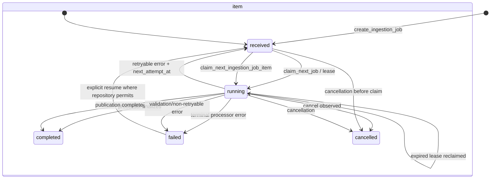

Evidence: `src/wikipediarag/db.py:410 — ingestion_jobs`; `:429 — ingestion_job_items`; `src/wikipediarag/repository.py:238 — claim_next_job()`; `:1584 — claim_next_ingestion_job_item()`; `:1641 — update_ingestion_job_item()`; `src/wikipediarag/ingestion.py:1999 — claim_and_process_once()`.

### 8.2 Upload/document/version lifecycle

**CONFIRMED.** Upload session status and document version status are SQL-enumerated. The worker explicitly advances validation, parser, normalized, indexing and publication stages; version terminal state is published/failed/cancelled. Document lifecycle begins `active`, becomes deletion-requested/deleted through `soft_delete_document`, and a delayed purge job can make the physical lifecycle terminal or `purge_failed`.

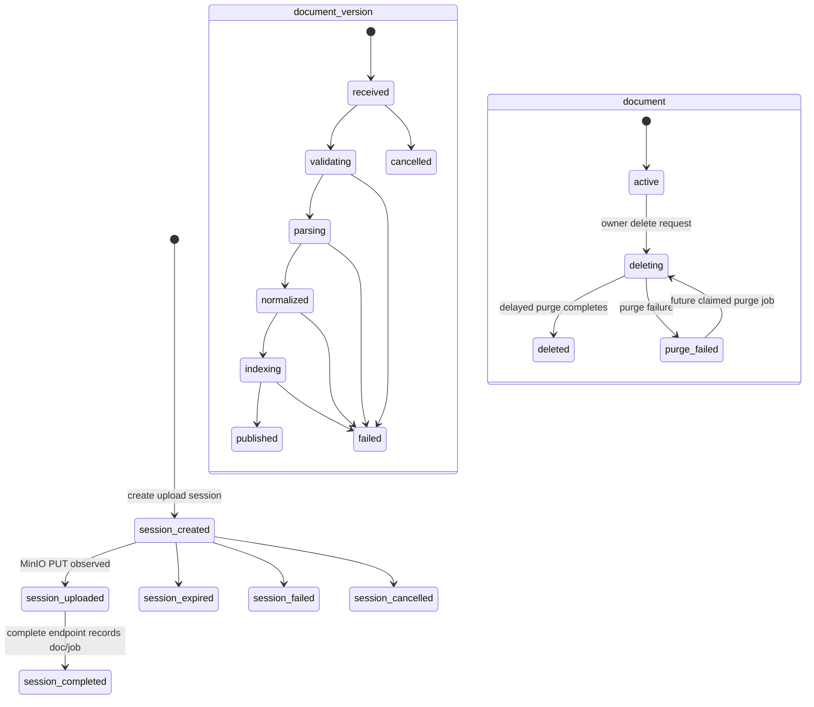

Evidence: `src/wikipediarag/db.py:338 — upload_sessions`; `:359 — document_versions`; `:231-237 — documents lifecycle columns`; `src/wikipediarag/ingestion.py:845 — process_document_upload()`; `:1885 — process_document_delete()`; `src/wikipediarag/api/handlers.py:2619 — delete_document()`.

### 8.3 Query/chat state machine

**CONFIRMED.** Query runs use the job-style five-state check. The chat handler writes a running run and emits SSE stages, completes with answer/usage or marks failed/cancelled; startup recovers stale chat runs. No durable pause/resume API exists for chat query runs.

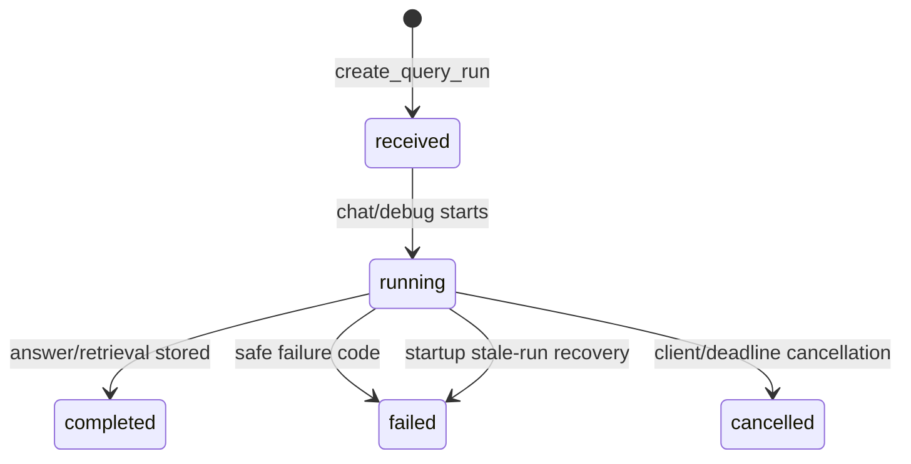

Evidence: `src/wikipediarag/db.py:512 — query_runs`; `src/wikipediarag/repository.py:3912 — create_query_run()`; `:4330 — complete_query_run()`; `:4375 — fail_query_run()`; `:4388 — cancel_query_run()`; `:4401 — recover_stale_chat_query_runs()`; `src/wikipediarag/api/handlers.py:2785 — stream_chat_response()`.

### 8.4 Source sync

**CONFIRMED.** Source record state is active/disabled/failed, while each sync run follows received/running/completed/failed/cancelled. Sync operation persists checkpoint/cursor/stats and marks source document states active/deleted. Exact transition from failed source to active relies on explicit update paths and is not generalized here.

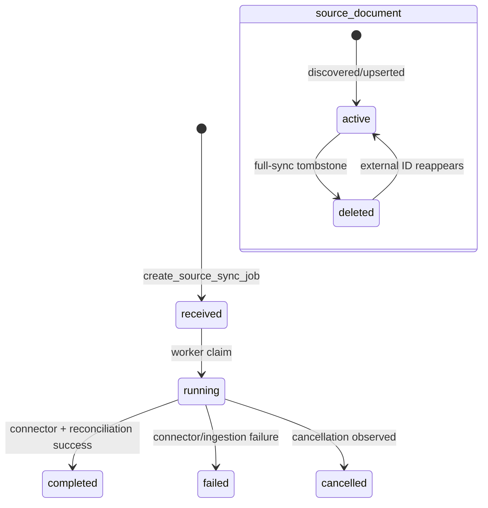

Evidence: `src/wikipediarag/db.py:253 — knowledge_sources`; `:277 — source_sync_runs`; `:299 — source_document_states`; `src/wikipediarag/ingestion.py:1407 — process_source_sync()`; `src/wikipediarag/repository.py:1344 — upsert_source_document_state()`.

### 8.5 Deep Research plan/run/episode

**CONFIRMED.** Plan and run SQL state sets are explicit; controls set request flags and controller applies them at bounded execution points. Tool calls can also become `stalled` after later migration. A completed run may contain partial value/report rather than a claim that every question is covered.

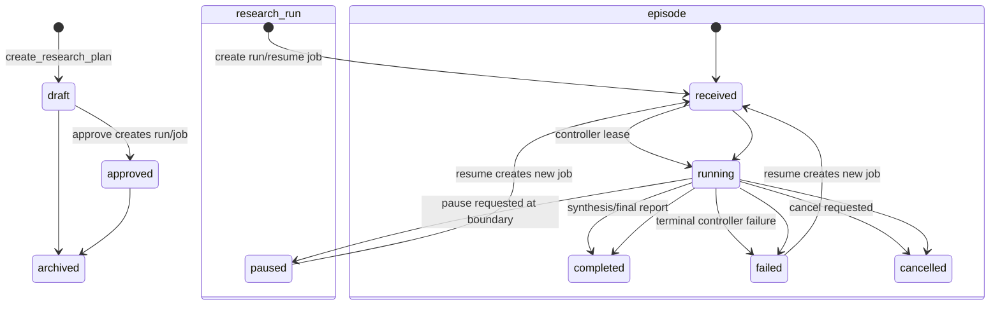

Evidence: `src/wikipediarag/db.py:566 — research_plans`; `:589 — research_runs`; `:633 — research_episodes`; `src/wikipediarag/api/handlers.py:3888 — approve_research_plan_endpoint()`; `:4172 — pause_research_run()`; `:4189 — resume_research_run()`; `src/wikipediarag/deep_research.py:1096 — process_deep_research()`; `:2745 — _finish_requested()`.

### 8.6 Model revision and search projection

**CONFIRMED.** Revision table constrains `draft/validated/active/archived`; validation alone must precede activation at repository boundary. Projection events are durable/retryable; reconciliation can be due/running/ok/degraded. OpenSearch is never made the state-machine authority.

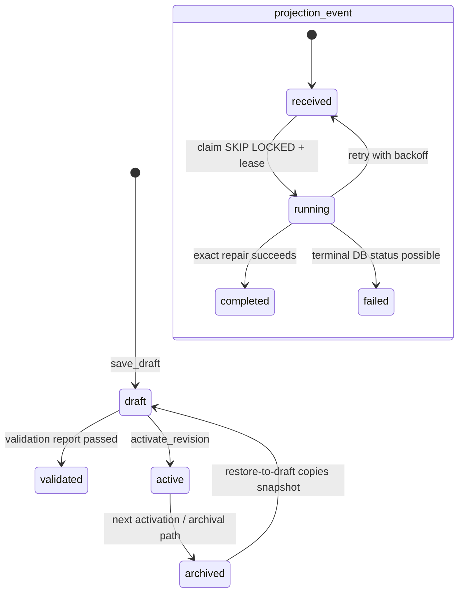

Evidence: `src/wikipediarag/db.py:983 — model_configuration_revisions`; `src/wikipediarag/api/routers/model_control.py:488 — admin_save_model_configuration()`; `:626 — admin_validate_model_configuration()`; `:670 — admin_activate_model_configuration()`; `src/wikipediarag/repository.py:2833 — claim_next_search_projection_event()`; `:2884 — retry_search_projection_event()`.

## 9. Algorithm catalogue

### A-01. Upload validation, normalization and chunking

**CONFIRMED.**

* **Input/preconditions:** bytes, filename, supplied type, expected size/SHA-256 and settings.
* **Validation:** reject zero/oversized bytes; expected size/checksum mismatch; archive/macro/unapproved extension; bad signature; remote HTML assets; too-deep JSON. See BR-031–033.
* **Parser selection:** structured/text formats take local normalization; other formats try Xberg and fall back to Docling on parser error/quality-gate reason.
* **Quality thresholds:** Xberg result falls back at `replacement character ratio > 0.01`; PDF fewer than 30 words; high-quality profile; expected table absent; selected layout markers.
* **Metadata:** service gets at most 20,000 source chars; optional-service failure invokes deterministic local Cyrillic-vs-Latin language ratio and date extraction over bounded samples.
* **Chunking:** `document.text.split()` into non-overlapping 220-word blocks. Per chunk, deterministic ID derives from version, chunker version, ordinal and content hash; section path/locator comes from preceding normalized blocks.
* **Output:** `Chunk` records bearing content, hash, source metadata, parser route/version, language/date, section and vector placeholder.

Evidence: `src/wikipediarag/document_ingestion.py:155 — validate_upload_bytes()`; `:203 — extract_metadata()`; `:242 — detect_language()`; `:281 — normalize_uploaded_document()`; `:315 — quality_gate_fallback_reasons()`; `:338 — chunks_for_normalized_document()`.

### A-02. Embedding, canonical publication and projection

**CONFIRMED.** `process_document_upload` resolves target index contract. It uses active index embedding alias/dimensions when present; otherwise constructs/saves an upload index version with profile aliases. It embeds chunks through `model_client.embeddings`, writes canonical chunks with `staged` publication status, then in a subsequent DB scope upserts `published` chunks, replaces sections, marks version published and enqueues a projection event. Projection worker compares a canonical fingerprint with exact OpenSearch records; it deletes extra/stale IDs, bulk indexes missing/stale chunks, reads back and requires equality.

Evidence: `src/wikipediarag/ingestion.py:1011-1074 — _process_document_upload_item()`; `:1097 — _resolve_upload_index_target()`; `src/wikipediarag/model_client.py:156 — embeddings()`; `src/wikipediarag/worker.py:87 — _repair_search_projection_document()`.

### A-03. Hybrid retrieval and RRF

**CONFIRMED.**

1. `retrieve()` validates active retrieval contract/profile, normalizes query and creates bounded query variants/transforms.
2. It obtains a shared query embedding for dense search and runs BM25/dense candidates per variant under bounded parallel work.
3. Candidate identity is `(knowledge_base_id, document_id, chunk_id)` and RRF adds `1/(60 + rank)` for each rank list.
4. Rerank applies Gateway rerank scores; profile permitting non-real provider falls back to lexical overlap. Exact unambiguous title has a `title_exact` boost.
5. Postprocessing applies negative-title removal, optional parent expansion, content/content-unit deduplication, page/document quotas and context token budget. Result candidates are re-confirmed from current canonical rows/ACL before presentation.

Formula: `rrf_total(c) = Σ_stage 1 / (60 + rank_stage(c))`.

Evidence: `src/wikipediarag/retrieval.py:88 — retrieve()`; `:384 — retrieve_multi()`; `:859 — dense_search_profile()`; `:936 — dense_search_db()`; `:1046 — rrf_fuse()`; `:1099 — rerank()`; `:1166 — _apply_entity_title_boost()`; `:1192 — postprocess_candidates()`; candidate authority guard `:1001 — _confirm_current_candidates()`.

### A-04. Answerability and Extended Search

**CONFIRMED.** `decide_answerability()` derives query parts, coverage, title/entity alignment, conflicts and rank/diversity signals to classify `answerable`, `partial`, `unanswerable` or `conflicting`. Only partial/unanswerable returns true from `should_try_extended_search()`. The Extended harness creates deterministic subqueries, reserves one gap-repair slot, optionally prefetches multi-KB calls, deduplicates tool call signature, gathers evidence + neighbor chunks, recomputes answerability/coverage, optionally adds repair query and terminates under budgets/stall/evidence conditions. It stores its ledger/state in `agent_runs` and retrieval events.

Evidence: `src/wikipediarag/answerability.py:122 — decide_answerability()`; `:251 — should_try_extended_search()`; `src/wikipediarag/extended.py:34 — HarnessBudgets`; `:116 — run_extended_search()`; `:288-525 — run_extended_search()`; `:1041 — _persist_agent_run()`.

### A-05. Citation and claim validation

**CONFIRMED.** Answer generation asks Model Gateway for structured response, parses it, validates citations against allowed evidence and policy, then runs configured claim verification. An invalid/unrecoverable output returns deterministic abstention instead of unvalidated free text. Exact generated answer quality is `NOT PROVEN` because it depends on provider response. Evidence: `src/wikipediarag/answering.py:222 — generate_answer()`; `src/wikipediarag/claim_verifier.py:63 — verify_claims()`; Gateway structured validation: `src/wikipediarag/gateway_app.py:841 — _validate_structured_provider_response()`.

### A-06. Deep Research planner/tool loop and reporting

**CONFIRMED.** Controller obtains allowed tool set from tool mode. `plan_research_step()` requests JSON through Gateway and validates tool candidates against allowlist; malformed/unsafe output falls back to deterministic plan. Each episode records a tool-call object, performs the selected implementation, persists evidence/claims/coverage/reflection and may derive bounded questions. Controller heartbeats leases, checks pause/cancel/deadline, then synthesizes report via model or deterministic fallback and applies public redaction/ACL trimming at API read time.

Evidence: `src/wikipediarag/research_tool_registry.py:5 — ResearchToolName`; `:25 — TOOL_MODE_ALLOWLISTS`; `src/wikipediarag/research_planner.py:126 — plan_research_step()`; `:246 — _validate_planner_output()`; `src/wikipediarag/deep_research.py:1096 — process_deep_research()`; `:1696 — _run_single_episode()`; `:2563 — _persist_episode_outputs()`; `:702 — build_public_research_report()`.

### A-07. Query/retrieval transformations

**CONFIRMED.** Transform code normalizes whitespace, makes deterministic rewrite/decomposition/bridge variants under profile limits, and retrieval limits variants in actual call path. This is not an LLM planner. Evidence: `src/wikipediarag/query_transforms.py:1 — module`; `src/wikipediarag/retrieval.py:88 — retrieve()`; `src/wikipediarag/extended.py:602 — _build_subqueries()`.

## 10. Data lineage

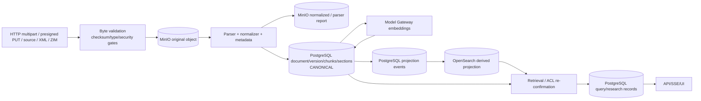

| Data type | Input / mutation | Authority | Derived copies / retrieval path | Deletion/retention | Evidence |
| --- | --- | --- | --- | --- | --- |
| Raw document bytes | multipart, direct presigned PUT, source/XML/ZIM importer | MinIO object key is byte authority; DB stores checksum/key | fetched by ingestion worker only | purge job deletes object after DB soft-delete retention; exact actual object removal `NOT PROVEN` | `storage.py:64 — put_bytes()`; `:78 — get_bytes()`; `api/handlers.py:1973 — upload_document_multipart()` |
| Upload/session metadata | API command; object `HEAD` completion | PostgreSQL | UI batch/job polling | session expires/fails/cancels per status | `repository.py:396 — create_upload_session()`; `api/handlers.py:2325 — complete_upload_session_endpoint()` |
| Parsed normalized document/report | parser transformation | MinIO payload; DB artifact row gives identity/checksum/reference | sections/chunks derive from normalized form | physical deletion delayed by document purge | `ingestion.py:968-1007 — _process_document_upload_item()` |
| Document/version/lifecycle/ACL | API and ingestion state writes | PostgreSQL | public payload, OpenSearch metadata, research views | soft delete then scheduled purge | `db.py:217 — documents`; `repository.py:1870 — soft_delete_document()`; `repository.py:2539 — update_document_access_metadata()` |
| Chunks/embeddings/sections | canonical ingestion upserts | PostgreSQL | OpenSearch projection, evidence/search cache | mark/delete with document lifecycle; projection reconciles | `db.py:455 — chunks`; `repository.py:2297 — upsert_chunk()`; `worker.py:87 — _repair_search_projection_document()` |
| OpenSearch documents | projector/reconciler | **not authority** | BM25/dense candidate source; candidate rechecked in PostgreSQL | API immediate delete plus eventual repair | `search_index.py:118 — bulk_index_chunks()`; `retrieval.py:1001 — _confirm_current_candidates()` |
| Redis search cache | public search response | never authority | only `SearchResult` cache, 120 s, scope fingerprint; recheck current/ACL | TTL/failed operations are ignored | `search_service.py:36-39`; `:93-103`; `:201-219` |
| Retrieval/query events | chat/debug/extended/research | PostgreSQL | query run replay, retrieval/debug UI | no shown delete/retention rule except projection events | `repository.py:3912 — create_query_run()`; `:4330 — complete_query_run()`; `extended.py:514-524 — run_extended_search()` |
| Research evidence/claims/report | episode persistence/synthesis | PostgreSQL JSON/rows | API applies current ACL trimming before response | no shown hard-delete flow | `deep_research.py:2563 — _persist_episode_outputs()`; `api/handlers.py:5046 — _research_detail()` |

## 11. Async, reliability and consistency map

### 11.1 Durable queue topology

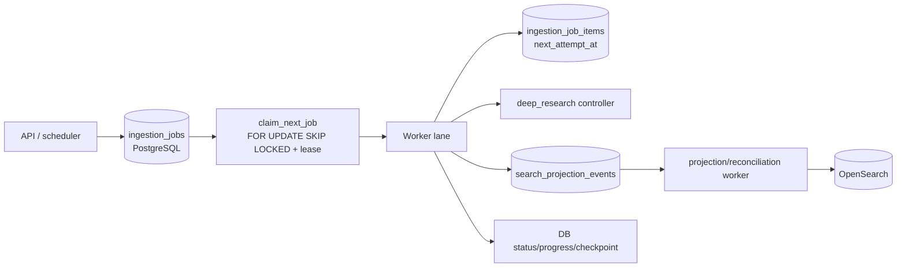

**CONFIRMED.** There is no broker consumer/producer for ingestion in the code path: the durable queue is PostgreSQL. Jobs are selected oldest-first among allowed kinds with `FOR UPDATE SKIP LOCKED`; an expired running lease becomes claimable again. Background lane owns `wikipedia_xml`, `wikipedia_zim`, `document_upload`, `source_sync`, `document_delete`; research lane owns `deep_research`. Evidence: `src/wikipediarag/repository.py:238 — claim_next_job()`; `src/wikipediarag/worker.py:39 — RESEARCH_KINDS`; `:40 — BACKGROUND_KINDS`; `:333 — _run_lane()`.

| Concern | Implemented behaviour | Evidence | Limit / recovery conclusion |
| --- | --- | --- | --- |
| Claim concurrency | `FOR UPDATE SKIP LOCKED`, status/lease update occurs in the same claim statement | `repository.py:238 — claim_next_job()`; `:1584 — claim_next_ingestion_job_item()` | Two workers do not claim same unlocked row in one transaction; crash after claim relies on lease expiry |
| Job lease | Claim sets lease ID, expiry and heartbeat; heartbeat update predicates on same job/lease | `repository.py:295 — heartbeat_job_lease()`; `ingestion.py:2028 — claim_and_process_once.heartbeat_loop()` | Lease holder that loses predicate is fenced; an expired job can run again, so external effects require idempotency/reconciliation |
| Item retry | Due items claim with `next_attempt_at`; retry scheduler persists delay | `repository.py:1593-1632 — claim_next_ingestion_job_item()`; `:1680 — update_ingestion_job_item()` | Validation error terminal; retryable parser/exception is retried only under ingestion predicate |
| Worker liveness | Per-lane heartbeat in `worker_instances`; readiness checks both research and upload lane | `worker.py:343 — _run_lane.heartbeat()`; `api/handlers.py:337-350 — ready()` | API can be healthy while an external parser/provider is not; actual running worker `NOT PROVEN` |
| Source schedule | background runner asks DB for due sources before job claim | `worker.py:358-362 — _run_lane.runner()`; `repository.py:1552 — enqueue_due_source_sync_jobs()` | schedule is polling, not an external scheduler/broker |
| Projection retry | event claim/lease, exponential retry (capped 300 sec), durable state | `repository.py:2833 — claim_next_search_projection_event()`; `:2884 — retry_search_projection_event()` | event may be repeatedly delivered; repair is convergence-oriented |
| Projection reconciliation | scans/schedules records, lease-guards external I/O, compares exact fingerprint, read-backs | `worker.py:87 — _repair_search_projection_document()`; `:262 — _process_search_projection_reconciliation_once()` | temporary absent index projection is accepted, stale projection is not authority |
| Chat reliability | handler emits stage heartbeats, deadline-cancels tasks; startup fails stale runs | `api/handlers.py:3005 — wait_for_stage_task()`; `repository.py:4401 — recover_stale_chat_query_runs()` | SSE disconnect/cancellation is handled in coroutine; client receipt of terminal event is not durable acknowledgement |
| Research lease | controller/tool heartbeats renew research lease and stale tool calls have a repository transition | `deep_research.py:2450 — _research_tool_heartbeat_loop()`; `:2473 — _research_controller_heartbeat_loop()`; `repository.py:5400 — mark_stalled_research_tool_calls()` | controller crash can be recovered by lease/resume, not by exactly-once tool execution |
| API idempotency | tenant+actor+route+key + payload hash records in DB, completed response replay | `repository.py:3974 — claim_idempotency_record()`; `:4039 — complete_idempotency_record()`; `api/handlers.py:1873 — _claim_operation_idempotency()` | only endpoints that call this helper are idempotent; do not infer it for every POST |

### 11.2 What if a process stops between steps?

| Window | Observed consequence | Recovery / invariant | Evidence / status |
| --- | --- | --- | --- |
| MinIO original PUT succeeds before DB upload records | orphan object can remain: DB has no job/reference yet | no shown generic orphan-object sweeper | `CONFIRMED` ordering: `api/handlers.py:1973 — upload_document_multipart()`; global cleanup `NOT PROVEN` |
| DB upload record commits before worker | bytes and durable job survive | worker claims later through DB; no API-time parse | `repository.py:607 — create_document_upload_records()`; `repository.py:238 — claim_next_job()` |
| Worker dies after claim before completion | job remains running until lease expiry | another worker may reclaim same job | `repository.py:263-286 — claim_next_job()` |
| Normalized/report MinIO write succeeds before metadata transaction | unreferenced derivative object can remain on DB failure | no shown generic orphan sweeper | `CONFIRMED` order: `ingestion.py:968-1007 — _process_document_upload_item()`; cleanup `NOT PROVEN` |
| Staged chunks committed before publication | canonical rows may be staged before later publication scope | retrieval canonical queries use current published predicates; later retry/reprocess must converge | `ingestion.py:1033-1060 — _process_document_upload_item()`; exact crash reconciliation for staged rows `PARTIALLY CONFIRMED` |
| Published canonical DB commit succeeds before OpenSearch projection | OpenSearch can be missing/stale temporarily | event/reconciliation projects exact canonical snapshot; retrieval re-confirms candidates | `repository.py:2639 — enqueue_document_publication_projection()`; `worker.py:216 — _process_search_projection_once()`; `retrieval.py:1001 — _confirm_current_candidates()` |
| Soft-delete DB commit succeeds before immediate OpenSearch deletion | deleted document may remain in index briefly | canonical/ACL re-confirmation prevents it being authoritative; projection repair applies later | `api/handlers.py:2640-2672 — delete_document()`; `retrieval.py:1001 — _confirm_current_candidates()` |
| DB research episode record succeeds before provider/client returns later stage | partial durable research data remains | controller stores checkpoint/progress; terminalization/recovery follows run/job logic | `deep_research.py:1696 — _run_single_episode()`; `:2563 — _persist_episode_outputs()` |
| API answer SSE emitted but connection drops | server may have completed query run while user misses event | query run can be read/replayed where handler supports it; delivery acknowledgement absent | `api/handlers.py:2785 — stream_chat_response()`; `:3489 — _replay_query_run_stream()` |

### 11.3 Cross-system consistency model

**CONFIRMED.** The system is transactional inside each `connect()` scope and eventually consistent between PostgreSQL authority and MinIO/OpenSearch/provider/network operations. It uses DB outbox-like projection events and reconciliation for OpenSearch, but not an atomic DB+MinIO or DB+provider transaction. The code deliberately rechecks PostgreSQL/ACL after search/index/cache candidates, reducing exposure from derived drift. Evidence: `src/wikipediarag/db.py:1153 — connect()`; `src/wikipediarag/worker.py:87 — _repair_search_projection_document()`; `src/wikipediarag/search_service.py:314 — _confirm_current_search_results()`.

## 12. Runtime configuration that changes behaviour

Only fields visibly read by runtime code are included. Secret values and real `.env` contents are intentionally not reported.

| Config | Default in code (non-secret only) | Read by | Behaviour affected | Evidence |
| --- | --- | --- | --- | --- |
| `app_env`, `log_level` | development / INFO | app/worker configuration | environment/log verbosity | `src/wikipediarag/config.py:12-13 — Settings` |
| `database_url` | local PostgreSQL URL (value omitted) | `db` | database connection authority | `config.py:15`; `db.py:1153 — connect()` |
| `redis_url` | local Redis URL | public search cache client | cache endpoint only; cache errors degrade to miss | `config.py:16`; `search_service.py:201 — _redis_get()` |
| MinIO endpoint/public endpoint/bucket/access credentials | local endpoints; secret-like values omitted | `storage`, upload/ingestion | object storage and presigned PUT | `config.py:17-21`; `storage.py:49 — put_text()`; `:140 — create_presigned_put_url()` |
| `opensearch_url` | local OpenSearch URL | `search_index` | candidate search/projection target | `config.py:22`; `search_index.py:64 — get_client()` |
| `model_gateway_url`, chat/embed/rerank timeouts, retry attempts | 300/240/240 seconds; 2 attempts | `model_client` | all business model call endpoint/budget/retry | `config.py:23`, `:37-45`; `model_client.py:78`, `:156`, `:199`, `:263` |
| mock-provider URL/delay/output mode and `model_provider` | local URL; delays zero; provider `mock` | mock provider/Gateway registry | deterministic mock provider and legacy registry provider selection when configured | `config.py:24-30 — Settings`; `mock_provider_app.py:1 — runtime module`; `gateway_app.py:536 — _resolve_alias_payload()` |
| Gateway provider timeout, startup smoke, circuit threshold/cooldown | 180 seconds / required / 3 / 15 sec | `gateway_app` | readiness/circuit/provider call behaviour | `config.py:31`, `:36`, `:42-43`; `gateway_app.py:168 — startup_smoke()`; `:1104 — _circuit_for_alias()` |
| `models_config_path` | `config/models.yaml` | model registry/Gateway | YAML registry fallback aliases/providers | `config.py:60`; `gateway_app.py:536 — _resolve_alias_payload()` |
| `retrieval_config_path`, `retrieval_profile`, `embedding_dimensions` | `config/retrieval.yaml`, `test_mock`, 64 | profile resolver/retrieval/ingestion | pipeline options, aliases, contracts, index dims | `config.py:61-67`; `retrieval_profile.py:1 — runtime loader`; `ingestion.py:1097 — _resolve_upload_index_target()` |
| wiki XML/index/snapshot, ZIM dir/file/Kiwix URLs | configured paths and local URLs | import workers | import input/source links | `config.py:64-72`; `ingestion.py:102 — process_wiki_import()`; `:299 — process_zim_import()` |
| `api_public_base_url` | local API URL | document ingestion | generated source URL stored on uploaded chunks | `config.py:73`; `ingestion.py:1012 — _process_document_upload_item()` |
| parser URLs, required flag, parser timeout/concurrency, item concurrency | parser-required false; 180 sec; 2/1/2 | document ingestion | parser route failure/fallback/concurrency | `config.py:75-84`; `document_ingestion.py:203 — extract_metadata()`; `:281 — normalize_uploaded_document()` |
| document soft-delete retention | 30 days | document deletion | purge-after schedule | `config.py:85`; `api/handlers.py:2619 — delete_document()` |
| upload TTL/size/JSON depth | 900 sec / 100 MiB / 32 | upload creation/validation | session expiry and security gates | `config.py:86-88`; `document_ingestion.py:155 — validate_upload_bytes()` |
| worker concurrency/lease/heartbeat | research 1, background 1, lease 180 sec, heartbeat 30 sec | worker/readiness | lane count, claim lease and health requirement | `config.py:46-49`; `worker.py:382 — run_worker()`; `repository.py:238 — claim_next_job()` |
| projection interval/batches/retention/readiness age | 300 sec, 25/100, 30 days, 600 sec | worker/API readiness | reconciliation volume/retention/degraded readiness | `config.py:50-59`; `worker.py:262 — _process_search_projection_reconciliation_once()` |
| `auth_disabled`, `auth_mode`, bootstrap identity files/fields | false / local | auth handlers/service | bypass actor, enabled login modes and startup bootstrap | `config.py:94-100`; `auth_service.py:73`, `:77`, `:101` |
| default tenant/user/KB IDs | fixed development UUID defaults | auth-disabled, imports and unscoped request resolution | default actor and fallback KB selection | `config.py:90-92`; `auth_service.py:77 — auth_disabled_actor()`; `api/handlers.py:4595 — _kb_scope_ids()` |
| session cookie/name/expiry/SameSite/secure | code defaults, no actual deployment values | auth service/handlers | opaque session expiry and cookie flags | `config.py:101-107`; `auth_service.py:238 — create_session()`; `api/handlers.py:5134 — _set_session_cookie()` |
| OIDC discovery/claims/provision/group-sync fields | empty/defined claim names | OIDC service | OIDC integration and mapping | `config.py:108-125`; `api/handlers.py:451 — oidc_start()` |
| eval auth mode/username/password | local defaults; password value omitted | CLI evaluation HTTP client | operator evaluator authentication when an eval command selects it | `config.py:127-129 — Settings`; `cli.py:762-1122 — command dispatch` |
| model endpoint allowlist, OpenRouter key source/base URL | allowlist empty; public base URL | model-control/Gateway | endpoint validation and provider availability | `config.py:32-35`; `api/routers/model_control.py:60 — _safe_url()`; `gateway_app.py:1116 — _alias_available()` |
| telemetry content capture/max text/retention | off/256/30d | observability | content logging masking/retention policy | `config.py:131-133 — Settings`; actual backend sink state `NOT PROVEN` |

**PARTIALLY CONFIRMED.** `config/models.yaml` and `config/retrieval.yaml` are runtime inputs because Settings points to them and registry/profile code loads them. A particular profile or alias is active only after settings/DB data resolution. Evidence: `src/wikipediarag/config.py:60-62 — Settings`; `src/wikipediarag/gateway_app.py:536 — _resolve_alias_payload()`; `src/wikipediarag/retrieval.py:88 — retrieve()`.

## 13. Error map

| Error / response family | Trigger / layer | State impact | Retryable? | User-visible form | Evidence |
| --- | --- | --- | --- | --- | --- |
| `UNAUTHENTICATED` | no valid actor/session | no command state change | no | safe API auth error | `api/handlers.py:4409 — _require_actor()`; `auth_service.py:284 — load_actor_for_session()` |
| `CSRF_TOKEN_REQUIRED` / `CSRF_TOKEN_INVALID` | missing/wrong token on protected mutator | no business mutation | no | 403 | `api/handlers.py:5104 — _require_csrf()` |
| `ACTIVE_TENANT_REQUIRED` | tenant-scoped call without tenant | no mutation | user must select tenant | 409 | `auth.py:103 — require_active_tenant()` |
| `KNOWLEDGE_BASE_ROLE_REQUIRED` | insufficient effective role | no mutation / protected resource hidden/denied | role/grant change can alter future result | 403 | `auth.py:150 — require_kb_role()` |
| request/Pydantic validation | malformed API body/query | no handler business work | client corrects input | 422 safe validation response | `api/handlers.py:261 — request_validation_exception_handler()` |
| upload safe validation code | bytes/content invariant violation | upload item/version fails; no retry for validation | generally no | safe item progress/API response | `document_ingestion.py:155 — validate_upload_bytes()`; `ingestion.py:1077 — _process_document_upload_item()` |
| parser failure | Xberg/Docling/metadata error | retryable item reschedules or terminal item/version fail | predicate-dependent | safe code/progress | `document_ingestion.py:203 — extract_metadata()`; `ingestion.py:1079-1094 — _process_document_upload_item()` |
| `KnowledgeBaseNotReady` | no compatible current index contract | search/research command rejected | after index/contract becomes valid | mapped structured API error | `api/handlers.py:4681 — _require_search_scope_ready()`; `:5558 — _kb_not_ready_http()` |
| model gateway HTTP error | provider timeout/rejection/invalid structured output | chat/research stage can fail/abstain/retry | only retryable status up to bounded attempts | safe gateway error metadata | `model_client.py:263 — _post_json()`; `gateway_app.py:950 — _structured_http_error()` |
| projection error | index I/O/fingerprint mismatch | event retry or reconciliation degraded; canonical DB remains | yes for event backoff | readiness/degraded details/logs | `worker.py:216 — _process_search_projection_once()`; `repository.py:2884 — retry_search_projection_event()` |
| stale chat run | startup age threshold | running query becomes recovered failure path | user can inspect/replay if data exists | stored run status | `api/handlers.py:298 — startup()`; `repository.py:4401 — recover_stale_chat_query_runs()` |
| research terminal controller failure | stage exception/deadline | run/questions/job terminalized/partial report according to path | resume allowed except terminal completed/cancelled | run status/detail | `deep_research.py:2326 — _run_single_episode()`; `:3103 — _finish_partial_run()`; `api/handlers.py:4189 — resume_research_run()` |

## 14. Factual behavioural inconsistencies / distinctions

This section is descriptive only; it is not a remediation list.

| Status | Observation | Evidence |
| --- | --- | --- |
| `CONFIRMED` | Ingestion job **read/SSE** is tenant-scoped but does not require KB role; **cancel/resume** requires editor on job KB. | `src/wikipediarag/api/handlers.py:1788 — get_ingestion_job()`; `:1803 — ingestion_job_events()`; `:1819 — cancel_ingestion_job()`; `:1838 — resume_ingestion_job()` |
| `CONFIRMED` | Redis is part of Compose/runtime search code, but `/ready` does not probe it; cache errors silently degrade to cache miss. | `compose.yaml:18 — redis`; `search_service.py:201 — _redis_get()`; `api/handlers.py:318 — ready()` |
| `CONFIRMED` | API CORS allowlist is hard-coded to `http://localhost:5173`, while session cookie security/SameSite is Settings-driven. | `api/app.py:53 — create_app()`; `config.py:101-107 — Settings` |
| `CONFIRMED` | `POST/PATCH/DELETE` get generic CSRF through `_require_actor`; only the model draft endpoint needs extra `PUT` CSRF guard. This is an intentional code-level method distinction, not proof of a vulnerability. | `api/handlers.py:4409 — _require_actor()`; `api/routers/model_control.py:89 — _admin()` |
| `CONFIRMED` | OpenSearch and Redis are candidate/performance layers, whereas PostgreSQL chunks/current document ACL remain final authorization/data authority. | `retrieval.py:1001 — _confirm_current_candidates()`; `search_service.py:314 — _confirm_current_search_results()` |
| `PARTIALLY CONFIRMED` | UI exposes a subset and changes button disabled state, but not every backend endpoint is necessarily reachable through a visible control under every runtime role/configuration. | UI calls: `services/ui/src/App.tsx:1210 — apiFetch()`; backend route registry: `api/app.py:32 — ROUTERS` |

## 15. Frontend AS-IS

**CONFIRMED.** Vite/React bootstrap creates one `App`; it calls `/ready`, loads session then KBs, wraps API calls in `apiFetch`, sends credentials, and reads chat response via `ReadableStream.getReader()` rather than browser `EventSource`. It implements UI controls for local/OIDC login, logout, KB/source/model control, ZIM import, job status/resume, search/chat, research plan/run controls, document viewer/access editing and presigned upload batches. Evidence: `services/ui/src/main.tsx:6 — ReactDOM.createRoot()`; `services/ui/src/App.tsx:916 — readiness effect`; `:1210 — apiFetch()`; `:1759 — send chat`; `:1794 — getReader()`; `:2551-2583 — upload batch`.

**CONFIRMED.** Client-side disabled controls encode loading state, missing selected KB, profile compatibility, plan draft status and local validation. They do not replace backend access control; every visible mutation still reaches handler guards described above. Evidence: representative controls `services/ui/src/App.tsx:2942`, `:3290-3304`, `:4006`, `:5229`; server guard `src/wikipediarag/api/handlers.py:4409 — _require_actor()`.

| UI capability | Client behaviour | Server authority / outcome | Evidence |
| --- | --- | --- | --- |
| Session bootstrap | checks readiness, session, KB list; displays auth/error state | API determines authenticated actor and active tenant | `App.tsx:916`, `:936`, `:943`; `api/handlers.py:555 — get_session()` |
| Chat | POST then incrementally reads SSE body; stores stage/progress/error locally | server creates/replays query run and emits SSE | `App.tsx:1759-1794`; `api/handlers.py:2785 — stream_chat_response()` |
| Search | POST `/search`, display result/citation groups/errors | server applies KB scope and ACL | `App.tsx:1932`; `api/handlers.py:2736 — search()` |
| Upload | create batch, browser PUTs to presigned URL, calls complete, polls job | MinIO bytes then API/worker validation/publication | `App.tsx:2551-2671`; `api/handlers.py:2181`, `:2325` |
| Sources | source CRUD, healthcheck/sync, access editing, sync-run reads | manager/viewer role gates on each endpoint | `App.tsx:1489-1672`; `api/handlers.py:1378-1642` |
| Research | plan CRUD/approval; run creation; read events; pause/resume/cancel | plan/run authorization and state guards | `App.tsx:1983-2255`; `api/handlers.py:3719-4210` |
| Model administration | loads connections/models/config; validates/activates; creates/tests | platform-admin gate and DB revision validation | `App.tsx:1223-1349`; `api/routers/model_control.py:89 — _admin()` |

**NOT PROVEN.** Browser persistence beyond component/local browser mechanics (for example a persisted Redux-like store or offline queue) is not evidenced by the inspected bootstrapped app paths. The API response body reader proves streamed consumption, not guaranteed user receipt of every SSE event.

## 16. External integrations

| Business code → adapter | External service | Request / failure behaviour | Status and evidence |
| --- | --- | --- | --- |
| `model_client.chat_completion/embeddings/rerank` → HTTP `/v1/*` | Model Gateway | per-operation timeouts, bounded retry and retry-after handling; business code does not call provider URL directly | `CONFIRMED`: `src/wikipediarag/model_client.py:78`, `:156`, `:199`, `:263` |
| Gateway `proxy()` → driver/provider | configured mock/OpenRouter/OpenAI-compatible/local provider | active DB revision or YAML resolves alias; circuit / structured schema checks / provider timeout; provider result itself external | `PARTIALLY CONFIRMED`: `src/wikipediarag/gateway_app.py:536 — _resolve_alias_payload()`; `:612 — proxy()`; `:950 — _structured_http_error()` |
| document ingestion → metadata HTTP | Metadata service | max 20,000 chars; optional-service error gets local fallback, required-service error fails | `CONFIRMED`: `src/wikipediarag/document_ingestion.py:203 — extract_metadata()` |
| document ingestion → Xberg / Docling HTTP | parser services | parser route and quality-gate fallback; parser required/config decides failure fallback | `CONFIRMED`: `document_ingestion.py:281 — normalize_uploaded_document()`; `:315 — quality_gate_fallback_reasons()` |
| storage adapter | MinIO/S3 API | put/get/head/delete/presigned PUT | `PARTIALLY CONFIRMED` network result; adapter use `CONFIRMED`: `src/wikipediarag/storage.py:49`, `:64`, `:78`, `:86`, `:98`, `:140` |
| search index adapter | OpenSearch | bulk index, BM25, dense, delete/read projection | `PARTIALLY CONFIRMED` network result; adapter use `CONFIRMED`: `src/wikipediarag/search_index.py:118`, `:181`, `:225`, `:259`, `:325` |
| public search adapter | Redis | cache get/set with broad exception-to-miss/ignore | `PARTIALLY CONFIRMED` actual cache service; code `CONFIRMED`: `src/wikipediarag/search_service.py:201 — _redis_get()`; `:212 — _redis_set()` |
| source connector adapter | local folder/Confluence DC/Jira DC/GitLab/Kiwix/crawler/mock systems | connector kind allowlist, secure-ish local-network URL constraints and per-connector sync | `PARTIALLY CONFIRMED`: `src/wikipediarag/source_connectors.py:97 — connector_for_kind()`; `:143 — _make_client()`; `:223-721 — connector classes` |
| ZIM import/source | libzim/Kiwix | local configured file/Kiwix source | `PARTIALLY CONFIRMED`: `src/wikipediarag/ingestion.py:299 — process_zim_import()`; `source_connectors.py:634 — KiwixZimSourceConnector` |
| OIDC service | discovery/token/userinfo provider | state/nonce/verifier and callback path; external identity result required | `PARTIALLY CONFIRMED`: `api/handlers.py:451 — oidc_start()`; `:461 — oidc_callback()`; `db.py:129 — auth_oidc_flows` |

## 17. Business Process Map

```text
Authenticated actor
 ├── Tenant / access administration
 │    ├── Select active tenant
 │    │    ├── Preconditions: valid session, membership/platform role
 │    │    ├── Rules: BR-001, BR-011–015
 │    │    └── Result: session active tenant + rotated CSRF
 │    └── Manage groups, KBs, grants and document ACL
 │         ├── Preconditions: tenant/KB manager or owner depending operation
 │         ├── Rules: BR-003–006, BR-016–023
 │         ├── Side effects: PostgreSQL grants/metadata + search projection event
 │         └── Result: future effective role/visibility changes
 ├── Knowledge ingestion
 │    ├── Upload/import/source-sync
 │    │    ├── Preconditions: editor/manager + content/config validation
 │    │    ├── Rules: BR-031–049
 │    │    ├── State: session/version/job/item/source-sync transitions
 │    │    ├── Side effects: MinIO, parser, Model Gateway, PostgreSQL, OpenSearch projection
 │    │    └── Result: published canonical chunks or terminal safe failure
 ├── Knowledge use
 │    ├── Search/debug/chat
 │    │    ├── Preconditions: viewer/editor in every KB scope + active index
 │    │    ├── Rules: BR-024–030, BR-050–056
 │    │    ├── Side effects: cache, query/rerieval events, optional model calls
 │    │    └── Result: ACL-trimmed evidence/SSE answer or failure/abstention
 │    └── Deep Research
 │         ├── Preconditions: viewer in up to 3 scope KBs; approved plan if used
 │         ├── Rules: BR-057–062
 │         ├── State: plan/run/episode/question/tool lifecycle
 │         └── Result: durable ACL-trimmed evidence, claims and report
 └── Platform administrator
      └── Model control plane
           ├── Preconditions: platform role + CSRF
           ├── Rules: BR-063–066
           ├── Side effects: encrypted connection credentials, revisions, audit
           └── Result: validated/active model routing or safe validation failure

Operator / CLI
 └── Import, smoke, evaluation and release-gate commands
      ├── Preconditions: command arguments and whatever API/DB/external setup command requires
      ├── Rules: command parser and invoked production implementation
      └── Result: operator artifacts/status; concrete run result NOT PROVEN here
```

## 18. Dead, legacy, alternative and test-only register

| Classification | Code / surface | Why it is classified so | Evidence |
| --- | --- | --- | --- |
| `ACTIVE` | `api_app.py` re-export | console script resolves `wikipediarag.api_app:main/app`; it is compatibility-shaped but reachable | `pyproject.toml:37 — [project.scripts]`; `src/wikipediarag/api_app.py:1` |
| `ACTIVE` | `chat_service.py`, `debug_search_service.py` wrappers | connected routers import wrapper functions which route to handlers | `api/routers/chat.py:9 — router.add_api_route`; `api/routers/search.py:11 — router.add_api_route` |
| `CONDITIONALLY ACTIVE` | Mock provider and mock connector classes | compose/registry/source-kind can select them; not restricted to tests | `compose.yaml:148 — mock-provider`; `source_connectors.py:105-106 — connector_for_kind()` |
| `CONDITIONALLY ACTIVE` | YAML model registry fallback | used only when no active DB model revision exists | `gateway_app.py:536 — _resolve_alias_payload()` |
| `CONDITIONALLY ACTIVE` | Metadata local fallback | selected only if metadata request fails while parser service is not required | `document_ingestion.py:203 — extract_metadata()` |
| `CONDITIONALLY ACTIVE` | Xberg → Docling fallback | executes only for non-text/structured inputs with parser failure/quality trigger | `document_ingestion.py:281 — normalize_uploaded_document()` |
| `ACTIVE operator-only` | `deep_research_eval.py` and evaluator families | CLI parser/dispatch is runtime entrypoint, but no API/UI route makes it an end-user capability | `cli.py:202-378 — build_parser()`; `:762-1122 — main dispatch` |
| `TEST ONLY` | `tests/` | pytest testpaths; no production router/worker includes tests | `pyproject.toml:67-69 — pytest options` |
| `DEAD / UNREACHABLE` | No production implementation is classified dead solely from filename/import absence | This analysis did not assert deadness without a complete negative reachability proof | method constraint; no positive evidence claimed |
| `UNKNOWN` | Unobserved external adapter branches selected by persisted source/model records | implementations exist, but current DB/config selection is not known | `source_connectors.py:97 — connector_for_kind()`; `gateway_app.py:536 — _resolve_alias_payload()` |

## 19. Project-specific hypothesis check

| Hypothesis | Result | Code basis |
| --- | --- | --- |
| Auth / sessions / OIDC / CSRF | `CONFIRMED` (OIDC external success `PARTIAL`) | `auth_service.py:238 — create_session()`; `api/handlers.py:4409 — _require_actor()`; `:451 — oidc_start()` |
| Tenants / roles / KB access | `CONFIRMED` | `auth.py:103 — require_active_tenant()`; `:123 — effective_knowledge_base_role()` |
| Upload / object storage | `CONFIRMED` | `api/handlers.py:1973 — upload_document_multipart()`; `storage.py:140 — create_presigned_put_url()` |
| Ingestion / validation / parsing | `CONFIRMED` | `ingestion.py:845 — process_document_upload()`; `document_ingestion.py:155`, `:281` |
| Normalization / chunking / embeddings | `CONFIRMED` | `document_ingestion.py:338 — chunks_for_normalized_document()`; `ingestion.py:1025-1043` |
| Wikipedia XML import | `CONFIRMED` | `api/handlers.py:1661`; `ingestion.py:102 — process_wiki_import()` |
| Wikipedia ZIM / Kiwix | `CONFIRMED` (actual corpus/service `NOT PROVEN`) | `api/handlers.py:1720`; `ingestion.py:299`; `source_connectors.py:634` |
| BM25 / dense retrieval / fusion | `CONFIRMED` | `search_index.py:181`, `:225`; `retrieval.py:1046 — rrf_fuse()` |
| Rerank / parent expansion | `CONFIRMED` | `retrieval.py:1099 — rerank()`; `:1192 — postprocess_candidates()` |
| Answerability / citation validation | `CONFIRMED` | `answerability.py:122`; `answering.py:222 — generate_answer()` |
| Chat / Extended Search | `CONFIRMED` | `api/handlers.py:2785`; `extended.py:116` |
| Deep Research | `CONFIRMED` | `api/handlers.py:3953`; `deep_research.py:1096` |
| Planner / bounded tool loop | `CONFIRMED` | `research_planner.py:126`; `research_tool_registry.py:25`; `deep_research.py:1696` |
| Evidence / claims / derived questions | `CONFIRMED` | `deep_research.py:2563`; `:3017`; `db.py:705-857` |
| Multi-KB scope | `CONFIRMED` (max three IDs) | `api/handlers.py:4595 — _kb_scope_ids()`; `:3672 — _research_plan_scope_ids()`; `retrieval.py:384 — retrieve_multi()` |
| Pause / resume / cancel | `CONFIRMED` for ingestion and research; chat only cancellation | `api/handlers.py:1819`, `:1838`, `:4172-4210` |
| Heartbeat / recovery | `CONFIRMED` | `worker.py:343`; `repository.py:238`; `deep_research.py:2450` |
| ACL trimming | `CONFIRMED` | `document_access.py:67`; `search_service.py:314`; `api/handlers.py:5046` |
| Research report generation | `CONFIRMED` | `deep_research.py:702`; `:840 — synthesize_research_report()` |
| Model Gateway / generation / embeddings / reranking | `CONFIRMED` | `gateway_app.py:361-382`; `model_client.py:78`, `:156`, `:199` |
| Provider/model routing | `CONFIRMED` for code, `PARTIAL` for actual provider choice | `gateway_app.py:403`, `:536`, `:612` |
| Parser routing | `CONFIRMED` | `document_ingestion.py:281` |
| Readiness | `CONFIRMED` | `api/handlers.py:318 — ready()` |
| Delete / reprocess / sharing | `CONFIRMED` | `api/handlers.py:1234`; `:2619`; `:2681` |
| GraphRAG | `NOT FOUND` in reachable production code | static search under `src/services/config` found no runtime occurrence |
| Multi-agent swarm | `NOT FOUND` in reachable production code | static search under `src/services/config` found no runtime occurrence |
| ColBERT / learned sparse retrieval / proposition indexing | `NOT FOUND` in reachable production code | static search under `src/services/config` found no runtime occurrence |

## 20. Evidence index

| Flow / rule / component | Primary implementation | Supporting code / caller chain |
| --- | --- | --- |
| API topology | `src/wikipediarag/api/app.py:50 — create_app()` | `:32 — ROUTERS`; `pyproject.toml:37 — [project.scripts]` |
| Worker topology | `src/wikipediarag/worker.py:382 — run_worker()` | `:39-40 — kind lanes`; `:333 — _run_lane()` |
| Authentication | `src/wikipediarag/auth_service.py:207 — authenticate_local_user()` | `api/handlers.py:404 — local_login()`; `auth_service.py:238 — create_session()` |
| Role/ACL | `src/wikipediarag/auth.py:123 — effective_knowledge_base_role()` | `document_access.py:67 — is_document_visible()`; `api/handlers.py:4435 — _require_kb_role()` |
| Upload | `src/wikipediarag/api/handlers.py:1973 — upload_document_multipart()` | `repository.py:607 — create_document_upload_records()`; `storage.py:64 — put_bytes()` |
| Ingestion | `src/wikipediarag/ingestion.py:845 — process_document_upload()` | `document_ingestion.py:155`, `:281`, `:338`; `model_client.py:156 — embeddings()` |
| Durable claim/retry | `src/wikipediarag/repository.py:238 — claim_next_job()` | `:1584 — claim_next_ingestion_job_item()`; `ingestion.py:1999 — claim_and_process_once()` |
| Source sync | `src/wikipediarag/ingestion.py:1407 — process_source_sync()` | `source_connectors.py:97 — connector_for_kind()`; `repository.py:1344 — upsert_source_document_state()` |
| Search | `src/wikipediarag/api/handlers.py:2736 — search()` | `search_service.py:55 — run_public_search()`; `retrieval.py:88 — retrieve()` |
| RRF/rerank/postprocess | `src/wikipediarag/retrieval.py:1046 — rrf_fuse()` | `:1099 — rerank()`; `:1192 — postprocess_candidates()` |
| Search consistency | `src/wikipediarag/search_service.py:314 — _confirm_current_search_results()` | `retrieval.py:1001 — _confirm_current_candidates()`; `worker.py:87 — _repair_search_projection_document()` |
| Chat | `src/wikipediarag/api/handlers.py:2785 — stream_chat_response()` | `:3005 — wait_for_stage_task()`; `answering.py:222 — generate_answer()` |
| Extended Search | `src/wikipediarag/extended.py:116 — run_extended_search()` | `answerability.py:122 — decide_answerability()`; `extended.py:1041 — _persist_agent_run()` |
| Deep Research | `src/wikipediarag/deep_research.py:1096 — process_deep_research()` | `api/handlers.py:3953 — create_research_run_endpoint()`; `:1696 — _run_single_episode()` |
| Model control | `src/wikipediarag/api/routers/model_control.py:539 — _validate_snapshot()` | `:670 — admin_activate_model_configuration()`; `gateway_app.py:536 — _resolve_alias_payload()` |
| Gateway client/retry | `src/wikipediarag/model_client.py:263 — _post_json()` | `gateway_app.py:612 — proxy()`; `:950 — _structured_http_error()` |
| CLI operator domain | `src/wikipediarag/cli.py:182 — build_parser()` | `:538 — main()`; `:762-1122 — command dispatch` |

## 21. Unresolved / Not Proven

* `NOT PROVEN:` which Compose services are currently running, their images’ actual readiness, volumes, networking, database schema version, bucket/index contents and Redis cache contents.
* `NOT PROVEN:` real `.env`, secret files, credentials, active tenant/user/grant records, OIDC provider configuration, model configuration revision, selected model aliases, provider responses, provider latency/cost and actual model quality.
* `NOT PROVEN:` successful external source connector access, filesystem contents, XML/ZIM files, Kiwix catalog, parser service responses and object storage physical consistency.
* `NOT PROVEN:` that every CLI command has been run successfully against this snapshot; reachability is proven by parser/dispatch only.
* `NOT PROVEN:` exact data-retention execution in production beyond code paths; e.g. a document purge will be attempted by a due job, but actual worker execution/object deletion is environment-dependent.
* `NOT PROVEN:` a complete negative call-graph proof for all unreferenced-looking code. Consequently the report uses `UNKNOWN` instead of declaring most non-entrypoint code dead.
* `PARTIALLY CONFIRMED:` live model provider routing. Gateway logic has an active DB-revision path and YAML fallback, but active DB state is not in repository.
* `PARTIALLY CONFIRMED:` end-to-end OIDC and external integrations. Request/guard/adapter code is reachable, while remote response success is outside repository proof.

## 22. Static verification of this report

The report itself was checked after creation using only read-only/static commands:

1. route inventory was derived from `api/app.py` router registry and router registrations, not OpenAPI/docs;
2. runtime entrypoints were derived from `pyproject.toml` scripts and `compose.yaml` commands;
3. entity assertions were cross-checked against `db.py` executable SQL and repository mutations;
4. Mermaid blocks were structurally balanced (`flowchart`, `sequenceDiagram`, `stateDiagram-v2`, `erDiagram`) and code references were checked as repository-relative existing paths;
5. no `.env` was read or copied; the report contains no secret value.

Any claim that could not be tied to an executable path is marked `NOT PROVEN`, `PARTIALLY CONFIRMED`, `UNKNOWN`, `DEAD / UNREACHABLE` or `TEST ONLY` rather than being promoted to AS-IS behaviour.
