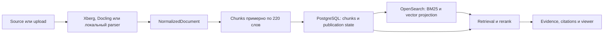
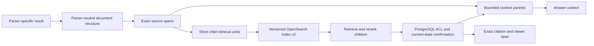

# Chunking и хранение поисковой проекции в OpenSearch

## Зачем нужен WikipediaRag

WikipediaRag — multi-tenant RAG-платформа для русской Википедии и
пользовательских баз знаний. Она принимает Wikipedia/ZIM, загруженные файлы и
данные внешних источников, асинхронно обрабатывает их, выполняет гибридный
лексический и векторный поиск и формирует ответы с проверяемыми citations.
Поверх того же evidence-контракта работают Extended Search и долговечный Deep
Research.

Платформа должна одинаково безопасно обслуживать разные классы данных:

- статьи Wikipedia и страницы Confluence;
- HTML, Markdown и обычный текст;
- PDF, DOCX и презентации;
- CSV и Excel с табличной структурой;
- документы с неполной или недостоверной структурой, включая сканы.

Главная сложность состоит не только в извлечении текста. Поисковая единица
должна быть достаточно короткой для точного retrieval, достаточно содержательной
для ответа и одновременно точно связанной с тем местом исходного документа,
которое можно показать пользователю и процитировать.

## Текущий поток данных

Для upload-документов основной путь выглядит так:

`NormalizedDocument` уже содержит `blocks`, `tables`, parser metadata и
locators. Однако `chunks_for_normalized_document` строит поисковые chunks прежде
всего из общего `document.text`: текст разделяется окнами по 220 слов. Locator и
`section_path` выбираются по позиции начала окна. Поэтому один chunk может
начаться в одном block, закончиться в другом и получить координаты только
первого из них.

Wikipedia/ZIM проходит отдельный source-specific путь. Статья сначала делится
на sections, а затем каждая section — на chunks с собственными identifiers и
parent/neighbor links. В результате ZIM и upload приходят к похожей форме
`Chunk`, но структура и смысл parent у них формируются по-разному.

## Граница авторитетных и производных данных

PostgreSQL и object storage образуют авторитетную границу хранения:

- PostgreSQL владеет tenant/KB scope, ACL, document lifecycle, актуальными
  версиями, chunks, publication state и зарегистрированными `index_versions`;
- object storage хранит оригинальные uploads, normalized documents и parser
  artifacts;
- OpenSearch хранит только перестраиваемую tenant/KB-scoped проекцию для BM25 и
  vector retrieval.

OpenSearch не является источником истины. Запись в нём может устареть, временно
отсутствовать или пережить изменение авторитетного состояния. Поэтому найденные
кандидаты перед выдачей повторно подтверждаются через PostgreSQL: проверяются
текущая document version, состояние публикации и доступ пользователя. Устаревшая
проекция может безопасно уменьшить recall, но не должна расширять доступ.

`index_versions` связывает физический индекс, read/write aliases, embedding
contract и retrieval profile с конкретной KB. Активный индекс выбирается
сервером через metadata базы знаний, а не идентификатором от клиента.

Подробнее эта граница описана в [Data and Storage](architecture/data-and-storage.md)
и [Search, Answer and Deep Research](architecture/search-and-deep-research.md).

## Почему текущего `Chunk` недостаточно

Сейчас одна сущность `Chunk` выполняет сразу несколько разных функций:

1. является короткой единицей BM25 и vector retrieval;
2. передаётся reranker-у и участвует в context selection;
3. служит основой parent/neighbor expansion;
4. становится citation anchor в `Evidence`;
5. отображается как fragment в document viewer.

У этих функций разные требования. Retrieval выигрывает от короткого,
самодостаточного текста с заголовочным контекстом. Генерации иногда нужен более
широкий раздел. Citation должна указывать на минимальный точный source fragment,
а viewer — восстанавливать исходный порядок и нативные координаты. Один текст и
один `chunk_id` не могут надёжно выразить все эти представления.

### Потеря структуры при normalization

Xberg и Docling способны возвращать иерархию, таблицы, страницы и layout
metadata. Текущий adapter извлекает из parser payload общий текст, повторно
строит blocks из Markdown-подобного представления и отдельно извлекает список
tables. При этом связь таблицы с окружающими blocks, heading hierarchy и
исходными координатами частично теряется.

`NormalizedTable` сохраняется в normalized artifact, но текущий chunker строит
chunks из `document.text` и не создаёт отдельные retrieval units из таблиц.
Следовательно, наличие таблицы в parser result ещё не означает, что её строки,
headers и cells представлены в OpenSearch подходящим для поиска способом.

### Недостаточные координаты

Текущий `locator` является свободным JSON-объектом. Обычно он содержит часть
координат, например page или block index, но нет единого обязательного
контракта для:

- page/slide/sheet;
- table, row и column ranges;
- cell coordinates и merged cells;
- character или byte offsets в normalized source;
- точного набора исходных blocks, вошедших в chunk.

Из-за этого citation может корректно вести к документу и примерной странице,
но не всегда к точному абзацу, строке таблицы или диапазону ячеек.

### Опасность смешивания поколений

Таблица `chunks` и document viewer сейчас не изолируют разные chunking contracts
как независимые представления одного document version. Если просто записать в
неё новые v2 chunks рядом с v1, чтение документа может смешать оба поколения.
Такая смесь создаст неоднозначность для порядка fragments, ACL confirmation,
parent expansion, reconciliation и citation resolution.

Index v2 поэтому должен иметь собственную versioned identity. Нельзя считать,
что новая OpenSearch mapping сама по себе решает проблему: PostgreSQL-модель и
публичное разрешение citations тоже должны понимать, к какому contract относится
поисковая единица.

## Как проблема проявляется на разных источниках

### Confluence, HTML и Markdown

Эти источники обычно имеют естественную иерархию `document → heading → block`.
Фиксированное окно может соединить соседние sections или отделить короткий
абзац от определяющего его heading. Для Confluence дополнительно важны page
title, space, ancestors, lists, macros и tables. Преобразование страницы в
plain text сохраняет слова, но ослабляет эту структуру.

### PDF, DOCX и PPTX

Здесь важны reading order, страницы, slides, captions и layout regions. Если
parser распознал их корректно, фиксированное деление снова теряет часть
информации. Если документ является сканом или parser вернул слабую структуру,
система не должна придумывать headings и coordinates: нужен явно помеченный
degraded fallback.

### CSV и Excel

Плоский текст особенно плохо соответствует таблицам. Строка без headers не
объясняет смысл значений, а разрез посреди строки уничтожает связь между
колонкой и cell. Индексация всего sheet одним большим fragment ухудшает ranking
и может переполнить context. Кроме того, точная citation должна указывать на
sheet и диапазон rows/columns, а не только на номер условного chunk.

Даже правильное табличное представление не делает LLM надёжным вычислителем.
Вопросы `count`, `sum`, `group`, `sort` и `pivot` в будущем потребуют отдельного
детерминированного executor-а; увеличение размера chunk или parent эту задачу
не решает.

### Plain text и сканы

У plain text может не быть структуры кроме абзацев и предложений. В этом случае
structure-aware chunker не получит сильного сигнала и должен использовать
предсказуемое bounded разбиение с соседним контекстом. Для сканов качество
ограничено OCR и layout extraction; несуществующую точность нельзя имитировать
богатыми, но недостоверными locators.

## Целевое архитектурное направление

Цель — сохранить parent-child подход, но разделить retrieval, context и source
coordinates. Это направление, а не окончательная схема RetrievalUnitV2 или
план миграции.

Основные принципы:

- **Короткий child для retrieval.** Child содержит текст, подходящий для BM25,
  embedding и rerank, а также deterministic prefix из document title, heading
  path или table schema. Его границы соблюдают blocks, rows и cells.
- **Bounded parent для контекста.** После попадания child система может получить
  ограниченный section/window с тем же logical parent. Parent не обязан быть
  отдельным поисковым кандидатом и никогда не должен бесконтрольно добавлять в
  prompt целый документ или sheet.
- **Точный source span.** Citation и viewer разрешают отдельную авторитетную
  ссылку на исходные blocks или табличный диапазон. Поисковая сериализация не
  становится цитируемым оригиналом.
- **Parser-neutral структура.** Xberg, Docling, локальные parsers и ZIM adapters
  приводят результаты к одному внутреннему контракту blocks/tables/locators.
  Parser выбирает способ extraction, но не определяет публичную identity.
- **Versioned Index v2.** Chunking, serialization, embedding и mapping входят в
  index contract. V2 строится рядом с работающим v1; переключение чтения не
  смешивает их candidates или PostgreSQL identities.
- **Таблицы как rows, а не плоский текст.** Для CSV/XLSX child представляет
  schema либо bounded contiguous row group. Headers повторяются в каждом
  продолжении; oversized rows делятся только по границам cells. Source span
  сохраняет sheet/table и точные row/column coordinates.

## Каким должно быть корректное решение

Будущее изменение можно считать архитектурно корректным, если выполняются все
следующие условия:

1. PostgreSQL и object storage остаются авторитетными, а OpenSearch полностью
   перестраивается из сохранённого состояния.
2. Failed или cancelled ingestion не публикует ни v1, ни v2 retrieval units.
3. Каждый OpenSearch candidate содержит достаточную contract identity для
   повторной проверки current version, publication и ACL в PostgreSQL.
4. Retrieval unit, context parent и citation span имеют разные явные роли и не
   отождествляются одним текстовым fragment по умолчанию.
5. Child не пересекает logical section/table boundary без явно обозначенного
   fallback; parent всегда ограничен token budget.
6. CSV/XLSX сохраняют headers, row/cell relations и точные coordinates; большие
   sheets не помещаются целиком в обычный answer context.
7. Viewer открывает точный source span и показывает соседний контекст без
   смешивания разных index/chunking contracts.
8. V1 продолжает обслуживать чтение во время построения v2, а переключение
   происходит только после проверки полноты проекции и совместимости contract.
9. Ablation сравнивает v1 и v2 на одном corpus/index-model scope по evidence
   recall, citation exactness, context tokens, latency, indexing time и размеру
   индекса.
10. Plain text и некачественные scans имеют детерминированный degraded fallback,
    а не вымышленную структуру.

## Связанные документы

- [README](../README.md) — назначение и основные возможности проекта.
- [Project Status](STATUS.md) — текущее состояние и активные ограничения.
- [Architecture Overview](architecture.md) — границы компонентов.
- [Data and Storage](architecture/data-and-storage.md) — владельцы данных и
  rebuild boundary.
- [Main Flows](architecture/flows.md) — ingestion, retrieval и publication.
- [Search, Answer and Deep Research](architecture/search-and-deep-research.md) —
  действующий retrieval/evidence contract.
- [Contract Map](architecture/contract-map.md) — карта исполняемых контрактов.
- [Search/RAG Improvement Plan](search-rag-improvement-plan-2026.md) — контекст
  P0.2 и дальнейших улучшений.
